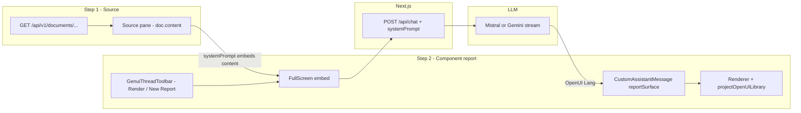

# ADPA Document GenUI Workspace

The **document GenUI workspace** is a **split-screen report** experience:

| Pane | User-facing role | What the user sees |
|------|------------------|-------------------|
| **Step 1 — Source document** | Read and verify extracted text | Title, metrics, full `doc.content` from the documents API |
| **Step 2 — Component report** | Build an interactive **OpenUI report** from that source | Rendered OpenUI Lang (cards, tables, timeline, cover, TOC) — **not** a generic chat transcript UI |

Step 2 is **report-first**: `GenuiReportSurfaceProvider` + `reportSurface` on `CustomAssistantMessage` (full-width canvas, no advisor avatar). Toolbar actions are **Render document** and **+ New Report** (`GenuiThreadToolbar`), not “new chat”. CSS hides OpenUI’s built-in “New Chat” control (`.genui-workspace`).

**Implementation (do not confuse with product copy):** Step 2 still embeds OpenUI’s `FullScreen` and streams via `POST /api/chat` with `systemPrompt`. That route name is historical; the **product surface** is a document-scoped **component report**, not project **OpenUI Chat** (`/openui-chat`).

This is **not** the same as project-scoped **OpenUI Chat** (`/openui-chat`, `/api/v1/openui-chat`, persisted threads, Gemini on the server). Do not conflate the two when debugging or extending features.

**Document-agnostic:** Layout and rendering use whatever `docId` is in the URL (`GET /documents/{id}` → `doc.content`). There is **no** allowlist of document UUIDs or hard tie to “Schedule Management Plan” only. Heuristics (markdown headings, prompt keywords) apply to **any** governance-style document in the stack.

**Shared component catalog:** Anything registered in `lib/openui/adpaGenuiExtensionDefs.ts` is merged into `projectOpenUIPromptLibrary` and is available on **both** this page and `/openui-chat` (same `projectOpenUILibrary` renderer). Existing React Kanban/Gantt pages elsewhere in ADPA (`IssueKanbanBoard`, `TaskGanttView`, …) do **not** auto-appear in Lang until you add a `defineComponent` extension (see below).

## When to use this skill

- Editing `app/projects/[id]/documents/genui/**`
- Fixing raw `openui-lang` code showing instead of rendered report components
- Changing layout, theme, **report** starters, or toolbar navigation
- Wiring new LLM behavior, RAG, or **report session** persistence for the document workspace
- Adding document-type-specific prompts or GenUI output patterns

Also read (design context, different surfaces):

- `docs/codedocs/genui-workspace.md` — human-readable codedoc (mirrors this skill)
- `docs/superpowers/specs/2026-05-14-openui-chat-design.md` — GenUI strategy for **project** OpenUI chat (separate route)
- `docs/superpowers/specs/2026-05-18-genui-personalized-dashboards-design.md` — future PM dashboards (out of scope for this page v1)
- `docs/codedocs/openui-chat.md` — backend OpenUI chat module (threads, SSE); **not** this document report HTTP path

## Routes and navigation

| Item | Location |
|------|----------|
| Canonical URL | `/projects/{projectId}/documents/genui?docId={documentId}` |
| URL helper | `lib/documents/document-routes.ts` → `getProjectDocumentGenUIPath()` |
| Legacy nested route | `app/projects/[id]/documents/[docId]/genui/` may exist for old links; IDs resolve via `useProjectDocumentRouteIds()` |
| Toolbar entry | `components/documents/DocumentPageToolbar.tsx` — mode `genui`, **GenUI** button from view/source/report |

## Architecture (data flow)



### Request path (critical)

1. `page.tsx` builds `systemPrompt` from `buildOpenUIGenuiLibraryPrompt()` plus **full document body** and metadata.
2. User prompts (starters or typed input) go through `FullScreen` → `POST /api/chat` with messages enriched by `enrichOpenUIApiMessages()` — each user turn gets a **REQUIRED LAYOUT PLAN** from `buildLayoutPlan({ prompt, sourceText: doc.content })` (`lib/openui/layoutPlan.ts`). Document text stays in system prompt; plan uses the same content for segment → component mapping.
3. `app/api/chat/route.ts`: when `systemPrompt` is set → **Mistral** or **Gemini** (`GENUI_LLM_PROVIDER`); executor must implement the layout plan; typography only for `typography-fallback` nodes.
4. `buildLayoutPlan({ prompt: lastUserMessage, sourceText: doc.content, documentId })` — prompt comes from the **latest user message** (`setLastUserLayoutPrompt` in `page.tsx`); Lang repair in `CustomAssistantMessage` uses the same prompt (not only the default “full document” string).
5. Model output should be **OpenUI Lang** (e.g. `root = Stack([...])`), optionally wrapped in ` ```openui-lang ` fences, rendered as the **report canvas**.

### Focused vs full document layout (`lib/openui/layoutPlan.ts`)

| Mode | Triggered by (examples) | Planner output | Cover / TOC |
|------|------------------------|----------------|-------------|
| **Focused detail** | `wantsGenuiFocusedDetailRender(prompt)` — timeline/gantt/kanban from a section, `no cover`, `only the timeline`, `from this report` + chart type, etc. | Usually **one** widget (`Timeline`, `Table`, …) in `root = Stack([...])` | **Omitted** |
| **Full report** | `wantsGenuiFullDocumentLayout(prompt)` — “render the full document”, cover + chapters, `GENUI_RENDER_FULL_DOCUMENT_PROMPT` | Cover + optional TOC + **Card per chapter** (when doc has enough `##` sections) | **Included** when structure warrants |

**Exports:** `wantsGenuiFocusedDetailRender`, `wantsGenuiFullDocumentLayout`, `wantsAiCoverSummary` (cover API only for full-document prompts).

**User-facing prompt templates:** `lib/documents/genui-prompts.ts` (full render CTA + focused timeline/gantt/kanban starters). Keyword buckets on document names: `lib/documents/document-chat-prompts.ts` (filename is historical; content is **report** starters for this workspace).

**Current fallbacks (no dedicated Lang widget yet):**

| User asks for | Lang component today | Notes |
|---------------|---------------------|--------|
| Timeline / milestones | `Timeline` | ADPA extension |
| “Gantt chart” | `Table` (activity, start, finish, dependencies) | Planner `shell: "table"` when focused + gantt |
| Kanban-style board | `Table` (status columns) | Not `KanbanComponent` (legacy JSON path only) |

**Follow-up rule:** Short messages like “from this report, generate a gantt chart” must stay **focused** — do not expand to full charter unless the user asks for full document / cover / all chapters. Tests: `follow-up gantt from this report stays focused` in `__tests__/lib/layoutPlan.test.ts`.

### Rendering path (critical)

| Piece | Role |
|-------|------|
| `componentLibrary={projectOpenUILibrary}` on `FullScreen` | GenUI catalog + ADPA extensions: **Bullets, Timeline, Team, Comparison, TableOfContents, ReportCoverHero, TwoColumnProse** |
| `GenuiReportSurfaceProvider` + `reportSurface` on `CustomAssistantMessage` | **Report canvas** — full width, no avatar; distinguishes this pane from conversational OpenUI Chat |
| `GenuiThreadToolbar` | **Render document** (full report CTA via `GenuiPromptBridge`); **+ New Report** remounts session |
| `assistantMessage={CustomAssistantMessage}` | **Overrides** default assistant UI — must render Lang as report, not markdown-only |
| `components/openui-chat/AssistantMessage.tsx` | Shared renderer; detects Lang → `DynamicComponentRenderer` with **`projectOpenUILibrary`** |
| `components/openui-chat/DynamicComponentRenderer.tsx` | `Renderer` from `@openuidev/react-lang` |
| `lib/openui/library.ts` | `extractOpenUILangText()`, `looksLikeOpenUILang()` |
| `lib/openui/systemPrompt.ts` | `buildOpenUIGenuiLibraryPrompt()`, `enrichOpenUIApiMessages()` |
| `lib/openui/layoutPlan.ts` | Text → UI plan (strict executor); shared with `/openui-chat` |

**Long prose (≈360+ chars):** planner emits a row `Stack` with two `TextContent` columns via `splitProseIntoTwoColumns` (paragraph break first, else nearest sentence boundary — skips `Dr.`, `Ed.`, `3.1`-style decimals); hints `twoColumn` + `REQUIRED_LANG` carry pre-split left/right text. Executor must use `Stack([col1, col2], "row", "m", "stretch", "start", true)` and must not re-split mid-sentence.

**Pitfall:** If `CustomAssistantMessage` only uses `MarkDownRenderer`, users see a fenced code block instead of Cards/Tables/Charts. Always route OpenUI Lang through `Renderer` + **`projectOpenUILibrary`**.

**Pitfall:** Bare `openuiLibrary` without merge → `unknown-component` for **Bullets**. **`adpaLibrary`** → wrong Report-era widgets.

**Pitfall:** Report shows only Bullets — usually **model output**, not a missing library. Verify with `getProjectOpenUIComponentNames()`; strengthen prompts in `systemPrompt.ts` / starters.

**Related skill:** Project **OpenUI Chat** at `/openui-chat` (Gemini, persisted threads, conversational UI) — `.agents/skills/adpa-openui-chat/SKILL.md`.

## Source map

| Concern | Files |
|---------|--------|
| Main page (split layout) | `app/projects/[id]/documents/genui/page.tsx` |
| Workspace theme / report embed CSS | `app/projects/[id]/documents/genui/genui-workspace.css` |
| Error boundary | `app/projects/[id]/documents/genui/error.tsx` |
| Report toolbar + prompt bridge | `components/genui/GenuiThreadToolbar.tsx`, `GenuiPromptBridge.tsx`, `GenuiReportSurfaceContext.tsx` |
| Step 2 export bar | `components/genui/GenuiReportExportBar.tsx`, `lib/genui/reportExport.ts` |
| **Step 3 reserve (types only)** | `lib/genui/presentationSnapshot.ts`, `docs/superpowers/specs/2026-05-21-genui-step3-presentations-design.md` |
| GenUI LLM route (`systemPrompt` branch) | `app/api/chat/route.ts` |
| Canonical library + prompt | `lib/openui/projectOpenUILibrary.ts`, `lib/openui/adpaGenuiExtensionDefs.ts`, `lib/openui/systemPrompt.ts` |
| Assistant / report renderer | `components/openui-chat/AssistantMessage.tsx` (re-export: `components/Chat/AssistantMessage.tsx`) |
| Lang utilities | `lib/openui/library.ts` |
| Report starters / render CTAs | `lib/documents/genui-prompts.ts`, `lib/documents/document-chat-prompts.ts` |
| Focused / full layout rules | `lib/openui/layoutPlan.ts`, `lib/openui/layoutPlanTypes.ts` |
| Document toolbar / nav | `components/documents/DocumentPageToolbar.tsx` |
| Route IDs (query vs path) | `lib/documents/use-project-document-route-ids.ts` |

### Related (different product surface)

| Concern | Files |
|---------|--------|
| Project OpenUI chat (conversational) | `.agents/skills/adpa-openui-chat/SKILL.md`, `app/openui-chat/`, `components/openui-chat/` |
| Backend threads + Gemini Lang SSE | `server/src/modules/openuiChat/` |
| Legacy Report components | `lib/openui/adpaLibrary.tsx` (not default for GenUI or `/openui-chat`) |

## Environment variables

Set in **`.env.local`** (see `.env.local.example`):

| Variable | Required for Step 2 report | Notes |
|----------|---------------------------|--------|
| `GENUI_LLM_PROVIDER` | No | `mistral` (default) or `google` / `gemini` for Gemini |
| `MISTRAL_API_KEY` | When provider is `mistral` | Without it, `/api/chat` returns 503 |
| `MISTRAL_MODEL` | No | Defaults to `mistral-large-latest` |
| `GOOGLE_AI_API_KEY` | When provider is `google` | Also accepts `GOOGLE_GENERATIVE_AI_API_KEY` |
| `GENUI_GOOGLE_MODEL` / `GEMINI_MODEL_OVERRIDE` | No | Default `gemini-2.5-flash` (see `lib/llm/googleModelConfig.ts`) |
| `NEXT_PUBLIC_GENUI_LLM_PROVIDER` | No | Optional badge in Step 2 header |
| `BACKEND_URL` | Step 1 + auth | Document fetch uses Express API via Next proxy |
| Firebase / `auth_token` cookie | Yes | Page requires authenticated user |

Response headers on GenUI streams: `X-GenUI-Provider`, `X-GenUI-Model` (DevTools → Network → `/api/chat`).

**Report session:** Not stored in `openui_chat_threads`. **+ New Report** remounts `FullScreen` via `chatSessionKey` (internal state name only — user-facing label is **New Report**). Resets when `documentId` changes.

## UI conventions

- **Layout:** ~38% source / ~62% report (`genui-source-pane`, `genui-advisor-pane` in CSS — class names are legacy; treat pane as **report** in copy and specs).
- **Theme:** Light workspace by default; optional dark report via `GENUI_RENDER_FULL_DOCUMENT_DARK_PROMPT` → `genui-report-dark` on `.genui-openui-root`.
- **OpenUI embed:** `.genui-openui-root` constrains `FullScreen` to the Step 2 panel; sidebar hidden; built-in “New Chat” hidden in favor of **+ New Report**.
- **Copy toolbar:** Copies raw `doc.content` (Step 1), not the OpenUI Lang source of the report.

When changing styles, prefer `genui-workspace.css` and existing Tailwind tokens over editing OpenUI package CSS.

## Extending features (safe patterns)

### Add report starters (suggested prompts)

Edit `lib/documents/document-chat-prompts.ts` and/or `lib/documents/genui-prompts.ts`. Keep prompts **grounded** in the source document. Use **focused** phrasing (`no cover`, named section) for a single widget — not the full report unless intended.

### Change system instructions

Edit `buildOpenUISystemPrompt()` in `lib/openui/systemPrompt.ts`. Keep document body injection in `page.tsx`; do not move secrets to the client.

### Add a new OpenUI Lang component (stack-wide)

Register once in the **ADPA extension layer**; both this **report workspace** and `/openui-chat` pick it up automatically. **Do not** only wire `DynamicComponentRenderer` JSON cases — legacy path, not OpenUI Lang reports.

**Checklist (mirror `lib/openui/timelineDef.tsx`):**

1. **Prefer existing GenUI** — `getProjectOpenUIComponentNames()` from `lib/openui/projectOpenUILibrary.ts`. For catalog coverage, visual-equivalence families (Table vs Carousel vs Bullets, etc.), and planner audit status, see `docs/implementation/GENUI_COMPONENT_CATALOG_AUDIT.md`.
2. **Define extension** — `lib/openui/<name>Def.tsx` with `defineComponent`.
3. **Register** — `ADPA_GENUI_EXTENSION_DEFS` / `ADPA_GENUI_EXTENSION_NAMES` in `adpaGenuiExtensionDefs.ts`.
4. **Planner intent** — `componentSelector.ts`, `layoutPlan.ts` (`toGenUIComponentName`, `resolveShellId`, `buildShellNodes`).
5. **Executor guidance** — `systemPrompt.ts`, `formatLayoutPlanForExecutor`.
6. **Tests** — `layoutPlan.test.ts`, `projectOpenUILibrary.test.ts` when applicable.
7. **Prompts** — optional entries in `genui-prompts.ts` / `document-chat-prompts.ts`.

**Do not change** document fetch, route IDs, or `docId` wiring when adding components.

### Step 2 export (shipped — client)

Bottom bar on Step 2: PDF (print), Word (.doc HTML), HTML, plus **More** (plain text, OpenUI Lang, Step 1 markdown). Implementation: `lib/genui/reportExport.ts`, `lib/genui/reportExportPrepare.ts`, portal in `GenuiReportExportBar.tsx`.

**Export preparation (`prepareGenuiReportExportHtml`):** clones the report DOM, expands paginated `Table` rows from `data-genui-table-export`, strips pagination/scroll controls, resolves `/images/…` to absolute URLs for print/Word. Step 3 server publish should reuse the same semantics for `html_snapshot`.

**Wide tables:** `hints.attributeTable` / `wideTable` in `layoutPlan.ts` + higher leaf budgets in `genuiPromptBudget.ts` reduce executor truncation in Activity Attributes–style tables.

Distinct from server `GET /api/v1/documents/:id/export/pdf` which exports **markdown** via `unifiedPdfService`, not the GenUI render tree.

### Step 3 — Publish snapshot + integrations (reserved, not built)

**Product intent:** Living truth stays `documents.content` (markdown). Beautiful OpenUI reports that must be **reproduced for stakeholders** become **named presentation snapshots** with artifacts in **blob storage** (PDF, DOCX, HTML snapshot, optional Lang replay). **Same Step 3 publish** can push those artifacts to **Confluence, Jira, SharePoint, ProjectWise** using existing project integration settings (not a separate “integration step”).

| Layer | Today | Step 3 (future) |
|-------|--------|------------------|
| Step 1 | Source markdown pane | Unchanged |
| Step 2 | Explore + client export | Unchanged |
| Step 3 | — | Snapshot + blobs + optional **direct publish** to enterprise systems |

**Do not implement Step 3 in Step 2 files without the spec.** Use reserved contracts:

- Design: `docs/superpowers/specs/2026-05-21-genui-step3-presentations-design.md` (blob checklist + **Direct publish to integrations**)
- Types: `lib/genui/presentationSnapshot.ts` — `CreateGenuiPresentationRequest.publishIntegrations`, `GenuiPresentationExternalPublishRef`, `GENUI_PRESENTATION_INTEGRATION_ADAPTERS`
- Feature flag: `NEXT_PUBLIC_GENUI_STEP3_PUBLISH=true` — gates **Publish presentation** (+ integration targets)

**vs document view today:** View page **Publish to Confluence/Jira** sends **markdown** / issue metadata. Step 3 sends **GenUI PDF/HTML snapshot** and records links on the presentation row.

**Invariants:** Never write OpenUI Lang into `documents.content`. Snapshot rows reference `document_id` + fingerprint. Blobs are derivatives only.

### Persist report sessions (explore only)

Today: in-memory `FullScreen` state only. Step 3 publish is separate from ephemeral exploration. Do not use `/openui-chat` threads for document reports without a migration plan.

### Add RAG beyond inline document text

Current grounding is **full `doc.content` in system prompt**. For large documents, chunk retrieval from server RAG modules — watch token limits.

## Manual verification checklist

After any GenUI workspace change:

1. Start backend + frontend (`AGENTS.md`); log in.
2. Open `/projects/{id}/documents/genui?docId={uuid}` for a document with body text.
3. **Step 1:** Title, metrics, extracted text visible.
4. **Step 2:** Report header, starters, prompt input; **Render document** / **+ New Report** in toolbar.
5. Send a starter (e.g. risks table) — response is **rendered OpenUI components** on the report canvas, not a raw `openui-lang` fence.
6. **View source** / **Show rendered** on an assistant turn toggles Lang vs report UI.
7. **+ New Report** clears the in-pane session; changing document resets Step 2.
8. Toolbar: View / Source / Report / GenUI; Copy copies Step 1 text.

## Troubleshooting

| Symptom | Likely cause | Fix |
|---------|----------------|-----|
| Raw OpenUI Lang code block | Markdown-only assistant path | `looksLikeOpenUILang` + `Renderer` + `projectOpenUILibrary` |
| Empty or broken widgets | Wrong library | `projectOpenUILibrary` on FullScreen + renderer |
| `unknown-component` Bullets | Missing extension merge | `projectOpenUILibrary` |
| Report is only Bullets | Model layout | `systemPrompt.ts` / starters; request Card + Table |
| 503 on send | Missing LLM key | `MISTRAL_API_KEY` or `GOOGLE_AI_API_KEY`; `GENUI_LLM_PROVIDER` |
| 401 on send | No auth | Log in |
| Step 1 empty | Document API | Check GET document by project + id |
| Report layout broken | CSS | `genui-workspace.css` `.genui-openui-root` |
| Model ignores document | Empty `doc.content` / weak system prompt | CRITICAL CONTEXT in `page.tsx` |
| Full report after gantt follow-up | Not focused | `wantsGenuiFocusedDetailRender` |
| “Gantt” is a table | No Gantt Lang widget yet | Add `GanttDef` per checklist |
| Stream stalls | LLM/network | Logs: `[FRONTEND-PROXY] OpenUI chat error` (log label is historical) |

## Agent workflow

1. Load this skill before editing GenUI workspace files.
2. Describe the UI as **source + component report**, not “document chat”, unless referring to the `/api/chat` route or OpenUI `FullScreen` internals.
3. Follow `adpa-aev-workflow` for scoped changes.
4. Do not modify `server/src/modules/openuiChat` for report-only UI unless wiring persistence or RAG by design.
5. Run the manual checklist; do not claim the report renders correctly without user confirmation on a real document.

## Expansion backlog (documented intent)

- **Step 3 publish** — DB row + blob artifacts; see `2026-05-21-genui-step3-presentations-design.md`
- Server PDF/DOCX from GenUI HTML snapshot (`unifiedPdfService.generateFromHtml`)
- Token-aware context (chunk RAG vs full-body prompt)
- Document-type templates → OpenUI Lang patterns
- PM dashboards per `2026-05-18-genui-personalized-dashboards-design.md` (separate route)
