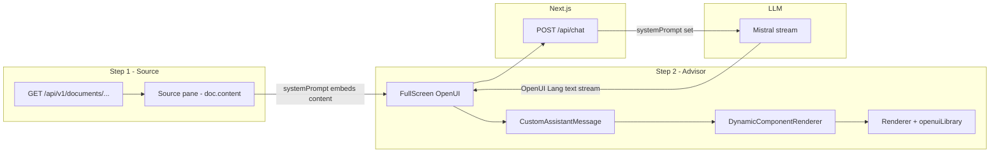

# ADPA Document GenUI Workspace

The **document GenUI workspace** is a split-pane experience: **Step 1** shows extracted document text; **Step 2** is an OpenUI `FullScreen` chat that can render **OpenUI Lang** into interactive UI (cards, tables, charts, tabs, steps).

This is **not** the same as project-scoped **OpenUI Chat** (`/openui-chat`, `/api/v1/openui-chat`). Do not conflate the two stacks when debugging or extending features.

## When to use this skill

- Editing `app/projects/[id]/documents/genui/**`
- Fixing raw `openui-lang` code showing instead of rendered components
- Changing layout, theme, conversation starters, or toolbar navigation
- Wiring new LLM behavior, RAG, or thread persistence for document chat
- Adding document-type-specific prompts or GenUI output patterns

Also read (design context, different surfaces):

- `docs/codedocs/genui-workspace.md` — human-readable codedoc (mirrors this skill)
- `docs/superpowers/specs/2026-05-14-openui-chat-design.md` — GenUI strategy for project OpenUI chat
- `docs/superpowers/specs/2026-05-18-genui-personalized-dashboards-design.md` — future PM dashboards (out of scope for this page v1)
- `docs/codedocs/openui-chat.md` — backend OpenUI chat module (threads, SSE); **not** the document workspace HTTP path

## Routes and navigation

| Item | Location |
|------|----------|
| Canonical URL | `/projects/{projectId}/documents/genui?docId={documentId}` |
| URL helper | `lib/documents/document-routes.ts` → `getProjectDocumentGenUIPath()` |
| Legacy nested route | `app/projects/[id]/documents/[docId]/genui/` may exist for old links; IDs resolve via `useProjectDocumentRouteIds()` |
| Toolbar entry | `components/documents/DocumentPageToolbar.tsx` — mode `genui`, **GenUI** button from view/source/report |

## Architecture (data flow)



### Request path (critical)

1. `page.tsx` builds `systemPrompt` from `buildOpenUIGenuiLibraryPrompt()` plus **full document body** and metadata.
2. `FullScreen` calls `POST /api/chat` with messages enriched by `enrichOpenUIApiMessages()` — each user turn gets a **REQUIRED LAYOUT PLAN** from `buildLayoutPlan({ prompt, sourceText: doc.content })` (`lib/openui/layoutPlan.ts`). Document text stays in system prompt; plan uses the same content for segment → component mapping.
3. `app/api/chat/route.ts`: if `systemPrompt` is set → **Mistral** streaming; executor must implement the layout plan; typography only for `typography-fallback` nodes.
4. Assistant replies should be **OpenUI Lang** (e.g. `root = Stack([...])`), optionally wrapped in ` ```openui-lang ` fences.

### Rendering path (critical)

| Piece | Role |
|-------|------|
| `componentLibrary={projectOpenUILibrary}` on `FullScreen` | GenUI catalog + ADPA **Bullets, Timeline, Team, Comparison, TableOfContents** |
| `assistantMessage={CustomAssistantMessage}` | **Overrides** default assistant UI — must render Lang itself |
| `components/openui-chat/AssistantMessage.tsx` | Detects Lang → `DynamicComponentRenderer` with **`projectOpenUILibrary`** |
| `components/openui-chat/DynamicComponentRenderer.tsx` | `Renderer` from `@openuidev/react-lang`; default `library` is `projectOpenUILibrary` |
| `lib/openui/library.ts` | `extractOpenUILangText()`, `looksLikeOpenUILang()` |
| `lib/openui/systemPrompt.ts` | `buildOpenUIGenuiLibraryPrompt()`, `buildOpenUIUserMessage()`, `enrichOpenUIApiMessages()` |
| `lib/openui/layoutPlan.ts` | Text → UI plan (strict executor); see `adpa-openui-chat` skill |

**Long prose (≈360+ chars):** planner emits a row `Stack` with two `TextContent` columns (`splitProseIntoTwoColumns`, hints `twoColumn`); executor must use `Stack([col1, col2], "row", "m", "stretch", "start", true)` — same pattern as chapter intros in full governance reports.

**Pitfall:** If `CustomAssistantMessage` only uses `MarkDownRenderer`, users see a fenced code block instead of Cards/Tables/Charts. Always route OpenUI Lang through `Renderer` + **`projectOpenUILibrary`**.

**Pitfall:** Bare `openuiLibrary` without merge → `unknown-component` for **Bullets**. **`adpaLibrary`** → wrong Report-era widgets.

**Pitfall:** Assistant shows only Bullets — usually **model output**, not a missing library. Verify with `getProjectOpenUIComponentNames()`; strengthen prompts in `systemPrompt.ts` / starters.

**Related skill:** Project OpenUI Chat at `/openui-chat` (Gemini, threads) — `.agents/skills/adpa-openui-chat/SKILL.md`.

## Source map

| Concern | Files |
|---------|--------|
| Main page | `app/projects/[id]/documents/genui/page.tsx` |
| Workspace theme / OpenUI shell CSS | `app/projects/[id]/documents/genui/genui-workspace.css` |
| Error boundary | `app/projects/[id]/documents/genui/error.tsx` |
| Chat API (Mistral branch) | `app/api/chat/route.ts` |
| Canonical library + prompt | `lib/openui/projectOpenUILibrary.ts`, `lib/openui/adpaGenuiExtensionDefs.ts`, `lib/openui/systemPrompt.ts` |
| Re-export for imports | `components/Chat/AssistantMessage.tsx` → `openui-chat/AssistantMessage.tsx` |
| Lang utilities | `lib/openui/library.ts` |
| Conversation starters | `lib/documents/document-chat-prompts.ts` |
| Document toolbar / nav | `components/documents/DocumentPageToolbar.tsx` |
| Route IDs (query vs path) | `lib/documents/use-project-document-route-ids.ts` |

### Related (different product surface)

| Concern | Files |
|---------|--------|
| Project OpenUI chat | `.agents/skills/adpa-openui-chat/SKILL.md`, `app/openui-chat/`, `components/openui-chat/` |
| Backend threads + Gemini Lang SSE | `server/src/modules/openuiChat/` |
| Legacy Report components | `lib/openui/adpaLibrary.tsx` (not default for GenUI or `/openui-chat`) |

## Environment variables

Set in **`.env.local`** (see `.env.local.example`):

| Variable | Required for Step 2 | Notes |
|----------|---------------------|--------|
| `GENUI_LLM_PROVIDER` | No | `mistral` (default) or `google` / `gemini` for Gemini (AI Studio–compatible logs) |
| `MISTRAL_API_KEY` | When provider is `mistral` | Without it, `/api/chat` returns 503 |
| `MISTRAL_MODEL` | No | Defaults to `mistral-large-latest` |
| `GOOGLE_AI_API_KEY` | When provider is `google` | Also accepts `GOOGLE_GENERATIVE_AI_API_KEY` |
| `GENUI_GOOGLE_MODEL` / `GEMINI_MODEL_OVERRIDE` | No | Default `gemini-2.5-flash` (see `lib/llm/googleModelConfig.ts`) |
| `NEXT_PUBLIC_GENUI_LLM_PROVIDER` | No | Optional badge in Step 2 UI; should match `GENUI_LLM_PROVIDER` |
| `BACKEND_URL` | Step 1 + auth | Document fetch uses Express API via Next proxy |
| Firebase / `auth_token` cookie | Yes | Page requires authenticated user |

Response headers on GenUI streams: `X-GenUI-Provider`, `X-GenUI-Model` (inspect in DevTools → Network → `/api/chat`).

GenUI workspace does **not** currently persist threads to `openui_chat_threads`. **New chat** remounts `FullScreen` via `chatSessionKey` (client-only reset).

## UI conventions

- **Theme:** Light workspace (`genui-workspace` root). OpenUI default CSS: `@openuidev/react-ui/defaults.css`, `components.css`.
- **Layout:** 50/50 split; OpenUI root uses `.genui-openui-root` overrides (hide sidebar, panel-sized viewport, centered chat).
- **Session:** `chatSessionKey` increments on **New chat**; resets when `documentId` changes.
- **Copy:** Toolbar copies raw `doc.content` (Step 1 body), not chat transcript.

When changing styles, prefer `genui-workspace.css` and existing Tailwind tokens (`slate-*`, `violet-*`) over editing OpenUI package CSS.

## Extending features (safe patterns)

### Add conversation starters

Edit `lib/documents/document-chat-prompts.ts` — keyword buckets on document name/template. Keep prompts **grounded** (“from this document”, “table”, “timeline”) so the model uses Step 1 content.

### Change system instructions

Edit `buildOpenUISystemPrompt()` in `lib/openui/systemPrompt.ts` (uses `projectOpenUILibrary.prompt()`). Keep document body injection in `page.tsx`; do not move secrets to the client.

### Add new OpenUI components

1. Prefer components already in `projectOpenUILibrary` / `@openuidev/react-ui/genui-lib` (`Card`, `Table`, `BarChart`, `Tabs`, `Steps`, etc.).
2. For ADPA-only widgets: add a `defineComponent` (see `bulletsDef.tsx`), append to `components` in `projectOpenUILibrary.ts` — **never** replace the full `Object.values(openuiLibrary.components)` spread.
3. Consult OpenUI / `@openuidev` docs (context7 MCP) for Lang grammar — do not invent syntax.
4. Run `__tests__/lib/projectOpenUILibrary.test.ts` after library changes.

### Persist chat threads (future)

Today: ephemeral `FullScreen` state. To persist:

- Either extend `POST /api/chat` to accept `projectId` + `documentId` and store in `openui_chat_messages`, or
- Add dedicated `document_genui_threads` tables — do not break existing `openui-chat` contract without migration design.

### Add RAG beyond inline document text

Current grounding is **full `doc.content` in system prompt**. For large documents, consider chunk retrieval from existing RAG services (`server` search/RAG modules) and inject a truncated context block — watch token limits on Mistral.

### Second route alias

If adding `documents/[docId]/genui`, re-export the same page component or redirect to `?docId=` so `useProjectDocumentRouteIds()` stays the single ID resolver.

## Manual verification checklist

After any GenUI workspace change:

1. Start backend + frontend (`AGENTS.md`); ensure logged in.
2. Open `/projects/{id}/documents/genui?docId={uuid}` for a document with body text.
3. **Step 1:** Title, metrics, extracted text visible.
4. **Step 2:** Welcome + conversation starters; chat input at bottom, centered in panel.
5. Send a starter (e.g. “Show all risks as a table”) — response renders **UI components**, not a raw `openui-lang` code fence.
6. **View source** on assistant message toggles Lang source; **Show rendered** restores UI.
7. **New chat** clears thread; switching document in toolbar loads new doc + resets chat.
8. Toolbar: View / Source / Report / GenUI navigation works; Copy copies document text.

## Troubleshooting

| Symptom | Likely cause | Fix |
|---------|----------------|-----|
| Raw OpenUI Lang code block | `CustomAssistantMessage` markdown-only path | Ensure `looksLikeOpenUILang` + `DynamicComponentRenderer` + `projectOpenUILibrary` |
| Empty or broken widgets | Wrong library (`adpaLibrary` or bare `openuiLibrary`) | Pass `projectOpenUILibrary` to FullScreen + renderer |
| `unknown-component` Bullets | Renderer missing BulletsDef | Use `projectOpenUILibrary` |
| Only Bullets in UI | Model chose minimal layout | Prompt rules in `systemPrompt.ts`; ask for Card + Table layout |
| 503 on chat | Missing key for active provider | `MISTRAL_API_KEY` or `GOOGLE_AI_API_KEY`; set `GENUI_LLM_PROVIDER`, restart Next |
| 401 on chat | No auth cookie | Log in via Firebase/demo |
| Step 1 empty | Document API / permissions | Check `GET` document by project + id |
| Chat off-center / sidebar bleed | CSS overrides | `genui-workspace.css` `.genui-openui-root` rules |
| Model ignores document | Weak prompt or empty `doc.content` | Strengthen CRITICAL CONTEXT block; verify fetch |
| Stream stalls | Mistral/network | Check server logs for `[FRONTEND-PROXY] OpenUI chat error` |

## Agent workflow

1. Load this skill before editing GenUI workspace files.
2. Follow `adpa-aev-workflow` for scoped changes (one concern per change when possible).
3. Do not modify `server/src/modules/openuiChat` for document-only UI unless explicitly wiring persistence or RAG.
4. After edits, run manual checklist above; do not claim “renders correctly” without user confirmation on a real document.

## Expansion backlog (documented intent)

Track larger work in specs/issues; typical next steps:

- Thread persistence per `projectId` + `documentId`
- Token-aware context (chunk RAG vs full-body prompt)
- Export rendered GenUI / report to PDF from workspace
- Document-type templates mapping to OpenUI Lang patterns
- Align with `2026-05-18-genui-personalized-dashboards-design.md` when PM dashboards ship (separate route)
