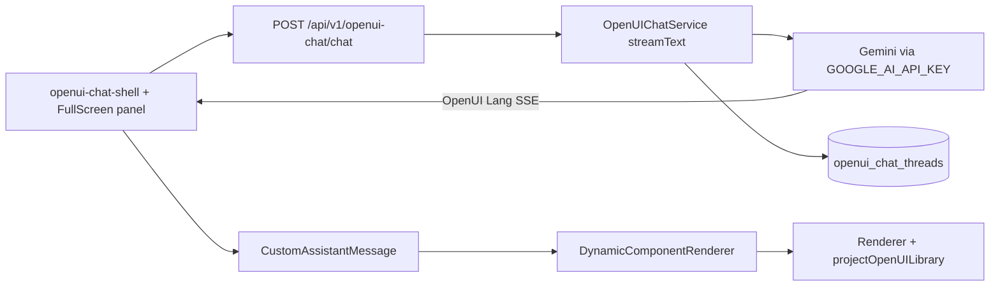

# ADPA Project OpenUI Chat

Project-scoped advisor at **`/openui-chat`**: pick a project, chat with persisted threads, stream **OpenUI Lang** from Gemini, render the **full GenUI component catalog** (Card, Stack, Accordion, Table, Tabs, Steps, Callout, charts, TextContent, **Bullets**, …).

**Not the same as** the document GenUI workspace (`/projects/.../documents/genui`). See `.agents/skills/adpa-genui-workspace/SKILL.md` for split-pane document + Mistral flow.

## Canonical library (critical)

| Rule | Detail |
|------|--------|
| **Single library** | `projectOpenUILibrary` from `lib/openui/projectOpenUILibrary.ts` |
| **What it is** | GenUI catalog (`openuiLibrary`) **+** ADPA extensions: `Bullets`, `Timeline`, `Team`, `Comparison`, `TableOfContents` (`lib/openui/adpaGenuiExtensionDefs.ts`) |
| **Prompt** | `projectOpenUILibrary.prompt(openuiPromptOptions)` via `buildOpenUISystemPrompt()` in `lib/openui/systemPrompt.ts` |
| **Renderer** | Same library on `FullScreen` `componentLibrary` **and** `CustomAssistantMessage` → `DynamicComponentRenderer` |
| **Never** | Replace with Bullets-only defs, bare `openuiLibrary` while prompts mention Bullets, or `adpaLibrary` (legacy Report grammar) on this surface |

Module init **throws** if base component count &lt; 40 or Card/Accordion/Table/Bullets are missing after merge.

```ts
import { projectOpenUILibrary, openuiPromptOptions, ADPA_GENUI_EXTENSION_NAMES } from "@/lib/openui/projectOpenUILibrary"
// New ADPA-only widgets: add defineComponent in lib/openui/*.tsx, append to adpaGenuiExtensionDefs.ts (never duplicate GenUI names)
```

### When to use `adpaLibrary`

Only for **legacy threads** that used `Report(...)` / ADPA Report components. Default for new chat is **`projectOpenUILibrary`**.

## Architecture



| Layer | Path |
|-------|------|
| Page | `app/openui-chat/page.tsx` → `components/openui-chat/openui-chat-shell.tsx` |
| FullScreen + stream | `components/openui-chat/openui-chat-fullscreen-panel.tsx` |
| Thread sync (no abort mid-stream) | `components/openui-chat/openui-chat-thread-sync.tsx` |
| SSE adapter | `lib/openui/streaming.ts` (`adpaOpenUIChatStreamAdapter`) |
| System / user prompts | `lib/openui/systemPrompt.ts`, `lib/openui/project-chat-prompts.ts` |
| **Text → UI layout plan** | `lib/openui/layoutPlan.ts` (`buildLayoutPlan`, `formatLayoutPlanForExecutor`) |
| Lang validation | `lib/openui/langValidation.ts` |
| Lang utils | `lib/openui/library.ts` |
| Backend | `server/src/modules/openuiChat/` |
| Tests | `__tests__/lib/openui-streaming.test.ts`, `__tests__/lib/projectOpenUILibrary.test.ts` |

Human codedoc: `docs/codedocs/openui-chat.md`

## Environment

| Variable | Where | Purpose |
|----------|--------|---------|
| `GOOGLE_AI_API_KEY` or `GOOGLE_GENERATIVE_AI_API_KEY` | `server/.env` | Gemini streaming in `OpenUIChatService` |
| `BACKEND_URL` | `.env.local` | Next proxy to Express |
| Auth (`auth_token` / Firebase) | — | Required for `/api/v1/openui-chat/*` |

Document GenUI uses **Mistral** in `.env.local` — do not confuse the two.

## Strict layout plan (text → component → executor LLM)

ADPA **chooses** widgets; the model **fills** the plan (does not redesign layout).

1. `segmentSourceText()` splits document/RAG markdown into sections.
2. Pattern rules + `selectComponentType(prompt)` → `buildLayoutPlan()` (`lib/openui/layoutPlan.ts`).
3. Unstructured blocks → `TextContent` with `mapping: typography-fallback` (full `sourceText` preserved).
4. `buildOpenUIUserMessage()` appends `=== REQUIRED LAYOUT PLAN ===` to every chat request.
5. GenUI (`genui/page.tsx`) uses `enrichOpenUIApiMessages()` with `layoutSourceText: doc.content`, `includeSourceInUserMessage: false` (doc stays in system prompt only).

| File | Role |
|------|------|
| `layoutPlan.ts` | Segment, classify, shell (charter/status/risk/…), format plan for LLM |
| `componentSelector.ts` | Intent scoring on user prompt |
| `langValidation.ts` | Warn on `root = Bullets/TextContent` only (client console) |

Tests: `__tests__/lib/layoutPlan.test.ts`

## Prompt / layout rules (avoid “Bullets-only” UI)

`lib/openui/systemPrompt.ts` enforces:

- Full catalog in system prompt (from `projectOpenUILibrary.prompt()`).
- **Layout plan execution** rules in system + user message.
- **`root = Stack([intro Card, section Card, …])`** — never a single top-level `Bullets` as the whole answer.
- **One Card per document heading** (`CardHeader` + body: Bullets, Table, or TextContent) for report-style output.
- **Bullets** for real lists inside section Cards; **Accordion** only when the user explicitly asks for collapsible/FAQ and Bullets is not the better fit.
- Tables for registers; Callout for top risks.

Conversation starters in `lib/openui/project-chat-prompts.ts` should mention **Card, Table, Accordion, Stack** — not Bullets alone.

## Rendering pitfalls

| Symptom | Cause | Fix |
|---------|--------|-----|
| Only Bullets visible | Model output is one `Bullets` assignment | Strengthen prompts; user request “use Card + Table layout” |
| `unknown-component` for Card/Table | Wrong library on Renderer | Use `projectOpenUILibrary` everywhere |
| `unknown-component` for Bullets | Bare `openuiLibrary` without merge | Use `projectOpenUILibrary` |
| Empty assistant / cut-off stream | `OpenUIChatThreadSync` calls `selectThread` while `isRunning` | Keep stream-end `onThreadResolved` only (see `openui-chat-thread-sync.tsx`) |
| Raw Lang code block | Markdown-only assistant path | `looksLikeOpenUILang` + `DynamicComponentRenderer` |
| Wrong widgets (Report layout) | `adpaLibrary` on GenUI chat | Switch to `projectOpenUILibrary` |

## API (backend)

Mount: `/api/v1/openui-chat`

| Method | Path | Notes |
|--------|------|--------|
| `POST` | `/chat` | SSE OpenUI Lang; body: `projectId`, `messages`, optional `threadId`, `documentId` |
| `GET` | `/threads?projectId=` | List threads |
| `GET` | `/threads/:id?projectId=` | Thread + messages |

Frontend panel calls `/api/v1/openui-chat/...` with Bearer token (Next rewrite to Express).

## Manual verification

1. `GOOGLE_AI_API_KEY` in `server/.env`; backend + frontend running (`AGENTS.md`).
2. Open `/openui-chat`, select a project.
3. Send: “Give a leadership status update with a summary Card and a Table of blockers.”
4. Response should render **Card + Table** (and/or Stack), not only a bullet list.
5. Browser console: no `unknown-component` for Card, Accordion, Table, Bullets.
6. Optional: run `pnpm exec jest __tests__/lib/projectOpenUILibrary.test.ts --no-coverage`

## Agent workflow

1. Load **this skill** for `/openui-chat` and `server/src/modules/openuiChat`.
2. Load **genui-workspace** skill only when editing document GenUI page.
3. Follow `adpa-aev-workflow` for scoped edits.
4. Any library change: update `projectOpenUILibrary.ts`, `systemPrompt.ts`, **both** render sites, and add/extend `projectOpenUILibrary.test.ts`.

## Extending components

1. Prefer existing GenUI names from `getProjectOpenUIComponentNames()`.
2. For ADPA-only widgets: add `defineComponent` in `lib/openui/` (e.g. `bulletsDef.tsx`), append to `components` array in `projectOpenUILibrary.ts`.
3. Re-run library test; confirm prompt still lists new component.
4. Do **not** register only one component — always preserve full `openuiLibrary.components` spread.
