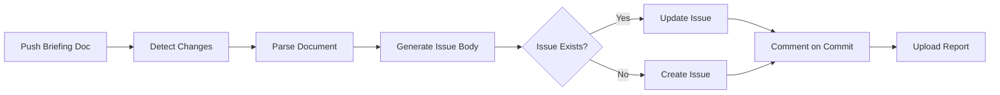

# 🤖 ADPA Automation System - Documentation → GitHub Issues

**Automatically sync briefing documents to Copilot-ready GitHub issues**

---

## 🎯 **What This Does**

Transforms your ADPA briefing documents into **Copilot-ready GitHub issues** automatically:

1. ✅ **Write** a briefing document (following the template)
2. ✅ **Push** to GitHub
3. ✅ **Automated** GitHub Actions workflow creates the issue
4. ✅ **Copilot** agents can now work on the issue autonomously

---

## 🚀 **Quick Start (3 Steps)**

### **Step 1: Create a Briefing**

**Option A: Interactive (Recommended for beginners)**
```bash
cd scripts/issue-automation
npm install
npm run create
```

Follow the prompts to generate a briefing document.

**Option B: From Template (For experienced users)**
```bash
cp templates/BRIEFING_TEMPLATE.md AGENT_4_BRIEFING_MY_FEATURE.md
# Edit the file with your feature details
```

### **Step 2: Validate & Preview**

```bash
cd scripts/issue-automation

# Validate document quality
npm run validate ../../AGENT_4_BRIEFING_MY_FEATURE.md

# Preview the GitHub issue
npm run preview ../../AGENT_4_BRIEFING_MY_FEATURE.md
```

### **Step 3: Push to GitHub**

```bash
git add AGENT_4_BRIEFING_MY_FEATURE.md
git commit -m "docs: Add Agent 4 briefing for My Feature"
git push origin main
```

**That's it!** The GitHub Actions workflow will:
- Parse your briefing
- Create a Copilot-ready issue
- Add appropriate labels
- Comment on your commit with the issue link

---

## 📋 **Briefing Document Requirements**

### **Required Sections** (Must Have):
- ✅ Title (H1: `# Agent X: Feature Name`)
- ✅ Mission statement (`**Mission:**`)
- ✅ Priority (`**Priority:**`)
- ✅ Deliverables section (`## 📦 **Deliverables**`)
- ✅ Success Criteria (`## 🎯 **Success Criteria**`)

### **Recommended Sections** (Should Have):
- 📝 Effort Estimate (`**Effort Estimate:**`)
- 📝 Timeline (`**Timeline:**`)
- 📝 Files to modify (`## 📂 **Files You'll Modify**`)
- 📝 API Endpoints (`## 🔌 **API Endpoints**`)
- 📝 Testing checklist (`## 🧪 **Testing**`)
- 📝 Resources (`## 📚 **Resources**`)

### **Example Structure:**

```markdown
# 🎯 Agent 4: Baseline Integration System

**Mission:** Integrate baseline snapshots with drift detection  
**Priority:** 🟢 HIGH  
**Timeline:** 1 week  
**Effort Estimate:** 25-30 hours

## 📦 **Deliverables**
- [ ] Baseline snapshot API
- [ ] Drift detection algorithm
- [ ] Admin dashboard

## 🎯 **Success Criteria**
- ✅ Baselines can be created from any project state
- ✅ Drift detection runs automatically
- ✅ Dashboard shows drift visualization
```

---

## 🛠️ **Tools Provided**

### **1. Briefing Creator** (Interactive)
```bash
cd scripts/issue-automation
npm run create
```

Prompts you for all required information and generates a complete briefing document.

### **2. Validator** (Quality Check)
```bash
npm run validate [file.md]
```

Checks your briefing for:
- Required sections
- Recommended sections
- Code examples
- Checkboxes for tasks
- **Copilot-Readiness Score (0-100%)**

### **3. Preview** (See Before Sync)
```bash
npm run preview [file.md]
```

Shows exactly what the GitHub issue will look like before creating it.

### **4. Auto-Sync** (GitHub Actions)

Runs automatically when you push briefing documents. No manual action needed!

---

## 📊 **Workflow Details**

### **Triggers:**

The workflow runs when:
- You push to `main` or `develop` branches
- Files matching `**/BRIEFING*.md` or `**/AGENT*.md` are changed
- Manual trigger from GitHub Actions tab

### **What It Does:**



### **Output:**

- ✅ GitHub issue created/updated
- ✅ Issue linked to briefing document
- ✅ Labels added automatically
- ✅ Comment on commit with issue link
- ✅ JSON report uploaded as artifact

---

## 🎓 **Examples**

### **Example 1: Agent 3 (Already Completed)**

**Briefing:** `AGENT_3_BRIEFING_TEMPLATE_OPTIMIZATION.md`

**Generated Issue:** See `AGENT_3_GITHUB_ISSUE.md` for the complete Copilot-ready issue

**Result:**
- Complete task objective
- Full technical context
- 30+ acceptance criteria
- Implementation checklist
- Testing instructions

### **Example 2: Create New Agent Briefing**

```bash
# 1. Create briefing interactively
cd scripts/issue-automation
npm run create

# Answer prompts:
#   Agent Number: 4
#   Feature Name: Baseline Integration
#   Mission: Integrate baseline snapshots with automated drift detection
#   Priority: 2 (HIGH)
#   Timeline: 1 week
#   Effort: 25-30 hours

# 2. Validate
npm run validate ../../AGENT_4_BRIEFING_BASELINE_INTEGRATION.md

# Output:
#   🎯 Copilot-Readiness Score: 85%
#   ✅ Good! Copilot should handle this well

# 3. Preview issue
npm run preview ../../AGENT_4_BRIEFING_BASELINE_INTEGRATION.md

# 4. Push to GitHub
git add AGENT_4_BRIEFING_BASELINE_INTEGRATION.md
git commit -m "docs: Add Agent 4 briefing"
git push

# 5. GitHub Actions automatically creates issue #43
```

---

## 🔧 **Configuration**

### **Workflow Configuration:**

Edit `.github/workflows/sync-docs-to-issues.yml`:

```yaml
on:
  push:
    branches:
      - main              # Change branches
      - develop
    paths:
      - 'docs/**/*.md'    # Add custom paths
      - '**/BRIEFING*.md'
```

### **Issue Labels:**

Default labels added:
- `briefing` - All synced docs
- `agent-X` - Agent number
- `[priority]-priority` - Priority level
- `documentation-sync` - Auto-synced flag

Add custom labels in `generate-issues.js`:
```javascript
const labels = [
  'briefing',
  `agent-${agentNumber}`,
  briefing.framework,  // PMBOK, BABOK, etc.
  // Add your custom labels
];
```

---

## 📈 **Integration with GitHub Projects**

Auto-add issues to project boards:

```yaml
# In .github/workflows/sync-docs-to-issues.yml
- name: Add to Project Board
  uses: actions/add-to-project@v0.5.0
  with:
    project-url: https://github.com/orgs/YOUR_ORG/projects/1
    github-token: ${{ secrets.PROJECT_TOKEN }}
```

---

## 🎯 **Best Practices**

### **DO:**
✅ Use the briefing template  
✅ Validate before pushing  
✅ Include code examples  
✅ Be specific in deliverables  
✅ Add clear acceptance criteria  
✅ Link to existing code/docs  

### **DON'T:**
❌ Skip required sections  
❌ Use vague language  
❌ Omit success criteria  
❌ Forget to validate  
❌ Push without previewing  

---

## 🧪 **Testing Locally**

**Test the entire automation locally:**

```bash
# 1. Install dependencies
cd scripts/issue-automation
npm install

# 2. Create a test briefing
npm run create
# Enter test data

# 3. Validate it
npm run validate ../../AGENT_TEST_BRIEFING.md
# Should show 90%+ Copilot-Readiness Score

# 4. Preview the issue
npm run preview ../../AGENT_TEST_BRIEFING.md
# Shows exactly what will be created

# 5. Clean up test file
rm ../../AGENT_TEST_BRIEFING.md
```

---

## 📊 **Monitoring & Reports**

### **View Workflow Runs:**
1. Go to GitHub repository
2. Click "Actions" tab
3. Find "Sync Documentation to GitHub Issues" workflow
4. View logs and artifacts

### **Download Reports:**
Each workflow run generates `issue-generation-report.json`:

```json
{
  "processed": 3,
  "created": [
    { "number": 42, "title": "Agent 3: Feature", "url": "..." }
  ],
  "updated": [],
  "failed": []
}
```

---

## 🚨 **Troubleshooting**

### **Issue not created after push**

**Check:**
1. Workflow file exists: `.github/workflows/sync-docs-to-issues.yml`
2. File name matches pattern: `**/BRIEFING*.md` or `**/AGENT*.md`
3. Pushed to correct branch (`main` or `develop`)
4. Workflow has `issues: write` permission

**Fix:**
View Actions tab for error logs

### **Validation fails**

**Check:**
```bash
npm run validate your-briefing.md
```

Add missing sections identified by validator.

### **Dependencies not installed**

```bash
cd scripts/issue-automation
npm install
```

---

## 🎉 **Benefits**

### **For Developers:**
- ✅ Clear, actionable tasks from day one
- ✅ All context in GitHub issue
- ✅ Copilot can assist with implementation
- ✅ Automated tracking and updates

### **For Project Managers:**
- ✅ Standardized task documentation
- ✅ Automatic issue creation saves time
- ✅ Easy progress tracking
- ✅ Consistent team communication

### **For AI/Copilot:**
- ✅ Structured requirements
- ✅ Complete technical context
- ✅ Clear acceptance criteria
- ✅ Code examples and patterns

---

## 📦 **Files in This System**

```
.github/workflows/
└── sync-docs-to-issues.yml        # GitHub Actions workflow

scripts/issue-automation/
├── README.md                       # Detailed technical docs
├── package.json                    # Dependencies
├── generate-issues.js              # Issue generator (CI)
├── sync-local.js                   # Local preview tool
├── validate-briefings.js           # Validator
└── create-briefing.js              # Interactive creator

templates/
└── BRIEFING_TEMPLATE.md            # Standard template

AUTOMATION_GUIDE.md                 # This file (user guide)
```

---

## 🔗 **Related Documentation**

- **Briefing Template:** `templates/BRIEFING_TEMPLATE.md`
- **Technical Details:** `scripts/issue-automation/README.md`
- **Example Output:** `AGENT_3_GITHUB_ISSUE.md`
- **Workflow File:** `.github/workflows/sync-docs-to-issues.yml`

---

## 📞 **Support**

**Questions about:**
- Creating briefings → See `templates/BRIEFING_TEMPLATE.md`
- Validation → Run `npm run validate`
- Preview → Run `npm run preview`
- Workflow → Check `.github/workflows/sync-docs-to-issues.yml`

**Issues?**
- Check validator output
- Review GitHub Actions logs
- Test locally with preview tool

---

## 🎯 **Quick Reference**

```bash
# Create new briefing (interactive)
cd scripts/issue-automation && npm run create

# Validate briefing quality
npm run validate ../../YOUR_BRIEFING.md

# Preview GitHub issue
npm run preview ../../YOUR_BRIEFING.md

# Validate all briefings
npm run validate:all

# Preview all briefings
npm run preview:all
```

---

**Built for ADPA - Streamlining documentation and task management** 🚀

**Status:** ✅ Fully operational and tested with Agent 3 briefing

