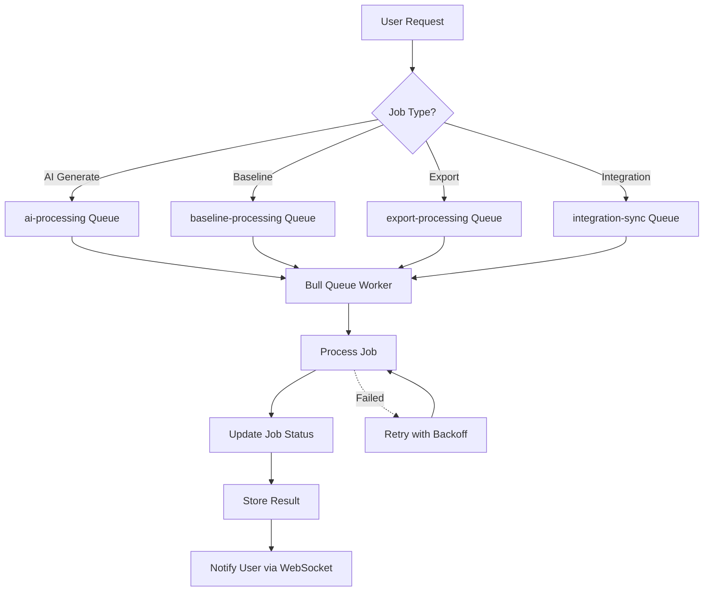

# 📋 Comprehensive Job Types in ADPA System

## Overview

The ADPA system processes various background jobs for document generation, analysis, processing, and integrations. This document outlines ALL job types that should be tracked and monitored.

---

## 🤖 AI-Driven Jobs

### 1. **AI Document Generation** (`ai-generate`)
**Status:** ✅ Currently Implemented
**Purpose:** Generate documents using AI providers
**Queue:** `ai-processing`
**Metadata Tracked:**
- Provider (Google Gemini, OpenAI, Mistral, etc.)
- Model (gemini-2.5-pro, gpt-4, etc.)
- Temperature, max_tokens
- Template ID and name
- Project ID and name
- Tokens used (input, output, total)
- Generated document ID
- Context used (documents, stakeholders, variables)

**Example:**
```
Job: "Project Charter - Enterprise AI Adoption"
Provider: Google Gemini
Model: gemini-2.5-pro
Tokens: 11,539
Result: Document ID 7b4120d5-...
```

---

### 2. **AI Data Summarization** (`ai-summarize`)
**Status:** ⚠️ Needs Implementation
**Purpose:** Summarize project data, documents, or stakeholder information
**Queue:** `ai-processing`
**Metadata Should Track:**
- Input source (document IDs, project ID)
- Summary type (executive, technical, stakeholder)
- Length constraint (words, paragraphs)
- Provider & model
- Tokens used
- Output format (bullet points, paragraph, table)

**Use Cases:**
- Executive summaries of project status
- Stakeholder communication briefs
- Document abstracts
- Meeting minutes summarization

---

### 3. **Project Variable Extraction** (`ai-extract-variables`)
**Status:** ⚠️ Needs Implementation
**Purpose:** Extract key project variables from documents
**Queue:** `ai-processing`
**Metadata Should Track:**
- Source documents
- Variables extracted (risks, stakeholders, objectives, KPIs)
- Confidence scores
- Variable type (text, number, date, list)
- Provider & model
- Validation status

**Use Cases:**
- Auto-populate project fields from uploaded documents
- Extract stakeholders from org charts
- Parse risk registers from PDFs
- Identify project objectives from business cases

---

### 4. **AI Content Enhancement** (`ai-enhance`)
**Status:** ⚠️ Needs Implementation
**Purpose:** Improve existing document quality
**Queue:** `ai-processing`
**Metadata Should Track:**
- Original document ID
- Enhancement type (grammar, clarity, compliance, depth)
- Before/after word count
- Changes made (additions, deletions, modifications)
- Quality score improvement

**Use Cases:**
- Improve grammar and style
- Enhance technical depth
- Add missing sections
- Ensure standards compliance

---

## 📊 Baseline & Analysis Jobs

### 5. **Baseline Calculation** (`baseline-calculate`)
**Status:** ✅ Partially Implemented
**Purpose:** Calculate project baseline from documents
**Queue:** `baseline-processing`
**Metadata Should Track:**
- Project ID
- Document IDs included
- Baseline type (scope, schedule, cost)
- Calculation method
- Extracted data (deliverables, milestones, budget)
- Version number

**Use Cases:**
- Create project baseline snapshot
- Extract scope from charter
- Calculate schedule from plan documents
- Aggregate cost estimates

---

### 6. **Baseline Review** (`baseline-review`)
**Status:** ⚠️ Needs Implementation
**Purpose:** Automated baseline compliance review
**Queue:** `baseline-processing`
**Metadata Should Track:**
- Baseline ID being reviewed
- Review criteria (completeness, consistency, compliance)
- Findings (issues, warnings, suggestions)
- Compliance score
- Standards checked (PMBOK, BABOK, DMBOK)

**Use Cases:**
- Automated quality checks
- Standards compliance validation
- Baseline drift detection
- Change impact analysis

---

### 7. **Drift Detection** (`baseline-drift-detect`)
**Status:** ⚠️ Needs Implementation
**Purpose:** Detect changes from approved baseline
**Queue:** `baseline-processing`
**Metadata Should Track:**
- Baseline ID
- Current state snapshot
- Detected drifts (scope, schedule, cost)
- Severity levels
- Affected documents
- Change recommendations

**Use Cases:**
- Continuous baseline monitoring
- Change control triggers
- Risk identification
- Stakeholder alerts

---

## 📄 Document Processing Jobs

### 8. **Document Export** (`document-export`)
**Status:** ⚠️ Needs Implementation
**Purpose:** Export documents to PDF, DOCX, HTML
**Queue:** `export-processing`
**Metadata Should Track:**
- Source document ID
- Target format (PDF, DOCX, HTML)
- Export options (template, styling, watermark)
- File size
- Output file path/URL
- Conversion time

**Use Cases:**
- PDF generation for distribution
- Word export for editing
- HTML for web publishing
- Batch export for deliverables

---

### 9. **Document Conversion** (`document-convert`)
**Status:** ⚠️ Needs Implementation
**Purpose:** Convert uploaded documents to Markdown
**Queue:** `export-processing`
**Metadata Should Track:**
- Source file (PDF, DOCX, etc.)
- Source file size
- Conversion method (Pandoc, Adobe PDF Services, custom parser)
- Output quality score
- Warnings/errors
- Manual review needed?

**Use Cases:**
- Import legacy documents
- Convert Word documents to Markdown
- Parse PDFs for content extraction
- Migrate from other systems

---

### 10. **Batch Document Processing** (`batch-process-documents`)
**Status:** ⚠️ Needs Implementation
**Purpose:** Process multiple documents in one job
**Queue:** `batch-processing`
**Metadata Should Track:**
- Document IDs (array)
- Operation type (export, enhance, validate)
- Individual results per document
- Success/failure counts
- Total processing time
- Partial success handling

**Use Cases:**
- Bulk export to PDF
- Mass compliance check
- Batch regeneration
- Archive multiple documents

---

## 🔗 Integration Jobs

### 11. **Confluence Sync** (`confluence-sync`)
**Status:** ⚠️ Needs Implementation
**Purpose:** Sync documents to/from Confluence
**Queue:** `integration-sync`
**Metadata Should Track:**
- Confluence space ID
- Page ID
- Sync direction (upload, download, bi-directional)
- Document mapping
- Conflict resolution
- Last sync timestamp

**Use Cases:**
- Publish documents to Confluence
- Import Confluence pages
- Keep documentation in sync
- Team collaboration

---

### 12. **SharePoint Sync** (`sharepoint-sync`)
**Status:** ⚠️ Needs Implementation
**Purpose:** Sync documents to/from SharePoint
**Queue:** `integration-sync`
**Metadata Should Track:**
- SharePoint site URL
- Document library
- Folder path
- Metadata mapping
- Version control
- Permission sync

---

### 13. **GitHub Integration** (`github-sync`)
**Status:** ⚠️ Needs Implementation
**Purpose:** Sync documentation to GitHub repos
**Queue:** `integration-sync`
**Metadata Should Track:**
- Repository URL
- Branch name
- Commit message
- PR creation
- Files affected
- Sync status

---

## 📈 Analytics & Reporting Jobs

### 14. **Analytics Processing** (`analytics-process`)
**Status:** ⚠️ Needs Implementation
**Purpose:** Calculate analytics and metrics
**Queue:** `analytics-processing`
**Metadata Should Track:**
- Metric type (usage, performance, cost)
- Time period (daily, weekly, monthly)
- Entities analyzed (users, projects, documents)
- Results cached?
- Processing duration

**Use Cases:**
- Daily usage reports
- Cost analysis
- Performance metrics
- User activity tracking

---

### 15. **Report Generation** (`report-generate`)
**Status:** ⚠️ Needs Implementation
**Purpose:** Generate custom reports
**Queue:** `analytics-processing`
**Metadata Should Track:**
- Report type (project status, AI usage, compliance)
- Data sources
- Parameters (date range, filters)
- Format (PDF, Excel, Dashboard)
- Recipients
- Schedule (one-time, recurring)

---

## 🔍 Quality & Compliance Jobs

### 16. **Compliance Validation** (`compliance-validate`)
**Status:** ⚠️ Needs Implementation
**Purpose:** Validate documents against standards
**Queue:** `quality-processing`
**Metadata Should Track:**
- Document ID
- Standard/framework (PMBOK 7, BABOK 3.0, DMBOK 2.0)
- Validation rules applied
- Issues found
- Compliance score
- Auto-fix suggestions

**Use Cases:**
- PMBOK compliance checking
- Regulatory requirement validation
- Template adherence
- Quality gates

---

### 17. **Quality Scoring** (`quality-score`)
**Status:** ⚠️ Needs Implementation
**Purpose:** Calculate document quality scores
**Queue:** `quality-processing`
**Metadata Should Track:**
- Document ID
- Quality dimensions (completeness, depth, structure)
- Scores per dimension
- Overall quality score
- Improvement suggestions
- Benchmark comparison

---

## 🔄 System Maintenance Jobs

### 18. **Database Backup** (`system-backup`)
**Status:** ⚠️ Needs Implementation
**Purpose:** Automated database backups
**Queue:** `system-maintenance`
**Metadata Should Track:**
- Backup type (full, incremental)
- Tables included
- Backup size
- Storage location (S3, local)
- Retention policy
- Restore test status

---

### 19. **Cache Warming** (`cache-warm`)
**Status:** ⚠️ Needs Implementation
**Purpose:** Pre-populate Redis cache
**Queue:** `system-maintenance`
**Metadata Should Track:**
- Cache keys populated
- Data sources
- Cache hit rate improvement
- Memory used
- Expiration times

---

### 20. **Cleanup Jobs** (`cleanup`)
**Status:** ⚠️ Needs Implementation
**Purpose:** Clean up old data
**Queue:** `system-maintenance`
**Metadata Should Track:**
- Cleanup type (old jobs, temp files, expired sessions)
- Items removed
- Space freed
- Retention policy
- Safety checks

---

## 🧪 Testing & Validation Jobs

### 21. **Template Testing** (`template-test`)
**Status:** ⚠️ Needs Implementation
**Purpose:** Test templates with sample data
**Queue:** `testing`
**Metadata Should Track:**
- Template ID
- Test data set
- Generated output
- Validation results
- Performance metrics

---

### 22. **Integration Testing** (`integration-test`)
**Status:** ⚠️ Needs Implementation
**Purpose:** Test third-party integrations
**Queue:** `testing`
**Metadata Should Track:**
- Integration type (Confluence, SharePoint, GitHub)
- Test cases run
- Pass/fail status
- Response times
- Error details

---

## 📊 Job Type Registry

### Recommended Implementation

Create a **Job Type Registry** in the backend:

```typescript
// server/src/types/jobTypes.ts
export enum JobType {
  // AI Jobs
  AI_GENERATE = 'ai-generate',
  AI_SUMMARIZE = 'ai-summarize',
  AI_EXTRACT_VARIABLES = 'ai-extract-variables',
  AI_ENHANCE = 'ai-enhance',
  
  // Baseline Jobs
  BASELINE_CALCULATE = 'baseline-calculate',
  BASELINE_REVIEW = 'baseline-review',
  BASELINE_DRIFT_DETECT = 'baseline-drift-detect',
  
  // Document Processing
  DOCUMENT_EXPORT = 'document-export',
  DOCUMENT_CONVERT = 'document-convert',
  BATCH_PROCESS = 'batch-process-documents',
  
  // Integrations
  CONFLUENCE_SYNC = 'confluence-sync',
  SHAREPOINT_SYNC = 'sharepoint-sync',
  GITHUB_SYNC = 'github-sync',
  
  // Analytics
  ANALYTICS_PROCESS = 'analytics-process',
  REPORT_GENERATE = 'report-generate',
  
  // Quality
  COMPLIANCE_VALIDATE = 'compliance-validate',
  QUALITY_SCORE = 'quality-score',
  
  // System
  SYSTEM_BACKUP = 'system-backup',
  CACHE_WARM = 'cache-warm',
  CLEANUP = 'cleanup',
  
  // Testing
  TEMPLATE_TEST = 'template-test',
  INTEGRATION_TEST = 'integration-test',
}

export const JOB_TYPE_METADATA = {
  [JobType.AI_GENERATE]: {
    name: 'AI Document Generation',
    description: 'Generate documents using AI providers',
    queue: 'ai-processing',
    priority: 'high',
    requiredFields: ['provider', 'model', 'template_id', 'project_id'],
    estimatedDuration: '15-30 seconds',
  },
  [JobType.BASELINE_CALCULATE]: {
    name: 'Baseline Calculation',
    description: 'Calculate project baseline from documents',
    queue: 'baseline-processing',
    priority: 'medium',
    requiredFields: ['project_id', 'document_ids'],
    estimatedDuration: '5-10 seconds',
  },
  // ... add all other types
}
```

---

## 🎯 Implementation Priority

### **Phase 1: Core Jobs** (Currently Working)
1. ✅ AI Document Generation
2. ✅ Job monitoring and status tracking

### **Phase 2: Document Operations** (Next Priority)
3. Document Export (PDF, DOCX)
4. Batch Processing
5. Document Conversion

### **Phase 3: Baseline & Quality**
6. Baseline Calculation (partially done)
7. Baseline Review
8. Quality Scoring
9. Compliance Validation

### **Phase 4: Integrations**
10. Confluence Sync
11. SharePoint Sync
12. GitHub Integration

### **Phase 5: Analytics & System**
13. Analytics Processing
14. Report Generation
15. System Maintenance

---

## 🔄 Current Job Flow



---

## 🧪 Testing the Jobs Monitor

### **Test Now (Refresh the Jobs page):**

1. **View Your Recent Jobs**
   - Should see: "Scope Baseline - Enterprise Data Governance"
   - Should see: "Project Charter - Enterprise AI Adoption"

2. **Click "View Details" in dropdown**
   - Should expand showing:
     - ✅ Job ID
     - ✅ Queue, Priority, Status
     - ✅ Timestamps
     - ✅ **AI Processing Details** (NEW!)
       - Provider: Google Gemini
       - Model: gemini-2.5-pro
       - Temperature: 0.7
       - Tokens: 8,348
       - Template: Scope Baseline
       - **View Document** link

3. **Check Job Metadata**
   - Provider and model should be visible
   - Template name should be shown
   - Link to generated document should work

---

## 📋 Next Steps

### **To Add More Job Types:**

1. **Create Queue**
   ```typescript
   // server/src/services/queueService.ts
   export const exportQueue = new Bull("export-processing", redisConfig)
   export const baselineQueue = new Bull("baseline-processing", redisConfig)
   ```

2. **Create Job Processor**
   ```typescript
   exportQueue.process("document-export", async (job) => {
     const { documentId, format } = job.data
     // Export logic
   })
   ```

3. **Add Job Tracking**
   ```typescript
   // When starting a job
   await pool.query(`
     INSERT INTO jobs (id, type, status, created_by, job_data)
     VALUES ($1, 'document-export', 'pending', $2, $3)
   `, [jobId, userId, JSON.stringify({ documentId, format })])
   ```

4. **Update Jobs Endpoint**
   - Already enhanced to show rich metadata!
   - Will automatically pick up new job types

---

## ✅ **What's Working Now**

After the latest changes:
- ✅ Jobs show descriptive names (template + project)
- ✅ AI metadata displayed (provider, model, tokens)
- ✅ Link to generated document
- ✅ Template and project context
- ✅ Status tracking with progress

**Test it now! Go to http://localhost:3000/jobs and click "View Details" on any job!** 🚀

---

## 💡 Future Enhancements

- [ ] Job retry mechanism
- [ ] Job cancellation
- [ ] Job dependencies (Job B waits for Job A)
- [ ] Scheduled/recurring jobs (cron-like)
- [ ] Job templates (pre-configured jobs)
- [ ] Performance analytics per job type
- [ ] Resource usage tracking (CPU, memory, tokens, cost)
- [ ] Job queuing strategies (priority, load balancing)
- [ ] Dead letter queue for failed jobs
- [ ] Job archival and cleanup policies

---

**The foundation is in place!** We can now track any job type with full metadata. Ready to expand to other job categories as needed! 🎯

