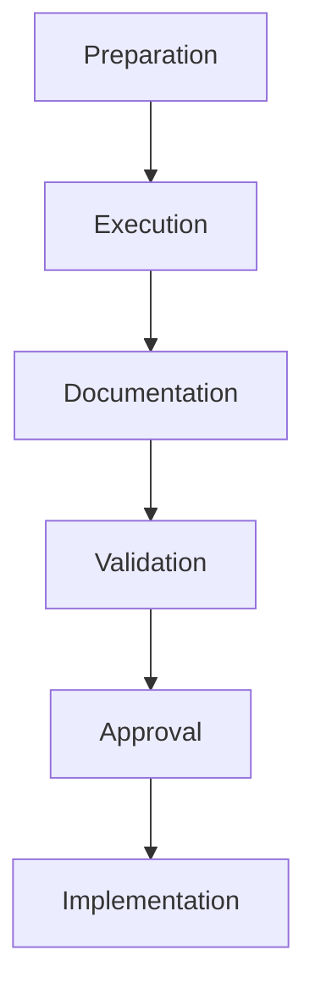

# Elicitation and Collaboration Plan
**Project Name:** Opportunities with No Working Capital
**Project ID:** b237e05a-e567-43d3-a92a-20898c56e8a3
**Framework:** PMBOK® Guide, 7th Edition
**Date:** 2026-08-15
**Version:** 1.0 (Production-Ready)
**Prepared By:** Senior Project Management Consultant
**Confidentiality Level:** Confidential
**Project Sponsor:** Menno Drescher (Super Admin)

---

## 1. Executive Summary

### 1.1 Project Overview
The *Elicitation and Collaboration Plan* for *Opportunities with No Working Capital* establishes a structured framework for gathering, analyzing, and validating requirements while fostering stakeholder engagement throughout the project lifecycle. This initiative empowers individuals to generate initial capital through **sweat equity**—leveraging time, skills, and available resources—rather than monetary investment. Aligned with **PMBOK® Guide, 7th Edition**, this plan emphasizes **adaptive planning**, **continuous stakeholder engagement**, and **iterative feedback loops** to ensure the project delivers **scalable, no-capital business opportunities** that evolve with market demands and user needs.

The project’s unique value proposition lies in its **dual focus**:
1. **Capital Generation**: Enabling individuals to monetize their time and skills to build initial capital.
2. **Scalability**: Ensuring generated capital can be reinvested into higher-yield opportunities, creating a compounding effect.

This plan integrates seamlessly with existing project artifacts, including the **Stakeholder Register**, **Scope Baseline**, and **Ideation Template**, ensuring consistency and traceability across all project components.

### 1.2 Objectives
The primary objectives of this plan are:
1. **Requirement Elicitation**: Systematically gather, document, and validate requirements from stakeholders, end users, and subject matter experts (SMEs) to ensure alignment with project goals.
2. **Stakeholder Collaboration**: Foster a collaborative environment where stakeholders actively contribute to opportunity ideation, validation, and execution.
3. **Adaptive Feedback Loops**: Implement iterative feedback mechanisms to refine opportunities based on real-time market data, user feedback, and performance metrics.
4. **Risk Mitigation**: Proactively identify and address risks associated with requirement gaps, stakeholder misalignment, and resource constraints.
5. **Value Delivery**: Ensure all elicited requirements contribute to the project’s **Business Value Proposition (BVP)**, focusing on **capital generation** and **scalability**.

---

## 2. Approach

### 2.1 Methodology
This plan adopts a **hybrid approach**, combining **PMBOK 7’s Stakeholder and Delivery Performance Domains** with **Agile principles** to ensure flexibility and responsiveness. The methodology is structured around three core phases:

1. **Elicitation Phase**: Gather requirements through workshops, interviews, and market analysis.
2. **Validation Phase**: Prioritize and validate requirements with stakeholders and end users.
3. **Collaboration Phase**: Foster ongoing engagement through feedback loops, ideation sessions, and performance reviews.

#### 2.1.1 Elicitation Techniques
The following techniques will be employed to gather requirements:
- **Workshops**: Facilitated sessions with stakeholders to brainstorm and refine opportunities.
- **Interviews**: One-on-one discussions with end users (e.g., individual entrepreneurs, freelancers) to understand their needs.
- **Surveys**: Structured questionnaires to collect quantitative data on user preferences and pain points.
- **Market Analysis**: Leverage tools like **Google Trends** and **Google Analytics** to identify emerging opportunities.
- **Prototyping**: Develop low-fidelity prototypes (e.g., wireframes, mockups) to validate user flows and functionality.

#### 2.1.2 Collaboration Tools
To facilitate stakeholder engagement, the following tools will be utilized:
| Tool | Purpose | Stakeholder Access |
|------|---------|---------------------|
| **Confluence** | Centralized documentation and knowledge sharing | All stakeholders |
| **Miro** | Collaborative ideation and brainstorming | Project Team, SMEs |
| **Slack** | Real-time communication and updates | All stakeholders |
| **Google Workspace** | Document collaboration and version control | All stakeholders |
| **Zoom** | Virtual workshops and meetings | All stakeholders |

### 2.2 Stakeholder Engagement Strategy
Stakeholder engagement is critical to the success of this project. The strategy focuses on **three key pillars**:

1. **Transparency**: Ensure all stakeholders have access to project documentation, progress updates, and decision-making processes.
2. **Inclusivity**: Actively involve stakeholders from diverse backgrounds (e.g., individual entrepreneurs, mentors, technology providers) to capture a wide range of perspectives.
3. **Accountability**: Assign clear roles and responsibilities to stakeholders, ensuring ownership of deliverables and outcomes.

#### 2.2.1 Stakeholder Matrix
The following table outlines the engagement strategy for key stakeholders:

| Stakeholder | Role | Interest | Influence | Engagement Strategy |
|-------------|------|----------|------------|---------------------|
| **Menno Drescher** | Business Sponsor | High | High | Monthly steering committee meetings, bi-weekly progress reviews |
| **Individual Entrepreneurs** | Primary Beneficiaries | High | Medium | Quarterly ideation workshops, monthly feedback surveys |
| **Mentors/Advisors** | Guidance Providers | Medium | High | Bi-monthly advisory sessions, ad-hoc consultations |
| **Market Analysts** | Opportunity Researchers | Medium | Medium | Weekly market trend reports, monthly validation sessions |
| **Project Team** | Execution Team | High | Medium | Daily stand-ups, bi-weekly sprint reviews |
| **Technology Providers** | Tool Support | Low | Medium | Quarterly tool performance reviews, ad-hoc technical support |
| **Legal Advisors** | Compliance Oversight | Low | High | Bi-annual compliance audits, ad-hoc legal consultations |
| **Financial Advisors** | Financial Oversight | Medium | Medium | Quarterly financial reviews, ad-hoc budget consultations |

### 2.3 Governance Structure
The project’s governance structure ensures alignment with strategic objectives and provides oversight for elicitation and collaboration activities. The **Steering Committee** and **Opportunity Review Board** play pivotal roles:

| Governance Body | Responsibilities | Meeting Cadence |
|-----------------|-----------------|-----------------|
| **Steering Committee** | Strategic oversight, resource allocation, risk management | Monthly |
| **Opportunity Review Board** | Opportunity validation, prioritization, and approval | Bi-weekly |
| **Change Control Board (CCB)** | Change request approvals, scope adjustments | Ad-hoc |

---

## 3. Key Components

### 3.1 Elicitation Process
The elicitation process is designed to systematically gather and validate requirements from stakeholders and end users. The process consists of **five phases**:

1. **Preparation**: Define elicitation objectives, identify stakeholders, and select appropriate techniques.
2. **Execution**: Conduct workshops, interviews, and surveys to gather requirements.
3. **Documentation**: Record requirements in a structured format (e.g., **Business Requirements Document (BRD)**).
4. **Validation**: Prioritize and validate requirements with stakeholders and SMEs.
5. **Approval**: Obtain formal approval from the **Opportunity Review Board** and **Steering Committee**.

#### 3.1.1 Elicitation Workflow

#### 3.1.2 Elicitation Techniques by Phase
| Phase | Technique | Stakeholders Involved | Output |
|-------|-----------|-----------------------|--------|
| Preparation | Stakeholder Analysis | Project Team, Business Sponsor | Stakeholder Register |
| Execution | Workshops | Individual Entrepreneurs, Mentors, Market Analysts | Opportunity Ideation Backlog |
| Execution | Interviews | Individual Entrepreneurs, Freelancers | User Personas, Pain Points |
| Execution | Surveys | Validation Network Members, Peers | Quantitative Feedback |
| Documentation | BRD Development | Business Analyst, Project Team | Business Requirements Document |
| Validation | Prioritization Sessions | Opportunity Review Board, Steering Committee | Prioritized Requirements |
| Approval | Formal Review | Steering Committee, Business Sponsor | Approved BRD |

### 3.2 Collaboration Framework
The collaboration framework ensures ongoing engagement and feedback loops throughout the project lifecycle. The framework is built on **three core principles**:

1. **Iterative Feedback**: Regularly collect and incorporate feedback from stakeholders to refine opportunities.
2. **Transparency**: Maintain open communication channels to keep stakeholders informed of progress and challenges.
3. **Accountability**: Assign clear ownership for deliverables and outcomes to ensure accountability.

#### 3.2.1 Collaboration Tools and Channels
| Channel | Purpose | Frequency | Stakeholders |
|---------|---------|-----------|--------------|
| **Slack** | Real-time communication | Daily | All stakeholders |
| **Confluence** | Documentation and knowledge sharing | Weekly | Project Team, SMEs |
| **Miro** | Ideation and brainstorming | Bi-weekly | Project Team, Individual Entrepreneurs |
| **Zoom** | Virtual workshops and meetings | Monthly | All stakeholders |
| **Google Workspace** | Document collaboration | Ongoing | All stakeholders |

#### 3.2.2 Feedback Loops
Feedback loops are critical to ensuring the project remains aligned with stakeholder needs and market demands. The following loops will be implemented:

| Feedback Loop | Purpose | Frequency | Stakeholders |
|--------------|---------|-----------|--------------|
| **Ideation Workshops** | Validate and refine opportunities | Quarterly | Individual Entrepreneurs, Mentors, Market Analysts |
| **User Feedback Surveys** | Collect quantitative feedback on user experience | Monthly | Validation Network Members, Peers |
| **Performance Reviews** | Assess progress against KPIs | Bi-weekly | Project Team, Steering Committee |
| **Market Trend Analysis** | Identify emerging opportunities | Weekly | Market Analysts, Project Team |

### 3.3 Risk Management
Risk management is integral to the elicitation and collaboration process. The following risks have been identified and mitigation strategies developed:

| Risk | Probability | Impact | Mitigation Strategy | Owner |
|------|-------------|--------|---------------------|-------|
| **Requirement Gaps** | High | High | Conduct thorough stakeholder analysis and validation sessions | Business Analyst |
| **Stakeholder Misalignment** | Medium | High | Regular engagement and transparent communication | Stakeholder Engagement Lead |
| **Resource Constraints** | Medium | Medium | Prioritize requirements and allocate resources based on value delivery | Resource Manager |
| **Market Volatility** | High | Medium | Continuous market trend analysis and adaptive planning | Market Analyst |
| **Tool Limitations** | Low | Medium | Regular tool performance reviews and vendor consultations | Technology Provider |

---

## 4. Implementation

### 4.1 Elicitation Implementation
The elicitation process will be implemented in **three phases**, each with specific deliverables and timelines:

#### 4.1.1 Phase 1: Preparation
| Activity | Description | Owner | Timeline | Deliverable |
|----------|-------------|-------|----------|-------------|
| Stakeholder Analysis | Identify and analyze stakeholders | Business Analyst | Week 1 | Stakeholder Register |
| Elicitation Planning | Define objectives, techniques, and tools | Project Manager | Week 2 | Elicitation Plan |
| Tool Setup | Configure collaboration tools (e.g., Confluence, Miro) | DevOps Lead | Week 3 | Tool Access and Documentation |

#### 4.1.2 Phase 2: Execution
| Activity | Description | Owner | Timeline | Deliverable |
|----------|-------------|-------|----------|-------------|
| Ideation Workshops | Facilitate workshops with stakeholders | Opportunity Lead | Weeks 4-6 | Opportunity Ideation Backlog |
| User Interviews | Conduct interviews with end users | Business Analyst | Weeks 5-7 | User Personas, Pain Points |
| Market Analysis | Analyze market trends and opportunities | Market Analyst | Weeks 6-8 | Market Competitive Analysis |
| Survey Distribution | Distribute surveys to validation network | Validation Team | Week 7 | Quantitative Feedback Report |

#### 4.1.3 Phase 3: Documentation and Validation
| Activity | Description | Owner | Timeline | Deliverable |
|----------|-------------|-------|----------|-------------|
| BRD Development | Document requirements in BRD | Business Analyst | Weeks 8-9 | Business Requirements Document |
| Prioritization Sessions | Prioritize requirements with stakeholders | Opportunity Review Board | Week 10 | Prioritized Requirements |
| Formal Review | Obtain approval from Steering Committee | Project Manager | Week 11 | Approved BRD |

### 4.2 Collaboration Implementation
The collaboration framework will be implemented through **ongoing engagement activities** and **feedback loops**:

#### 4.2.1 Engagement Activities
| Activity | Description | Owner | Frequency | Deliverable |
|----------|-------------|-------|-----------|-------------|
| Daily Stand-ups | Short meetings to align on progress and challenges | Scrum Master | Daily | Stand-up Notes |
| Bi-weekly Sprint Reviews | Review progress and demo deliverables | Project Team | Bi-weekly | Sprint Review Report |
| Monthly Steering Committee Meetings | Strategic oversight and decision-making | Steering Committee | Monthly | Meeting Minutes, Action Items |
| Quarterly Ideation Workshops | Validate and refine opportunities | Opportunity Lead | Quarterly | Workshop Report, Updated Backlog |

#### 4.2.2 Feedback Loops
| Feedback Loop | Description | Owner | Frequency | Deliverable |
|--------------|-------------|-------|-----------|-------------|
| User Feedback Surveys | Collect quantitative feedback on user experience | Validation Team | Monthly | Survey Report |
| Performance Reviews | Assess progress against KPIs | Performance Monitoring Team | Bi-weekly | Performance Dashboard |
| Market Trend Analysis | Identify emerging opportunities | Market Analyst | Weekly | Market Trend Report |

### 4.3 Tools and Technologies
The following tools and technologies will support the elicitation and collaboration process:

| Tool | Purpose | Owner | Access Level |
|------|---------|-------|--------------|
| **Confluence** | Centralized documentation and knowledge sharing | Knowledge Manager | All stakeholders |
| **Miro** | Collaborative ideation and brainstorming | UX Designer | Project Team, SMEs |
| **Slack** | Real-time communication and updates | Project Team | All stakeholders |
| **Google Workspace** | Document collaboration and version control | Project Team | All stakeholders |
| **Zoom** | Virtual workshops and meetings | Project Team | All stakeholders |
| **Google Analytics** | Market trend analysis and user behavior tracking | Market Analyst | Project Team |
| **Trello** | Task management and workflow tracking | Scrum Master | Project Team |

---

## 5. Metrics

### 5.1 Key Performance Indicators (KPIs)
The success of the elicitation and collaboration process will be measured using the following KPIs:

| KPI | Target | Measurement Method | Frequency | Owner |
|-----|--------|-------------------|-----------|-------|
| **Requirement Completeness** | 95% | Percentage of requirements documented and validated | Monthly | Business Analyst |
| **Stakeholder Engagement** | 80% | Percentage of stakeholders actively participating in workshops and feedback loops | Quarterly | Stakeholder Engagement Lead |
| **Opportunity Validation Rate** | 70% | Percentage of opportunities validated and approved by the Opportunity Review Board | Bi-weekly | Opportunity Lead |
| **User Satisfaction** | 85% | Percentage of positive feedback from user surveys | Monthly | Validation Team |
| **Market Alignment** | 90% | Percentage of opportunities aligned with current market trends | Weekly | Market Analyst |
| **Risk Mitigation** | 100% | Percentage of identified risks with mitigation strategies in place | Monthly | Risk Manager |

### 5.2 Reporting Cadence
Progress against KPIs will be reported to stakeholders at the following cadence:

| Report | Frequency | Audience | Owner |
|--------|-----------|----------|-------|
| **Daily Stand-up Notes** | Daily | Project Team | Scrum Master |
| **Sprint Review Report** | Bi-weekly | Project Team, Steering Committee | Project Manager |
| **Performance Dashboard** | Bi-weekly | Steering Committee, Opportunity Review Board | Performance Monitoring Team |
| **Market Trend Report** | Weekly | Project Team, Market Analysts | Market Analyst |
| **Stakeholder Engagement Report** | Quarterly | Steering Committee, Business Sponsor | Stakeholder Engagement Lead |

### 5.3 Continuous Improvement
The elicitation and collaboration process will be continuously improved through:

1. **Retrospectives**: Conduct retrospectives at the end of each sprint to identify areas for improvement.
2. **Feedback Analysis**: Regularly analyze feedback from stakeholders and end users to refine processes.
3. **Benchmarking**: Compare project performance against industry best practices and adjust strategies accordingly.
4. **Training**: Provide ongoing training to stakeholders on collaboration tools and techniques.

---

## 6. Approval

### 6.1 Approval Workflow
The *Elicitation and Collaboration Plan* requires formal approval from the following stakeholders:

| Stakeholder | Role | Approval Date | Signature |
|-------------|------|---------------|-----------|
| **Menno Drescher** | Business Sponsor | | |
| **Senior Project Manager** | Project Manager | | |
| **Opportunity Review Board** | Governance Body | | |
| **Steering Committee** | Strategic Oversight | | |

### 6.2 Revision History
| Version | Date | Author | Changes |
|---------|------|--------|---------|
| 1.0 | 2026-08-15 | Senior Project Management Consultant | Initial draft |

### 6.3 Next Steps
Following approval, the project team will:
1. **Finalize Tool Setup**: Configure collaboration tools (e.g., Confluence, Miro) and grant access to stakeholders.
2. **Kick Off Elicitation**: Begin Phase 1 of the elicitation process (Preparation).
3. **Schedule Workshops**: Plan and schedule ideation workshops with stakeholders.
4. **Monitor Progress**: Track KPIs and report progress to the Steering Committee.

---
