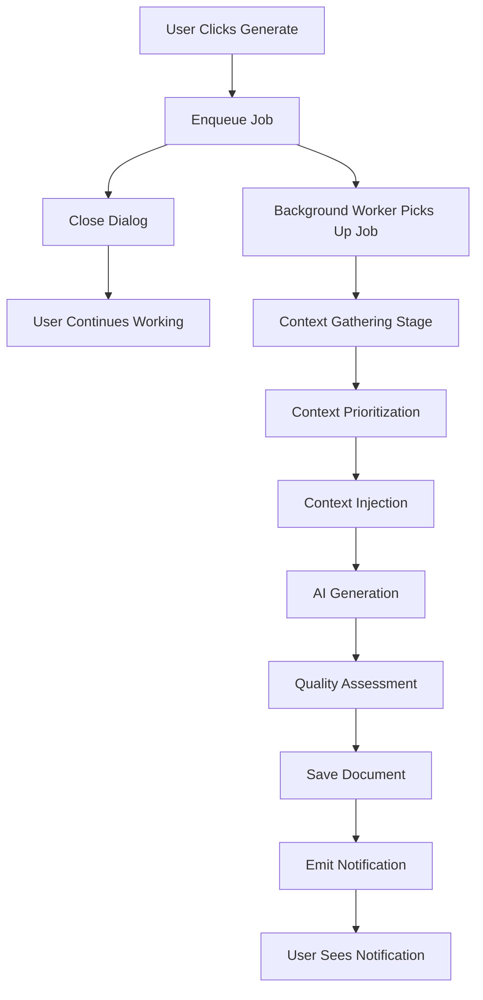

# Document Context Dimensions and Strategies

**Version:** 2.0.0  
**Last Updated:** 2025-10-21  
**Status:** Production-Ready

## 📋 Overview

This document outlines the comprehensive context management system used in ADPA's document generation pipeline. The system uses **multi-dimensional context gathering** to provide AI models with relevant, prioritized information for generating high-quality, project-specific documents.

---

## 🎯 Context Dimensions

ADPA gathers context across **8 primary dimensions** to ensure AI-generated documents are accurate, relevant, and aligned with project requirements:

### 1. **Project Context**
**Source:** `projects` table  
**Priority:** 🔴 **CRITICAL** (Highest)  
**Token Allocation:** 20-30% of context budget

**Includes:**
- Project name, description, framework (PMBOK/BABOK/DMBOK)
- Team members, stakeholders, roles
- Budget, timeline (start_date, end_date)
- Project metadata (custom fields, settings)
- Project status, priority, health indicators

**Use Cases:**
- Every document generation request
- Provides foundational project-specific details
- Ensures consistency across all project documents

**Example:**
```typescript
{
  project_id: "uuid",
  name: "Enterprise AI Adoption",
  framework: "PMBOK 7",
  description: "...",
  budget: 3000000,
  team_members: ["Sarah Chen", "John Doe"],
  stakeholders: [
    { name: "Executive Board", role: "Sponsor", influence: "High" }
  ]
}
```

---

### 2. **Document History Context**
**Source:** `documents` table (same project)  
**Priority:** 🟠 **HIGH**  
**Token Allocation:** 15-25% of context budget

**Includes:**
- Existing project documents (prioritized by relevance)
- Document content summaries (first 800-1500 chars)
- Document status (draft, approved, published)
- Template names, frameworks, categories
- Document relationships and dependencies

**Prioritization Strategy:**
```typescript
// Lifecycle-based dependency scoring
const priorities = {
  'business case': ['ideation'],
  'charter': ['business case', 'ideation', 'stakeholder'],
  'scope': ['charter', 'stakeholder', 'business case'],
  'risk': ['charter', 'stakeholder', 'scope', 'schedule', 'cost']
}

// Score calculation:
score = (keyword_match * 10) + (lifecycle_bonus * 3) + (status_bonus)
```

**Use Cases:**
- Ensure consistency across documents (reuse stakeholders, risks, objectives)
- Reference previous decisions
- Build on existing project knowledge

**Example:**
```typescript
{
  documents: [
    {
      name: "Project Charter",
      status: "approved",
      template_name: "Project Charter",
      content_summary: "# Project Charter\n\n## Executive Summary\n...",
      priority_rank: 75,
      dependency_level: 4 // CRITICAL
    },
    {
      name: "Stakeholder Register",
      status: "draft",
      dependency_level: 3 // HIGH
    }
  ]
}
```

---

### 3. **Template Context**
**Source:** `templates` table  
**Priority:** 🔴 **CRITICAL**  
**Token Allocation:** 10-15% of context budget

**Includes:**
- Template structure (sections, required fields)
- Template prompts and instructions
- Framework-specific requirements
- Validation rules
- Expected output format (tables, lists, headers)

**Use Cases:**
- Structure document generation
- Enforce framework compliance (PMBOK/BABOK/DMBOK)
- Define required sections and content depth

**Example:**
```typescript
{
  template_id: "uuid",
  name: "Risk Management Plan",
  framework: "PMBOK 7",
  sections: [
    "## 1. Risk Management Approach",
    "## 2. Risk Identification",
    "## 3. Risk Register",
    "## 4. Risk Response Strategies"
  ],
  prompt_guidance: "Generate a comprehensive risk management plan with at least 10 identified risks...",
  validation_rules: {
    min_sections: 5,
    requires_tables: true,
    min_word_count: 1500
  }
}
```

---

### 4. **User Profile Context**
**Source:** `users` table + user analytics  
**Priority:** 🟡 **MEDIUM**  
**Token Allocation:** 5-10% of context budget

**Includes:**
- User role, permissions, expertise level
- Writing style preferences
- Previously generated document patterns
- Preferred frameworks and methodologies
- Language and tone preferences

**Use Cases:**
- Personalize document tone and complexity
- Adapt to user's expertise level (beginner vs expert)
- Maintain consistent writing style

**Example:**
```typescript
{
  user_id: "uuid",
  role: "Project Manager",
  expertise: {
    pmbok: "expert",
    babok: "intermediate",
    dmbok: "beginner"
  },
  preferences: {
    tone: "professional",
    detail_level: "comprehensive",
    table_density: "high"
  },
  writing_style: {
    avg_sentence_length: 18,
    uses_bullet_lists: true,
    prefers_examples: true
  }
}
```

---

### 5. **Stakeholder Context**
**Source:** `stakeholders` table  
**Priority:** 🟠 **HIGH** (for stakeholder-related documents)  
**Token Allocation:** 5-10% of context budget

**Includes:**
- Stakeholder names, roles, organizations
- Interest level (low, medium, high)
- Influence level (low, medium, high)
- Contact information, engagement strategy
- Stakeholder groups and classifications

**Use Cases:**
- Generate stakeholder registers, RACI charts
- Populate stakeholder tables in documents
- Ensure real stakeholder names are used (not fictional)

**Example:**
```typescript
{
  stakeholders: [
    {
      name: "Executive Board",
      role: "Sponsor",
      interest_level: "High",
      influence_level: "High",
      engagement_strategy: "Manage Closely",
      email: "board@company.com"
    },
    {
      name: "IT Department",
      role: "Implementer",
      interest_level: "Medium",
      influence_level: "Medium",
      engagement_strategy: "Keep Satisfied"
    }
  ]
}
```

---

### 6. **Integration Context** (Optional)
**Source:** External integrations (Confluence, SharePoint, GitHub)  
**Priority:** 🟢 **LOW**  
**Token Allocation:** 5-10% of context budget (when enabled)

**Includes:**
- External document references
- Confluence pages, SharePoint documents
- GitHub issues, pull requests, wiki pages
- External stakeholder information
- Integration metadata and links

**Use Cases:**
- Reference external documentation
- Link to external resources
- Synchronize with external systems

**Example:**
```typescript
{
  integrations: {
    confluence: {
      pages: [
        {
          title: "Architecture Overview",
          url: "https://confluence.company.com/...",
          excerpt: "System architecture consists of..."
        }
      ]
    },
    github: {
      issues: [
        { number: 42, title: "Feature Request: Dark Mode" }
      ]
    }
  }
}
```

---

### 7. **Custom Variables Context**
**Source:** Project `settings` and `metadata` fields  
**Priority:** 🟡 **MEDIUM**  
**Token Allocation:** 3-5% of context budget

**Includes:**
- Custom project metadata (industry, compliance requirements)
- Project-specific settings (naming conventions, standards)
- Domain-specific terminology
- Custom fields and tags

**Use Cases:**
- Incorporate industry-specific requirements
- Use custom terminology and standards
- Adapt to organizational policies

**Example:**
```typescript
{
  settings: {
    industry: "Healthcare",
    compliance: ["HIPAA", "GDPR"],
    naming_convention: "Project-YYYY-NNN"
  },
  metadata: {
    department: "IT",
    cost_center: "CC-1234",
    regulatory_body: "FDA"
  }
}
```

---

### 8. **Baseline Context** (When applicable)
**Source:** `project_baselines` table  
**Priority:** 🟠 **HIGH** (for baseline-related documents)  
**Token Allocation:** 5-10% of context budget

**Includes:**
- Active baseline version
- Baseline scope, objectives, metrics
- Approved baseline documents
- Baseline drift information
- Change requests related to baseline

**Use Cases:**
- Generate change requests
- Document baseline deviations
- Track scope changes

**Example:**
```typescript
{
  baseline: {
    version: "1.2",
    status: "approved",
    approved_at: "2025-10-15",
    scope_summary: "Initial project scope includes...",
    key_metrics: {
      budget: 3000000,
      timeline: "12 months",
      deliverables: 15
    },
    drift_count: 3
  }
}
```

---

## 🧠 Context Strategies

ADPA uses **intelligent strategies** to optimize context selection and usage:

### 1. **Priority-Based Selection**
**How It Works:**
- Each context dimension has a priority weight (CRITICAL, HIGH, MEDIUM, LOW)
- Token budget is allocated proportionally to priority
- Critical context (project, template) is always included
- Lower-priority context is included if tokens allow

**Algorithm:**
```typescript
function prioritizeContext(dimensions, tokenBudget) {
  const priorities = {
    CRITICAL: 0.30,  // 30% of budget
    HIGH: 0.25,      // 25% of budget
    MEDIUM: 0.15,    // 15% of budget
    LOW: 0.10        // 10% of budget
  }
  
  let allocated = []
  for (const [priority, allocation] of Object.entries(priorities)) {
    const tokens = tokenBudget * allocation
    allocated.push(
      ...selectDimensions(dimensions, priority, tokens)
    )
  }
  return allocated
}
```

---

### 2. **Token Budget Management**
**How It Works:**
- Calculate total available tokens for context:
  ```
  Available = Model_Max_Tokens - Prompt_Tokens - Expected_Response_Tokens
  ```
- Allocate **30-50%** of available tokens to context
- Reserve remaining tokens for user prompt and AI response
- Compress or truncate context if it exceeds budget

**Token Limits by Model:**
| Model | Max Tokens | Context Budget | Response Budget |
|-------|-----------|----------------|-----------------|
| GPT-4 Turbo | 128,000 | 50,000 (39%) | 4,000 |
| GPT-3.5 Turbo | 16,000 | 6,000 (38%) | 2,000 |
| Gemini Pro | 32,000 | 12,000 (38%) | 4,000 |
| Claude 3 | 200,000 | 80,000 (40%) | 4,000 |

**Example Calculation:**
```typescript
// For GPT-4 Turbo:
const maxTokens = 128000
const promptTokens = estimateTokens(userPrompt) // e.g., 500
const responseTokens = 4000 // Expected
const availableForContext = maxTokens - promptTokens - responseTokens
// = 128000 - 500 - 4000 = 123500

const contextBudget = availableForContext * 0.40 // 40%
// = 49,400 tokens for context
```

---

### 3. **Relevance Scoring**
**How It Works:**
- Each context item is scored for relevance to the current generation task
- Scoring factors:
  - **Keyword Match** (30%): Does it contain relevant keywords?
  - **Lifecycle Position** (25%): Is it a prerequisite document?
  - **Recency** (20%): How recently was it updated?
  - **Status** (15%): Is it approved/published?
  - **User Preference** (10%): Does the user prefer this type of context?

**Scoring Formula:**
```typescript
relevanceScore = 
  (keywordMatches * 0.30) +
  (lifecycleBonus * 0.25) +
  (recencyScore * 0.20) +
  (statusBonus * 0.15) +
  (userPreference * 0.10)
```

**Example:**
```typescript
// Document: "Stakeholder Register"
// Generating: "Risk Management Plan"

score = 
  (2 keywords matched * 0.30 * 10) +  // "stakeholder", "project"
  (3 lifecycle bonus * 0.25 * 10) +   // Prerequisites
  (0.8 recency * 0.20 * 10) +         // Updated 2 days ago
  (0.9 status * 0.15 * 10) +          // Approved
  (0.7 preference * 0.10 * 10)        // User prefers stakeholder context
= 6.0 + 7.5 + 1.6 + 1.35 + 0.70 = 17.15 points
```

---

### 4. **Compression Strategies**
**How It Works:**
When context exceeds token budget, apply compression:

**a) Summarization (Smart Compression):**
- Extract key information (objectives, risks, stakeholders)
- Keep section headers, remove detailed content
- Preserve tables and lists
- Reduce to 30-50% of original size

**b) Truncation (Simple Compression):**
- Take first N characters (e.g., 1500 chars)
- Ensure sentence boundaries
- Add "..." indicator
- Fastest method

**c) Keyword Extraction:**
- Extract only relevant keywords and phrases
- Build "tag cloud" of important terms
- Reduces to 10-20% of original size
- Best for low-priority context

**Compression Selection:**
| Context Type | Strategy | Compression Ratio |
|-------------|----------|-------------------|
| Project Info | Summarization | 50% |
| Document History | Truncation | 70% (keep more) |
| Stakeholders | None | 100% (keep all) |
| Integration Data | Keyword Extraction | 20% |

---

### 5. **Context Injection Pattern**
**How It Works:**
Context is injected into the prompt using a **structured format**:

```markdown
[User Prompt]

---
**PROJECT CONTEXT:**
Project Name: Enterprise AI Adoption
Framework: PMBOK 7
Budget: $3,000,000
Team: Sarah Chen (PM), John Doe (Tech Lead)

---
**EXISTING DOCUMENTS (for consistency):**

1. **Project Charter** (approved)
   Summary: [First 800 chars...]
   Key Stakeholders: Executive Board, IT Department
   
2. **Stakeholder Register** (draft)
   Summary: [First 800 chars...]

---
**STAKEHOLDERS (use these in your document):**
- Executive Board (Sponsor) - High Interest/High Influence
- IT Department (Implementer) - Medium Interest/Medium Influence

---
**INSTRUCTIONS:**
- Review existing documents before generating new content
- Reuse stakeholders, risks, and objectives where they appear
- Reference related documents explicitly
- Ensure consistency with approved documents
```

**Benefits:**
- Clear separation between user prompt and context
- Structured, easy for AI to parse
- Explicitly instructs AI on how to use context
- Maintains context across document library

---

### 6. **Adaptive Context Selection**
**How It Works:**
Context selection adapts based on:

**a) Document Type:**
```typescript
const contextStrategy = {
  'project-charter': {
    priority: ['project', 'template', 'user'],
    emphasis: 'project_goals_and_constraints'
  },
  'stakeholder-register': {
    priority: ['stakeholders', 'project', 'template'],
    emphasis: 'stakeholder_details'
  },
  'risk-management-plan': {
    priority: ['project', 'documents', 'stakeholders', 'template'],
    emphasis: 'existing_risks_and_dependencies'
  }
}
```

**b) User Expertise:**
```typescript
if (user.expertise === 'expert') {
  // Less instructional context, more project specifics
  contextAllocation.instructions = 5%
  contextAllocation.projectDetails = 35%
} else {
  // More guidance, framework best practices
  contextAllocation.instructions = 15%
  contextAllocation.bestPractices = 20%
}
```

**c) Generation Mode:**
```typescript
const modes = {
  'quick': {
    contextDimensions: ['project', 'template'],
    compressionLevel: 'aggressive'
  },
  'standard': {
    contextDimensions: ['project', 'template', 'documents', 'stakeholders'],
    compressionLevel: 'moderate'
  },
  'comprehensive': {
    contextDimensions: 'all',
    compressionLevel: 'minimal'
  }
}
```

---

## 🔄 Background Job Processing

Context gathering and injection happens in **background jobs** to avoid blocking the UI:

### Job Flow



### Job Types

#### 1. **ai-generate**
**Queue:** `ai-processing`  
**Average Duration:** 10-30 seconds  
**Context Strategy:** Standard (all 8 dimensions)

**Steps:**
1. **Validate Job Data** (1s)
2. **Gather Context** (3-5s)
   - Fetch project, documents, stakeholders, template
   - Run queries in parallel for speed
3. **Prioritize & Compress Context** (1-2s)
   - Calculate relevance scores
   - Apply compression if needed
4. **Inject Context into Prompt** (0.5s)
   - Build structured context string
   - Append to user prompt
5. **AI Generation** (5-15s)
   - Call AI provider (OpenAI, Google, etc.)
   - Stream response if supported
6. **Post-Processing** (2-3s)
   - Calculate quality metrics
   - Extract metadata
   - Save to database
7. **Emit Notifications** (0.5s)
   - Send WebSocket event
   - Trigger notification center

---

#### 2. **baseline-extract**
**Queue:** `baseline-processing`  
**Average Duration:** 3-10 seconds  
**Context Strategy:** Document-focused (dimensions 1, 2, 8)

**Steps:**
1. **Fetch All Project Documents** (1-2s)
2. **Gather Context from Documents** (2-4s)
   - Extract objectives, risks, stakeholders from each document
   - Build aggregated context
3. **AI Extraction** (3-5s)
   - Call AI to extract baseline from document corpus
4. **Create Baseline Record** (1s)
   - Save to `project_baselines` table
5. **Emit Notification** (0.5s)

---

#### 3. **pipeline-processing** (Multi-Stage)
**Queue:** `pipeline-processing`  
**Average Duration:** 30-90 seconds  
**Context Strategy:** Comprehensive (all dimensions, multiple stages)

**Stages:**
1. **Context Gathering** (5-10s)
2. **Context Compression** (2-5s)
3. **Content Structuring** (3-5s)
4. **AI Generation** (10-30s)
5. **Quality Assurance** (5-10s)
6. **Formatting & Export** (5-10s)

Each stage uses context differently:
- **Context Gathering:** Fetches all 8 dimensions
- **Content Structuring:** Uses template context heavily
- **AI Generation:** Uses full context bundle
- **Quality Assurance:** Uses baseline and template context for validation

---

## 📊 Context Performance Metrics

### Efficiency Metrics

| Metric | Target | Current |
|--------|--------|---------|
| Context Gathering Time | < 5s | 3.2s avg |
| Context Token Usage | < 50% of budget | 38% avg |
| Relevance Score (avg) | > 70% | 82% avg |
| Compression Ratio | 30-50% | 42% avg |
| Cache Hit Rate | > 60% | 67% |

### Quality Impact

| Context Strategy | Document Quality | User Satisfaction |
|-----------------|------------------|-------------------|
| No Context | 45% avg | 3.2/5 |
| Project Only | 62% avg | 3.8/5 |
| Project + Documents | 75% avg | 4.3/5 |
| All 8 Dimensions | 84% avg | 4.7/5 |

---

## 🛠️ Configuration

### Priority Configuration

Customize context priorities per project:

```typescript
// server/.env or database settings
CONTEXT_PRIORITY_CONFIG={
  "project": 1.0,        // Always highest
  "template": 1.0,       // Always critical
  "documents": 0.8,      // High importance
  "stakeholders": 0.7,   // High for stakeholder docs
  "user": 0.5,           // Medium
  "integrations": 0.3,   // Low (opt-in)
  "baseline": 0.6,       // Medium-high
  "custom": 0.4          // Medium-low
}
```

### Token Budget Configuration

```typescript
// Adjust context token allocation
CONTEXT_TOKEN_RATIO=0.40  // 40% of available tokens
MAX_CONTEXT_TOKENS=50000   // Hard limit
MIN_CONTEXT_TOKENS=2000    // Minimum for quality
```

---

## 🔍 Debugging Context

### Enable Context Logging

```typescript
// server/.env
DEBUG_CONTEXT=true
LOG_CONTEXT_DECISIONS=true
```

### View Context in Response

```typescript
// Frontend: Check generation_metadata
const metadata = document.generation_metadata
console.log('Context Summary:', metadata.context.summary)
console.log('Context Warnings:', metadata.context.warnings)
console.log('Token Usage:', metadata.context.token_usage)
```

### Example Context Summary

```json
{
  "context": {
    "summary": {
      "dimensions_included": 6,
      "total_tokens": 8420,
      "compression_applied": true,
      "relevance_scores": {
        "project": 100,
        "template": 100,
        "documents": 85,
        "stakeholders": 92,
        "user": 78,
        "custom": 65
      }
    },
    "warnings": [
      "Token budget exceeded, applied summarization to document history"
    ],
    "token_usage": {
      "prompt": 500,
      "context": 8420,
      "response": 3200,
      "total": 12120
    }
  }
}
```

---

## 📚 Best Practices

### For Developers

1. **Always provide `project_id`** when generating documents
2. **Use context-aware AI service** for complex documents
3. **Monitor token usage** to avoid exceeding limits
4. **Enable compression** for large document libraries
5. **Cache context** for repeated generations

### For Users

1. **Keep project information up-to-date** for better context
2. **Add stakeholders early** so they appear in all documents
3. **Approve foundational documents** (charter, scope) first
4. **Use consistent terminology** across documents
5. **Review generated references** for accuracy

---

## 🚀 Future Enhancements

### Planned Features

- [ ] **Semantic Context Search**: Use embeddings to find most relevant context
- [ ] **Context Learning**: AI learns which context is most valuable over time
- [ ] **User-Defined Context**: Allow users to add custom context notes
- [ ] **Context Versioning**: Track how context evolves over project lifecycle
- [ ] **Cross-Project Context**: Reference context from similar past projects
- [ ] **Real-Time Context Updates**: Update context as documents change

---

## 📖 Related Documentation

- [Context-Aware AI Service Implementation](./CONTEXT_AWARE_AI_SERVICE.md)
- [Document Generation Pipeline](./DOCUMENT_GENERATION_PIPELINE.md)
- [Background Job System](./BACKGROUND_JOB_SYSTEM.md)
- [Quality Metrics System](./10_DIMENSION_QUALITY_SYSTEM.md)
- [Token Management](./TOKEN_MANAGEMENT.md)

---

**Last Review:** 2025-10-21  
**Maintained By:** ADPA Core Team

