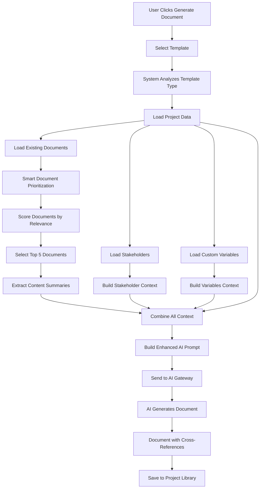

# Intelligent Document Context System - Flow Diagram

**Visual Guide to Document Generation with Smart Context**

---

## System Architecture



---

## Document Prioritization Algorithm

```
┌─────────────────────────────────────────────────────────────┐
│ Step 1: Template Type Analysis                             │
│ Input: "Risk Management Plan"                              │
│ Output: Priority keywords = ['charter', 'stakeholder',     │
│          'scope', 'schedule', 'cost']                      │
└─────────────────────────────────────────────────────────────┘
                          ↓
┌─────────────────────────────────────────────────────────────┐
│ Step 2: Document Scoring                                   │
│                                                             │
│ For each existing document:                                │
│   1. Check if name/template contains priority keywords     │
│   2. Calculate score based on keyword position             │
│   3. Add bonus for approved/final status                   │
│                                                             │
│ Example Scores:                                            │
│   Project Charter (charter) → 50 + 5 (approved) = 55 ⭐    │
│   Stakeholder Register (stakeholder) → 40 + 3 = 43 ⭐      │
│   Scope Plan (scope) → 30 points = 30 ⭐                   │
│   User Stories → 0 points (excluded)                       │
└─────────────────────────────────────────────────────────────┘
                          ↓
┌─────────────────────────────────────────────────────────────┐
│ Step 3: Selection & Extraction                             │
│   1. Sort by score (highest first)                         │
│   2. Take top 5 documents                                  │
│   3. Extract content preview (first 1500 chars)            │
│   4. Identify key sections (objectives, risks, etc.)       │
└─────────────────────────────────────────────────────────────┘
                          ↓
┌─────────────────────────────────────────────────────────────┐
│ Step 4: Context Injection                                  │
│   → Add to AI prompt with consistency instructions         │
└─────────────────────────────────────────────────────────────┘
```

---

## Context Building Flow

```
┌──────────────────────────────────────────────────────────────────┐
│                    CONTEXT BUILDER                               │
│                                                                  │
│  1. BASE PROJECT INFO (Always Included)                         │
│     ├─ Project Name                                             │
│     ├─ Framework (PMBOK, DMBOK, BABOK)                         │
│     ├─ Description                                              │
│     ├─ Team Members                                             │
│     ├─ Budget                                                   │
│     └─ Timeline                                                 │
│                          ↓                                       │
│  2. DOCUMENT LIBRARY CONTEXT (🆕 NEW!)                          │
│     ├─ Prioritize relevant documents                           │
│     ├─ Extract content summaries                               │
│     ├─ Identify key sections                                   │
│     └─ Add consistency instructions                            │
│                          ↓                                       │
│  3. STAKEHOLDER CONTEXT (🆕 NEW!)                               │
│     ├─ List all project stakeholders                           │
│     ├─ Include roles and influence                             │
│     ├─ Add contact information                                 │
│     └─ Instruct AI to use real stakeholders                    │
│                          ↓                                       │
│  4. CUSTOM VARIABLES CONTEXT (🆕 NEW!)                          │
│     ├─ Extract settings JSON                                   │
│     ├─ Extract metadata JSON                                   │
│     └─ Add variable usage instructions                         │
│                          ↓                                       │
│  5. COMBINE & INJECT INTO AI PROMPT                            │
│     └─ Enhanced prompt with full context                       │
└──────────────────────────────────────────────────────────────────┘
```

---

## Example: Risk Plan Generation with Full Context

### Input
```
Template: Risk Management Plan
Project: Enterprise Data Governance Framework
Existing Documents: 
  - Project Charter (approved, 5000 words)
  - Stakeholder Register (final, 3000 words)
Stakeholders: 12 stakeholders in database
Custom Variables: compliance_frameworks: "GDPR, HIPAA, SOC 2"
```

### Context Built
```
✅ Base project info: 500 tokens
✅ Document library: 3 documents, 1000 tokens
   └─ Project Charter (55 score) ⭐⭐⭐
   └─ Stakeholder Register (43 score) ⭐⭐
   └─ Scope Plan (30 score) ⭐
✅ Stakeholders: 12 stakeholders, 500 tokens
✅ Custom variables: 2 settings, 250 tokens
───────────────────────────────────────
Total context: ~14,500 tokens
```

### AI Output
```markdown
# Risk Management Plan

## 1. Executive Summary
As outlined in the **Project Charter (Section 2.1)**, the Enterprise Data 
Governance Framework project aims to reduce manual data reconciliation by 70% 
and achieve a 90% data quality score...

## 3. Risk Register

| Risk ID | Risk | Owner | Mitigation |
|---|---|---|---|
| R-01 | Data Quality Issues | **Dr. Alistair Finch** (CIO) | ... |
| R-02 | Stakeholder Resistance | **David Chen** (VP GRC) | Engage VRM Team early (see Stakeholder Register) |
| R-03 | GDPR Compliance Gaps | **Maria Santos** (CISO) | Leverage compliance frameworks: GDPR, HIPAA, SOC 2 |

**Note**: Risk owners align with the stakeholder matrix defined in the 
**Stakeholder Register** and the governance structure in the **Project Charter**.
```

**Key Features**:
- ✅ References "Project Charter" and "Stakeholder Register"
- ✅ Uses real stakeholder names (Dr. Finch, David Chen, Maria Santos)
- ✅ Incorporates custom variables (GDPR, HIPAA, SOC 2)
- ✅ Maintains consistency with Charter objectives

---

## Priority Matrix Reference

### Complete Priority Mapping

| Template Type | Priority Documents (Highest to Lowest) |
|---|---|
| 🎯 **Risk Management** | Charter → Stakeholder → Scope → Schedule → Cost |
| 👥 **Stakeholder Register** | Charter → Communication → Scope |
| 📢 **Communication Plan** | Stakeholder → Charter → Scope |
| 📋 **Scope Management** | Charter → Stakeholder → Requirements |
| 📅 **Schedule Management** | Charter → Scope → Resources |
| 💰 **Cost Management** | Charter → Scope → Schedule → Resources |
| ✅ **Quality Management** | Charter → Scope → Requirements |
| 👷 **Resource Management** | Charter → Scope → Schedule |
| 🛒 **Procurement Plan** | Charter → Scope → Cost → Risk |
| 🔗 **Integration Plan** | Charter → All Plans |
| 📝 **Requirements Doc** | Charter → Stakeholder → Scope |
| 💼 **Business Case** | Stakeholder → Risk → Cost |
| 📖 **Project Mgmt Plan** | ALL Documents (comprehensive) |
| 🔧 **Other Templates** | Charter → Stakeholder → Scope → Risk → Schedule → Cost (default) |

---

## Console Output Breakdown

When you generate a document, the console shows:

```
📚 [CONTEXT-1/3] Document Library Analysis:
  Total documents in project: 8
  Template being generated: Risk Management Plan
  Prioritized documents selected: 3
  Selected documents: Project Charter, Stakeholder Register, Scope Management Plan
```
**Meaning**: Found 8 docs, selected the top 3 most relevant for "Risk Management Plan"

```
👥 [CONTEXT-2/3] Stakeholder Analysis:
  Stakeholders available: 12
  Stakeholder names: Dr. Alistair Finch, Maria Santos, David Chen, ...
```
**Meaning**: 12 stakeholders will be included in the context for accurate tables

```
⚙️ [CONTEXT-3/3] Custom Variables Analysis:
  Settings available: 2
  Metadata available: 3
```
**Meaning**: 2 custom settings and 3 metadata entries will be included

```
📊 [CONTEXT SUMMARY]
  ✅ Base project info included
  📚 Document library context: 3 documents
  👥 Stakeholder context: 12 stakeholders
  ⚙️ Custom variables: settings metadata
  📏 Estimated tokens: 12125
```
**Meaning**: Final context breakdown with token estimate

---

## Feature Flags & Configuration

### Current Configuration

| Setting | Value | Location |
|---|---|---|
| **Max documents in context** | 5 | Line 485: `.slice(0, 5)` |
| **Content preview length** | 1500 chars | Line 508: `.substring(0, 1500)` |
| **Summary length** | 800 chars | Line 517: `.substring(0, 800)` |
| **Min score for inclusion** | > 0 | Line 483: `.filter(item => item.score > 0)` |
| **Document statuses** | final, approved, draft | Line 464 |

### To Adjust:

**Include more documents**:
```typescript
.slice(0, 5) → .slice(0, 10) // Top 10 instead of top 5
```

**Longer content previews**:
```typescript
.substring(0, 1500) → .substring(0, 3000)
```

**Stricter filtering** (only approved docs):
```typescript
.filter(doc => doc.status === 'final' || doc.status === 'approved' || doc.status === 'draft')
// Change to:
.filter(doc => doc.status === 'approved')
```

---

## Monitoring & Analytics

### Metrics to Track
1. **Context utilization rate**: % of generations that use document context
2. **Document reference rate**: % of generated docs that include cross-references
3. **Stakeholder accuracy**: % of stakeholder tables using real stakeholders
4. **User satisfaction**: Feedback on document quality improvement

### How to Measure
- Monitor console logs for context usage
- Search generated documents for phrases like "As defined in the"
- Check stakeholder tables for fictional vs. real names
- Collect user feedback on editing effort reduction

---

## Future Enhancements

### Phase 2: Smart Content Extraction
Instead of text summaries, extract structured data:
```json
{
  "objectives": ["Reduce reconciliation 70%", "Achieve 90% DQ"],
  "stakeholders": [{"name": "Dr. Finch", "role": "CIO"}],
  "risks": [{"id": "R-01", "name": "Data Quality"}]
}
```

### Phase 3: Semantic Search
Use embeddings to find relevant content by meaning, not just keywords:
```typescript
// Find documents semantically similar to the template being generated
const similar = await semanticSearch(templateContent.description, documents)
```

### Phase 4: Document Dependency Graph
```
Charter
├── Stakeholder Register
├── Scope Plan
│   ├── Requirements Doc
│   └── Quality Plan
├── Schedule Plan
│   └── Resource Plan
└── Risk Plan
```

---

## Conclusion

✅ **Intelligent Document Context System is LIVE!**

**Impact Summary**:
- 📚 Documents are now context-aware
- 🔗 Automatic cross-referencing
- 👥 Real stakeholder data
- ⚙️ Custom variable integration
- 🎯 Professional, consistent documentation

**Try it now by generating a document on your project!** 🚀

