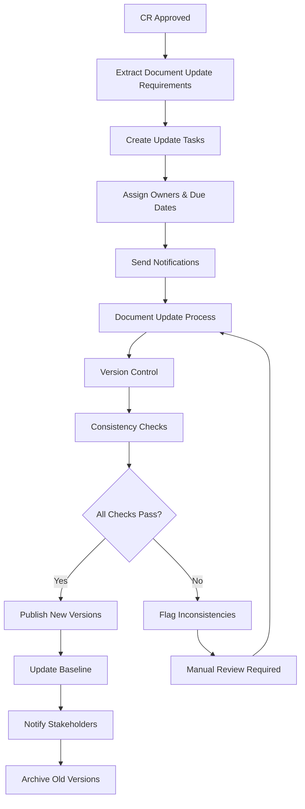

# Document Version Control & Cascading Updates System
**Enterprise-Grade Change Management with Water-Tight Documentation**

---

## 🎯 **The Challenge You Identified**

**Problem Statement:**
> "The Change Request could also include a section which provides next steps: rerun the project charter, rerun scope because of scope adjustments, rerun resource management plan, rerun the cost management plan. This would enable the change request to identify areas for project documentation that requires adjustment or rerun to get to integration of the change request in the documentation. The documentation itself needs to have a working version control to make this process water tight and leaving no gaps in the documentation."

**This is CRITICAL for enterprise PMO governance!**

---

## ✅ **Solution: Comprehensive Document Version Control System**

### **1. Enhanced Change Request Template**

**New Section 9: Document Version Control & Cascading Updates**

**Key Features:**
- ✅ **Immediate Regeneration List** (Project Charter, Scope, Resource, Cost, Schedule Plans)
- ✅ **Secondary Update Requirements** (Risk, Quality, Communication, Procurement Plans)
- ✅ **Version Control Standards** (v2.1 format, change logs, archive policy)
- ✅ **Integration & Consistency Checks** (cross-document validation)
- ✅ **Implementation Timeline** (with owners, dates, status tracking)
- ✅ **Quality Gates** (review process, consistency validation)
- ✅ **Communication Plan** (stakeholder notification, training)

---

## 🗄️ **Database Schema for Document Version Control**

### **Core Tables:**

```sql
-- Document versions tracking
CREATE TABLE document_versions (
  id UUID PRIMARY KEY DEFAULT gen_random_uuid(),
  document_id UUID NOT NULL REFERENCES documents(id),
  version_number VARCHAR(20) NOT NULL, -- e.g., "2.1", "3.0"
  version_type VARCHAR(20) NOT NULL, -- 'major', 'minor', 'patch'
  change_summary TEXT NOT NULL,
  change_reason VARCHAR(100) NOT NULL, -- 'CR-2026-004', 'Baseline update', 'Error correction'
  created_by UUID NOT NULL REFERENCES users(id),
  created_at TIMESTAMP DEFAULT NOW(),
  approved_by UUID REFERENCES users(id),
  approved_at TIMESTAMP,
  status VARCHAR(20) DEFAULT 'draft', -- 'draft', 'under_review', 'approved', 'published'
  content JSONB NOT NULL, -- Full document content
  metadata JSONB, -- Version-specific metadata
  UNIQUE(document_id, version_number)
);

-- Document dependencies (which docs affect which docs)
CREATE TABLE document_dependencies (
  id UUID PRIMARY KEY DEFAULT gen_random_uuid(),
  source_document_id UUID NOT NULL REFERENCES documents(id),
  target_document_id UUID NOT NULL REFERENCES documents(id),
  dependency_type VARCHAR(50) NOT NULL, -- 'requires_update', 'validates', 'references'
  change_impact VARCHAR(20) NOT NULL, -- 'high', 'medium', 'low'
  description TEXT,
  created_at TIMESTAMP DEFAULT NOW(),
  UNIQUE(source_document_id, target_document_id, dependency_type)
);

-- Change request document update requirements
CREATE TABLE cr_document_updates (
  id UUID PRIMARY KEY DEFAULT gen_random_uuid(),
  change_request_id UUID NOT NULL REFERENCES documents(id), -- CR document
  target_document_id UUID NOT NULL REFERENCES documents(id), -- Document to update
  update_priority VARCHAR(20) NOT NULL, -- 'high', 'medium', 'low'
  update_reason TEXT NOT NULL,
  required_changes TEXT NOT NULL,
  assigned_to UUID REFERENCES users(id),
  due_date DATE,
  status VARCHAR(20) DEFAULT 'pending', -- 'pending', 'in_progress', 'completed', 'overdue'
  created_at TIMESTAMP DEFAULT NOW(),
  completed_at TIMESTAMP,
  notes TEXT
);

-- Document consistency checks
CREATE TABLE document_consistency_checks (
  id UUID PRIMARY KEY DEFAULT gen_random_uuid(),
  check_name VARCHAR(100) NOT NULL,
  source_document_id UUID NOT NULL REFERENCES documents(id),
  target_document_id UUID NOT NULL REFERENCES documents(id),
  check_type VARCHAR(50) NOT NULL, -- 'budget_alignment', 'schedule_alignment', 'scope_alignment'
  check_query TEXT NOT NULL, -- SQL or validation logic
  last_run_at TIMESTAMP,
  last_result JSONB, -- Pass/fail with details
  auto_fix_enabled BOOLEAN DEFAULT FALSE,
  created_at TIMESTAMP DEFAULT NOW()
);

-- Document update workflow
CREATE TABLE document_update_workflows (
  id UUID PRIMARY KEY DEFAULT gen_random_uuid(),
  workflow_name VARCHAR(100) NOT NULL,
  trigger_event VARCHAR(50) NOT NULL, -- 'cr_approved', 'baseline_updated', 'manual'
  document_types TEXT[] NOT NULL, -- Array of document types to update
  update_order INTEGER[], -- Order of document updates
  approval_required BOOLEAN DEFAULT TRUE,
  notification_required BOOLEAN DEFAULT TRUE,
  created_at TIMESTAMP DEFAULT NOW(),
  is_active BOOLEAN DEFAULT TRUE
);
```

---

## 🔄 **Automated Cascading Update Process**

### **Workflow Design:**



### **Implementation Logic:**

```typescript
// When CR is approved, trigger cascading updates
async function processCRApproval(crId: string) {
  // 1. Extract document update requirements from CR
  const updateRequirements = await extractDocumentUpdateRequirements(crId);
  
  // 2. Create update tasks for each required document
  for (const requirement of updateRequirements) {
    await createDocumentUpdateTask({
      crId,
      targetDocumentId: requirement.documentId,
      priority: requirement.priority,
      reason: requirement.reason,
      requiredChanges: requirement.changes,
      dueDate: calculateDueDate(requirement.priority)
    });
  }
  
  // 3. Send notifications to document owners
  await notifyDocumentOwners(updateRequirements);
  
  // 4. Start monitoring update progress
  await startUpdateProgressMonitoring(crId);
}

// Document update process
async function updateDocument(documentId: string, updateTaskId: string) {
  // 1. Create new version
  const newVersion = await createDocumentVersion(documentId, {
    changeReason: 'CR Update',
    changeSummary: 'Updated per approved change request',
    content: await generateUpdatedContent(documentId, updateTaskId)
  });
  
  // 2. Run consistency checks
  const consistencyResults = await runConsistencyChecks(documentId);
  
  // 3. If checks pass, approve and publish
  if (consistencyResults.allPassed) {
    await approveDocumentVersion(newVersion.id);
    await publishDocumentVersion(newVersion.id);
  } else {
    await flagInconsistencies(newVersion.id, consistencyResults);
  }
}
```

---

## 📋 **Document Update Requirements Matrix**

### **CR-2026-004 Example (Budget Increase):**

| Document | Priority | Reason | Required Updates | Owner | Due Date |
|:---------|:---------|:-------|:-----------------|:------|:---------|
| **Project Charter** | High | Budget change | Objectives, success criteria, budget allocation | PM | 3 days |
| **Cost Management Plan** | High | Budget increase | Budget breakdown, contingency reserves | Finance | 2 days |
| **Resource Management Plan** | High | Resource allocation | Resource requirements, allocation matrix | PM | 3 days |
| **Schedule Management Plan** | Medium | Timeline impact | Milestone dates, critical path | PM | 5 days |
| **Risk Management Plan** | Medium | New risks | Risk register, mitigation strategies | PM | 5 days |
| **Communication Plan** | Low | Stakeholder updates | Notification procedures | PM | 7 days |

### **Automated Detection Logic:**

```typescript
// AI-powered document update requirement detection
async function detectDocumentUpdateRequirements(crContent: string) {
  const requirements = [];
  
  // Analyze CR content for impact keywords
  const impactAnalysis = await aiService.analyze({
    prompt: `Analyze this change request and identify which project documents need updating:
    
    Change Request: ${crContent}
    
    Return JSON with:
    - document_type: Project Charter, Cost Management Plan, etc.
    - priority: high/medium/low
    - reason: specific reason for update
    - required_changes: list of specific changes needed
    - estimated_effort: hours required
    `,
    responseFormat: 'json'
  });
  
  return impactAnalysis.requirements;
}
```

---

## 🔍 **Consistency Validation System**

### **Cross-Document Validation Rules:**

```sql
-- Budget consistency check
INSERT INTO document_consistency_checks (
  check_name, check_type, check_query
) VALUES (
  'Budget Alignment Check',
  'budget_alignment',
  'SELECT 
     pc.budget_total as charter_budget,
     cmp.total_budget as plan_budget,
     CASE 
       WHEN pc.budget_total = cmp.total_budget THEN ''PASS''
       ELSE ''FAIL: Budget mismatch''
     END as result
   FROM project_charter pc
   JOIN cost_management_plan cmp ON pc.project_id = cmp.project_id'
);

-- Schedule consistency check
INSERT INTO document_consistency_checks (
  check_name, check_type, check_query
) VALUES (
  'Schedule Alignment Check',
  'schedule_alignment',
  'SELECT 
     pc.project_end_date as charter_end,
     smp.project_end_date as plan_end,
     CASE 
       WHEN pc.project_end_date = smp.project_end_date THEN ''PASS''
       ELSE ''FAIL: End date mismatch''
     END as result
   FROM project_charter pc
   JOIN schedule_management_plan smp ON pc.project_id = smp.project_id'
);
```

### **Automated Consistency Monitoring:**

```typescript
// Run consistency checks after document updates
async function runConsistencyChecks(documentId: string) {
  const checks = await getConsistencyChecksForDocument(documentId);
  const results = [];
  
  for (const check of checks) {
    const result = await executeConsistencyCheck(check);
    results.push({
      checkName: check.check_name,
      passed: result.status === 'PASS',
      details: result.details,
      autoFixable: check.auto_fix_enabled && result.autoFixAvailable
    });
  }
  
  return {
    allPassed: results.every(r => r.passed),
    results: results,
    requiresManualReview: results.some(r => !r.passed && !r.autoFixable)
  };
}
```

---

## 📊 **Version Control Dashboard**

### **Document Version History:**

```
┌─────────────────────────────────────────────────────────────┐
│  PROJECT CHARTER - Version History                          │
├─────────────────────────────────────────────────────────────┤
│                                                             │
│  v2.1 (Current) ✅                                         │
│  ├─ Updated: 2025-10-20                                    │
│  ├─ Reason: CR-2026-004 (Budget increase)                  │
│  ├─ Changes: Budget $75K → $320K, Timeline +2 weeks        │
│  ├─ Approved by: Project Sponsor                           │
│  └─ Status: Published                                       │
│                                                             │
│  v2.0 (Previous) 📁                                        │
│  ├─ Updated: 2025-10-15                                    │
│  ├─ Reason: Scope baseline update                          │
│  ├─ Changes: Added baseline drift detection deliverable    │
│  ├─ Approved by: Project Manager                           │
│  └─ Status: Archived                                        │
│                                                             │
│  v1.0 (Original) 📁                                        │
│  ├─ Created: 2025-10-01                                    │
│  ├─ Reason: Initial project charter                        │
│  ├─ Changes: Initial scope, budget, timeline               │
│  ├─ Approved by: Project Sponsor                           │
│  └─ Status: Archived                                        │
│                                                             │
└─────────────────────────────────────────────────────────────┘
```

### **Update Progress Tracking:**

```
┌─────────────────────────────────────────────────────────────┐
│  CR-2026-004 Document Update Progress                      │
├─────────────────────────────────────────────────────────────┤
│                                                             │
│  ✅ Project Charter v2.1 (Completed 2025-10-20)           │
│  ✅ Cost Management Plan v1.2 (Completed 2025-10-20)      │
│  🔄 Resource Management Plan v1.1 (In Progress)           │
│  ⏳ Schedule Management Plan v1.1 (Pending)               │
│  ⏳ Risk Management Plan v1.1 (Pending)                    │
│                                                             │
│  Overall Progress: 40% (2/5 completed)                     │
│  Expected Completion: 2025-10-25                          │
│                                                             │
└─────────────────────────────────────────────────────────────┘
```

---

## 🚀 **Implementation Plan**

### **Phase 1: Enhanced CR Template (1 week)**

**Deliverables:**
- ✅ Enhanced Change Request template with Section 9
- ✅ Document update requirement fields
- ✅ Version control specifications
- ✅ Implementation timeline tracking

**Database Changes:**
- Add `document_versions` table
- Add `cr_document_updates` table
- Update CR template in database

### **Phase 2: Automated Update Detection (2 weeks)**

**Deliverables:**
- AI-powered document update requirement detection
- Automated task creation for document updates
- Notification system for document owners
- Progress tracking dashboard

**Features:**
- Extract update requirements from CR content
- Create update tasks with priorities and due dates
- Send notifications to document owners
- Track update progress

### **Phase 3: Version Control System (2 weeks)**

**Deliverables:**
- Document versioning system
- Version history tracking
- Change log generation
- Archive management

**Features:**
- Create new document versions
- Track version history
- Generate change logs
- Archive old versions

### **Phase 4: Consistency Validation (2 weeks)**

**Deliverables:**
- Cross-document consistency checks
- Automated validation rules
- Inconsistency detection and reporting
- Auto-fix capabilities (where possible)

**Features:**
- Budget alignment checks
- Schedule consistency validation
- Scope boundary verification
- Resource allocation validation

### **Phase 5: Integration & Workflow (1 week)**

**Deliverables:**
- Complete workflow integration
- Dashboard for monitoring
- Reporting and analytics
- User training materials

**Features:**
- End-to-end workflow automation
- Real-time progress monitoring
- Compliance reporting
- User documentation

---

## 📋 **User Experience Flow**

### **1. CR Submission:**

```
User submits CR → System analyzes content → 
Identifies required document updates → 
Creates update tasks → 
Sends notifications to owners
```

### **2. Document Update Process:**

```
Owner receives notification → 
Opens document update task → 
Reviews required changes → 
Updates document content → 
Creates new version → 
System runs consistency checks → 
Approves/publishes if checks pass
```

### **3. Monitoring & Control:**

```
PM monitors progress → 
Views update dashboard → 
Sees completion status → 
Receives alerts for overdue items → 
Takes corrective action if needed
```

---

## 🎯 **Key Benefits**

### **For Project Managers:**
- ✅ **No Documentation Gaps** - System ensures all affected documents are updated
- ✅ **Consistency Guaranteed** - Automated checks prevent misaligned documents
- ✅ **Progress Visibility** - Real-time tracking of update progress
- ✅ **Audit Trail** - Complete version history for compliance

### **For Document Owners:**
- ✅ **Clear Requirements** - Specific instructions on what to update
- ✅ **Automated Workflow** - System guides through update process
- ✅ **Quality Assurance** - Consistency checks catch errors
- ✅ **Version Control** - Professional versioning and change tracking

### **For Stakeholders:**
- ✅ **Confidence** - Know all documents are current and consistent
- ✅ **Transparency** - See what changed and why
- ✅ **Compliance** - Full audit trail for regulatory requirements
- ✅ **Quality** - Professional document management

---

## 🔧 **Technical Implementation**

### **API Endpoints:**

```typescript
// CR Document Update Management
POST /api/cr-document-updates
GET /api/cr-document-updates/:crId
PUT /api/cr-document-updates/:id/status
POST /api/cr-document-updates/:id/complete

// Document Version Control
POST /api/documents/:id/versions
GET /api/documents/:id/versions
PUT /api/documents/:id/versions/:versionId/approve
GET /api/documents/:id/versions/:versionId/content

// Consistency Checks
POST /api/consistency-checks/run
GET /api/consistency-checks/results/:documentId
POST /api/consistency-checks/auto-fix
```

### **Database Migrations:**

```sql
-- Migration 019: Document Version Control
-- (See enhanced-change-request-template.sql for full schema)

-- Migration 020: Consistency Check Rules
-- (See consistency validation system above)

-- Migration 021: Update Workflow Automation
-- (See workflow implementation above)
```

---

## 📊 **Success Metrics**

### **Quantitative Metrics:**
- **Document Update Completion Rate:** >95% within due dates
- **Consistency Check Pass Rate:** >90% on first attempt
- **Version Control Adoption:** 100% of project documents
- **Update Cycle Time:** <5 days average for high-priority updates

### **Qualitative Metrics:**
- **Stakeholder Satisfaction:** Improved confidence in document accuracy
- **Audit Readiness:** Complete traceability of all changes
- **Process Efficiency:** Reduced manual effort for document management
- **Quality Improvement:** Fewer inconsistencies and gaps

---

## 🎉 **Next Steps**

### **Immediate Actions:**
1. **Deploy Enhanced CR Template** - Add Section 9 to existing template
2. **Create Database Schema** - Implement version control tables
3. **Build Update Detection** - AI-powered requirement extraction
4. **Design Dashboard** - Progress tracking and monitoring

### **User Testing:**
1. **Upload CR-2026-004** - Test with real change request
2. **Verify Update Requirements** - Ensure system identifies all needed updates
3. **Test Version Control** - Create document versions
4. **Validate Consistency** - Run cross-document checks

---

**This system transforms change management from ad-hoc to enterprise-grade!** 🚀

**Ready to implement the enhanced CR template and version control system?**
