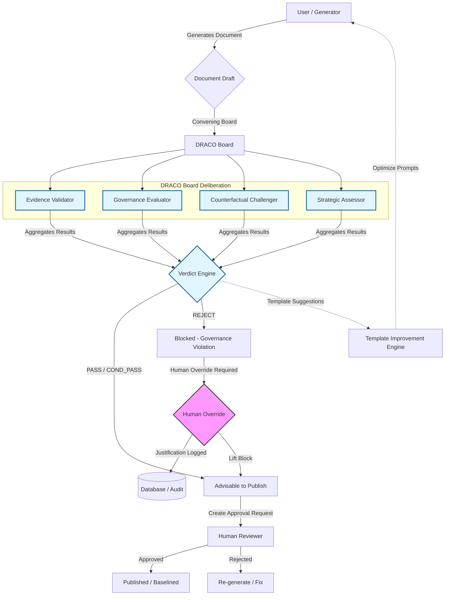

# DRACO Governance Lifecycle Diagram

This diagram visualizes the end-to-end flow of the DRACO Governance framework, from document generation to final publication.

## Lifecycle States

1.  **Draft**: Document is created from a template.
2.  **Deliberating**: Multi-agent board parallel analysis with progress streaming.
3.  **Verdict**: Final outcome determined by the Aggregator.
4.  **Blocked**: If verdict is REJECT and blocking mode is enabled.
5.  **Override**: Authorized human provides a reason for the deviation.
6.  **Approved**: Final publication or baseline update.
