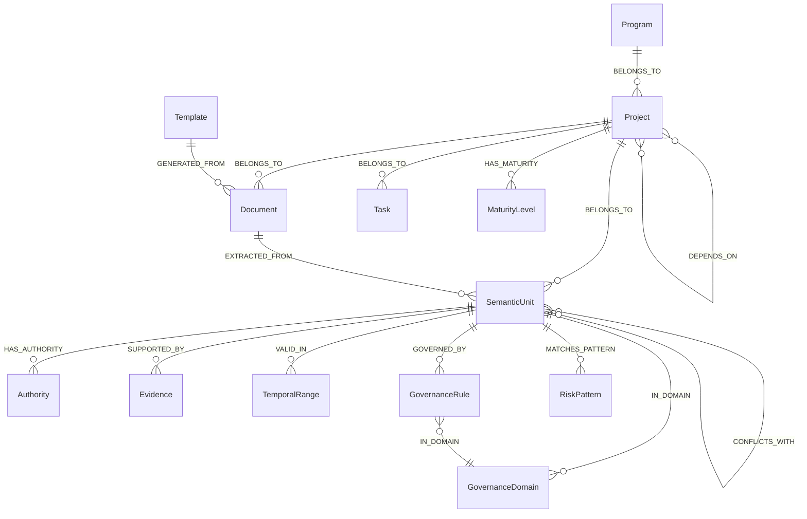

# Governance Knowledge Graph (GKG) Schema

**Status**: Design  
**Target**: Neo4j (Aura or self-hosted)  
**Alignment**: PMMA GKG, ECS (Authority / Evidence / Temporal), ADPA entities  

---

## 1. Purpose and Scope

The GKG is the graph layer for **evidence-based governance and decision support**. It holds:

- **Programs** (grouping of related projects; project belongs to program).
- **Projects** and **Documents** (anchors from ADPA).
- **Tasks** (project tasks / WBS; belong to project; optional `entity_type` for entity-task relationship).
- **Semantic units** (atomic meaning extracted from documents: requirements, risks, stakeholders, milestones, etc.).
- **ECS modeling**: Authority (who/what backs a claim), Evidence (sources), Temporal (validity windows).
- **Governance**: Rules, PMBOK domains, maturity levels, risk patterns.
- **Traceability** and **conflicts** between units.

Data is synced from ADPA PostgreSQL; the graph enables path queries, conflict detection, and Scenario Generator / mastery use cases.

---

## 2. Conventions

- **`adpa_id`**: UUID from PostgreSQL. Used for idempotent sync and lookups.
- **`adpa_entity_type`**: Table or entity type in ADPA (e.g. `Requirement`, `Risk`, `Stakeholder`).
- **`synced_at`**: Last sync timestamp (optional, for incremental updates).
- All node labels are **singular** (e.g. `Document`, `SemanticUnit`).

---

## 3. Node Labels and Properties

### 3.0 Program

Grouping of related projects. Source: `programs` table. Projects link via `projects.program_id`.

| Property    | Type   | Required | Description |
|-------------|--------|----------|-------------|
| `adpa_id`   | UUID   | Yes      | `programs.id` |
| `name`      | string | Yes      | Program name |
| `description`| string | No       | From ADPA |
| `status`    | string | No       | e.g. `green`, `amber`, `red` |
| `created_at`| datetime | No    | From ADPA |

**Constraint**: `adpa_id` unique per `Program`.

---

### 3.1 Project

| Property    | Type   | Required | Description |
|-------------|--------|----------|-------------|
| `adpa_id`   | UUID   | Yes      | `projects.id` |
| `name`      | string | Yes      | Project name |
| `created_at`| datetime | No    | From ADPA |

**Constraint**: `adpa_id` unique per `Project`.

---

### 3.2 Document

| Property       | Type   | Required | Description |
|----------------|--------|----------|-------------|
| `adpa_id`      | UUID   | Yes      | `documents.id` |
| `project_id`   | UUID   | Yes      | `documents.project_id` (for link to Project) |
| `template_type`| string | No       | e.g. `project_charter`, `risk_register` |
| `title`        | string | No       | Document title |
| `created_at`   | datetime | No     | From ADPA |

**Constraint**: `adpa_id` unique per `Document`.

---

### 3.2.3 Template

Document-generation template. Source: `templates` table. Documents link via `documents.template_id` (document was generated using this template). Enables: "which documents were generated by this template" and "which entities (semantic units) were extracted from documents generated by this template".

| Property    | Type   | Required | Description |
|-------------|--------|----------|-------------|
| `adpa_id`   | UUID   | Yes      | `templates.id` |
| `name`      | string | Yes      | Template name |
| `framework` | string | No       | e.g. `PMBOK 7`, `Custom` |
| `created_at`| datetime | No     | From ADPA |

**Constraint**: `adpa_id` unique per `Template`.

---

### 3.2.5 Task

Project task / WBS item. Source: `project_tasks` table. Enables querying all tasks under a program (Program → Projects → Tasks) and relationship to entity type (phase, milestone, deliverable, etc.).

| Property       | Type   | Required | Description |
|----------------|--------|----------|-------------|
| `adpa_id`      | UUID   | Yes      | `project_tasks.id` |
| `project_id`   | UUID   | Yes      | For link to Project |
| `task_name`    | string | Yes      | Task name |
| `summary`      | string | No       | Description or title for context |
| `status`       | string | No       | e.g. `planned`, `in_progress`, `completed` |
| `entity_type`  | string | No       | WBS entity type: phase, milestone, activity, deliverable, work_package, etc. |
| `wbs_code`     | string | No       | WBS code |
| `created_at`   | datetime | No     | From ADPA |

**Constraint**: `adpa_id` unique per `Task`.

---

### 3.3 SemanticUnit

Atomic unit of meaning extracted from a document. Maps to ADPA entity rows (requirements, risks, stakeholders, milestones, etc.).

| Property          | Type   | Required | Description |
|-------------------|--------|----------|-------------|
| `adpa_id`         | UUID   | Yes      | PK of the source entity row |
| `adpa_entity_type`| string | Yes      | e.g. `Requirement`, `Risk`, `Stakeholder`, `Milestone`, `GovernanceDecision` |
| `project_id`      | UUID   | Yes      | From entity row (for link to Project) |
| `document_id`     | UUID   | No       | Source document (`documents.id`) |
| `summary`         | string | No       | Short description or title |
| `payload`         | map    | No       | Optional structured fields (e.g. `priority`, `status`) |
| `synced_at`       | datetime | No     | Last sync from ADPA |

**Constraint**: `(adpa_entity_type, adpa_id)` unique per `SemanticUnit`.

---

### 3.4 Authority (ECS)

Who or what has authority over a semantic unit (role, person, or artifact).

| Property   | Type   | Required | Description |
|------------|--------|----------|-------------|
| `id`       | string | Yes      | Stable id (e.g. `role:sponsor`, `doc:<uuid>`) |
| `name`     | string | Yes      | Display name |
| `type`     | string | Yes      | `role` \| `person` \| `document` |

---

### 3.5 Evidence (ECS)

Source or citation supporting a semantic unit.

| Property     | Type   | Required | Description |
|--------------|--------|----------|-------------|
| `id`         | string | Yes      | Stable id (e.g. `doc:<uuid>:section:2`) |
| `source_type`| string | Yes      | `document` \| `citation` \| `policy` |
| `excerpt`    | string | No       | Relevant quote or summary |
| `adpa_document_id` | UUID | No   | Link to ADPA document when `source_type=document` |

---

### 3.6 TemporalRange (ECS)

Validity or effective window for a fact (version, period).

| Property    | Type   | Required | Description |
|-------------|--------|----------|-------------|
| `id`        | string | Yes      | Stable id |
| `valid_from`| datetime | No    | Start of validity |
| `valid_to`  | datetime | No    | End of validity |
| `version`   | string | No       | e.g. `v1`, `2.0` |

---

### 3.7 GovernanceRule

Policy or rule that governs behavior or compliance.

| Property   | Type   | Required | Description |
|------------|--------|----------|-------------|
| `id`       | string | Yes      | Stable id |
| `name`     | string | Yes      | Rule name |
| `rule_type`| string | No       | e.g. `compliance`, `approval_threshold` |
| `definition`| string | No      | Short description or reference |

---

### 3.8 GovernanceDomain

PMBOK / governance area (Integration, Scope, Schedule, etc.).

| Property | Type   | Required | Description |
|----------|--------|----------|-------------|
| `code`   | string | Yes      | e.g. `Integration`, `Scope`, `Risk` |
| `name`   | string | Yes      | Full name |

**Constraint**: `code` unique per `GovernanceDomain`.

---

### 3.9 MaturityLevel

Documentation/project maturity level (e.g. 1–5).

| Property | Type   | Required | Description |
|----------|--------|----------|-------------|
| `level`  | int    | Yes      | 1..5 |
| `name`   | string | Yes      | e.g. `Initial`, `Defined`, `Managed` |
| `criteria_summary` | string | No | Short criteria description |

---

### 3.10 RiskPattern

Reusable risk signature for the Risk Signature Index.

| Property   | Type   | Required | Description |
|------------|--------|----------|-------------|
| `id`       | string | Yes      | Stable id |
| `name`     | string | Yes      | Pattern name |
| `category` | string | No       | e.g. `schedule`, `resource` |
| `indicators`| list  | No       | Text indicators or tags |

---

## 4. Relationship Types

### 4.1 Structure and provenance

| Relationship     | From        | To         | Description |
|------------------|-------------|------------|-------------|
| `BELONGS_TO`     | Project     | Program    | Project belongs to program (`projects.program_id`) |
| `BELONGS_TO`     | Document    | Project    | Document belongs to project |
| `GENERATED_FROM` | Document    | Template   | Document was generated using this template (`documents.template_id`) |
| `BELONGS_TO`     | Task        | Project    | Task belongs to project (`project_tasks.project_id`) |
| `BELONGS_TO`     | SemanticUnit| Project    | Unit scoped to project |
| `EXTRACTED_FROM` | SemanticUnit| Document   | Unit was extracted from this document |
| `DEPENDS_ON`     | Project     | Project    | From `project_dependencies` (source → target) |

### 4.2 ECS (Authority, Evidence, Temporal)

| Relationship   | From        | To            | Description |
|----------------|-------------|---------------|-------------|
| `HAS_AUTHORITY`| SemanticUnit| Authority     | Unit is backed by this authority |
| `SUPPORTED_BY` | SemanticUnit| Evidence      | Unit is supported by this evidence |
| `VALID_IN`     | SemanticUnit| TemporalRange | Unit holds in this time window |
| `DERIVED_FROM` | Authority   | Document      | Authority comes from this document (when type=document) |

### 4.3 Governance and domain

| Relationship   | From        | To             | Description |
|----------------|-------------|----------------|-------------|
| `GOVERNED_BY`  | SemanticUnit| GovernanceRule | Unit is governed by this rule |
| `IN_DOMAIN`    | SemanticUnit| GovernanceDomain| Unit falls under this PMBOK domain |
| `IN_DOMAIN`    | GovernanceRule| GovernanceDomain| Rule applies in this domain |
| `HAS_MATURITY` | Project     | MaturityLevel  | Project’s documentation maturity |
| `MATCHES_PATTERN`| SemanticUnit| RiskPattern   | Unit matches this risk signature |

### 4.4 Traceability and conflicts

| Relationship   | From        | To         | Description |
|----------------|-------------|------------|-------------|
| `TRACES_TO`    | SemanticUnit| SemanticUnit | Traceability (e.g. requirement → test) |
| `CONFLICTS_WITH`| SemanticUnit| SemanticUnit | ECS-detected conflict (optional resolution props on rel) |

---

## 5. ECS Concepts in the Graph

- **Authority**: `(SemanticUnit)-[:HAS_AUTHORITY]->(Authority)`. Authority nodes can be tied to roles, people, or source documents.
- **Evidence**: `(SemanticUnit)-[:SUPPORTED_BY]->(Evidence)`. Evidence can reference `adpa_document_id` or external citations.
- **Temporal**: `(SemanticUnit)-[:VALID_IN]->(TemporalRange)`. Use for “as-of” reasoning and versioning.

Conflicts are modeled as `(SemanticUnit)-[:CONFLICTS_WITH]->(SemanticUnit)`; resolution state can be stored on the relationship (e.g. `status: open|resolved`, `resolved_at`, `resolution_summary`).

---

## 6. Mapping from ADPA Entities to SemanticUnit

| ADPA Table / Entity     | `adpa_entity_type` | Typical domains / relationships |
|--------------------------|--------------------|----------------------------------|
| `requirements`           | `Requirement`      | IN_DOMAIN(Scope), TRACES_TO(other units) |
| `risks`                  | `Risk`             | IN_DOMAIN(Risk), MATCHES_PATTERN(RiskPattern) |
| `stakeholders`           | `Stakeholder`      | IN_DOMAIN(Stakeholder), HAS_AUTHORITY |
| `milestones`             | `Milestone`        | IN_DOMAIN(Schedule) |
| `constraints`            | `Constraint`       | IN_DOMAIN(Schedule/Scope) |
| `governance_decisions`   | `GovernanceDecision`| GOVERNED_BY, IN_DOMAIN |
| `action_items`           | `ActionItem`       | TRACES_TO(Requirement/Risk) |
| `deliverables`           | `Deliverable`      | IN_DOMAIN(Scope), TRACES_TO |
| `phases`                 | `Phase`            | IN_DOMAIN(Schedule) |
| … (other extracted entities) | Same as type name | As per PMBOK/scope |

Each row is one `SemanticUnit` node with `adpa_id` = primary key, `adpa_entity_type` = table/type name, plus `project_id` and `document_id` when available.

---

## 7. Example Cypher Fragments

**Program and its projects, documents, tasks, and semantic units**

```cypher
MATCH (prog:Program {adpa_id: $programId})
OPTIONAL MATCH (p:Project)-[:BELONGS_TO]->(prog)
OPTIONAL MATCH (d:Document)-[:BELONGS_TO]->(p)
OPTIONAL MATCH (t:Task)-[:BELONGS_TO]->(p)
OPTIONAL MATCH (u:SemanticUnit)-[:BELONGS_TO]->(p)
RETURN prog,
       collect(DISTINCT p) AS projects,
       collect(DISTINCT d) AS documents,
       collect(DISTINCT t) AS tasks,
       collect(DISTINCT u) AS semanticUnits
```

**Project and its documents**

```cypher
MATCH (p:Project {adpa_id: $projectId})
OPTIONAL MATCH (d:Document)-[:BELONGS_TO]->(p)
RETURN p, collect(d) AS documents
```

**Project and its tasks (by entity type)**

```cypher
MATCH (p:Project {adpa_id: $projectId})
OPTIONAL MATCH (t:Task)-[:BELONGS_TO]->(p)
WHERE t.entity_type IS NULL OR t.entity_type = $entityType
RETURN p, collect(t) AS tasks
```

**Template and which documents it has generated**

```cypher
MATCH (tpl:Template {adpa_id: $templateId})
MATCH (d:Document)-[:GENERATED_FROM]->(tpl)
RETURN tpl, collect(d) AS documents
```

**Template and which entities (semantic units) were created from it**

Entities are extracted from documents; documents are generated from templates. So: Template → Document (GENERATED_FROM) → SemanticUnit (EXTRACTED_FROM).

```cypher
MATCH (tpl:Template {adpa_id: $templateId})
MATCH (d:Document)-[:GENERATED_FROM]->(tpl)
MATCH (u:SemanticUnit)-[:EXTRACTED_FROM]->(d)
RETURN tpl,
       collect(DISTINCT d) AS documents,
       collect(DISTINCT u) AS entities
```

**Semantic units from a document with ECS**

```cypher
MATCH (d:Document {adpa_id: $documentId})
MATCH (u:SemanticUnit)-[:EXTRACTED_FROM]->(d)
OPTIONAL MATCH (u)-[:HAS_AUTHORITY]->(a:Authority)
OPTIONAL MATCH (u)-[:SUPPORTED_BY]->(e:Evidence)
OPTIONAL MATCH (u)-[:VALID_IN]->(t:TemporalRange)
RETURN u, collect(DISTINCT a) AS authorities, collect(DISTINCT e) AS evidence, collect(DISTINCT t) AS temporal
```

**Conflicts in a project**

```cypher
MATCH (p:Project {adpa_id: $projectId})
MATCH (u1:SemanticUnit)-[:BELONGS_TO]->(p)
MATCH (u1)-[r:CONFLICTS_WITH]-(u2:SemanticUnit)
WHERE r.status <> 'resolved' OR r.status IS NULL
RETURN u1, u2, r
```

**Governance domains and rules for a unit**

```cypher
MATCH (u:SemanticUnit {adpa_id: $unitId})
OPTIONAL MATCH (u)-[:IN_DOMAIN]->(dom:GovernanceDomain)
OPTIONAL MATCH (u)-[:GOVERNED_BY]->(rule:GovernanceRule)-[:IN_DOMAIN]->(dom)
RETURN u, collect(DISTINCT dom) AS domains, collect(DISTINCT rule) AS rules
```

---

## 8. Constraints and Indexes (Neo4j)

See **[GKG_SCHEMA_CYPHER.md](./GKG_SCHEMA_CYPHER.md)** for runnable Cypher:

- Uniqueness constraints: `Program(adpa_id)`, `Project(adpa_id)`, `Document(adpa_id)`, `Template(adpa_id)`, `Task(adpa_id)`, `SemanticUnit(adpa_entity_type, adpa_id)`, `GovernanceDomain(code)`.
- Indexes for adpa_id, project_id, document_id, entity_type, and common traversal keys.

---

## 9. Ingestion Strategy (Outline)

1. **Bootstrap**: Create `Project` and `Document` nodes from ADPA; create `GovernanceDomain` and `MaturityLevel` reference nodes.
2. **Entity sync**: For each ADPA entity table, upsert `SemanticUnit` nodes and `EXTRACTED_FROM` / `BELONGS_TO` relationships.
3. **ECS**: When authority/evidence/temporal data is available (e.g. from ECS pipeline or rules), add `Authority`, `Evidence`, `TemporalRange` nodes and link via `HAS_AUTHORITY`, `SUPPORTED_BY`, `VALID_IN`.
4. **Governance**: Attach `IN_DOMAIN`, `GOVERNED_BY`, `HAS_MATURITY`, `MATCHES_PATTERN` from DME / governance engine outputs.
5. **Conflicts**: Create `CONFLICTS_WITH` and `TRACES_TO` from ECS conflict resolution and traceability pipelines.

Sync can be job-based (e.g. Bull job per project or document) and use `adpa_id` + `synced_at` for idempotence and incremental updates. Full ingestion design (triggers, job types, entity-type mapping, Cypher patterns): **[GKG_INGESTION_DESIGN.md](./GKG_INGESTION_DESIGN.md)**.

---

## 10. Core Structure (Diagram)


