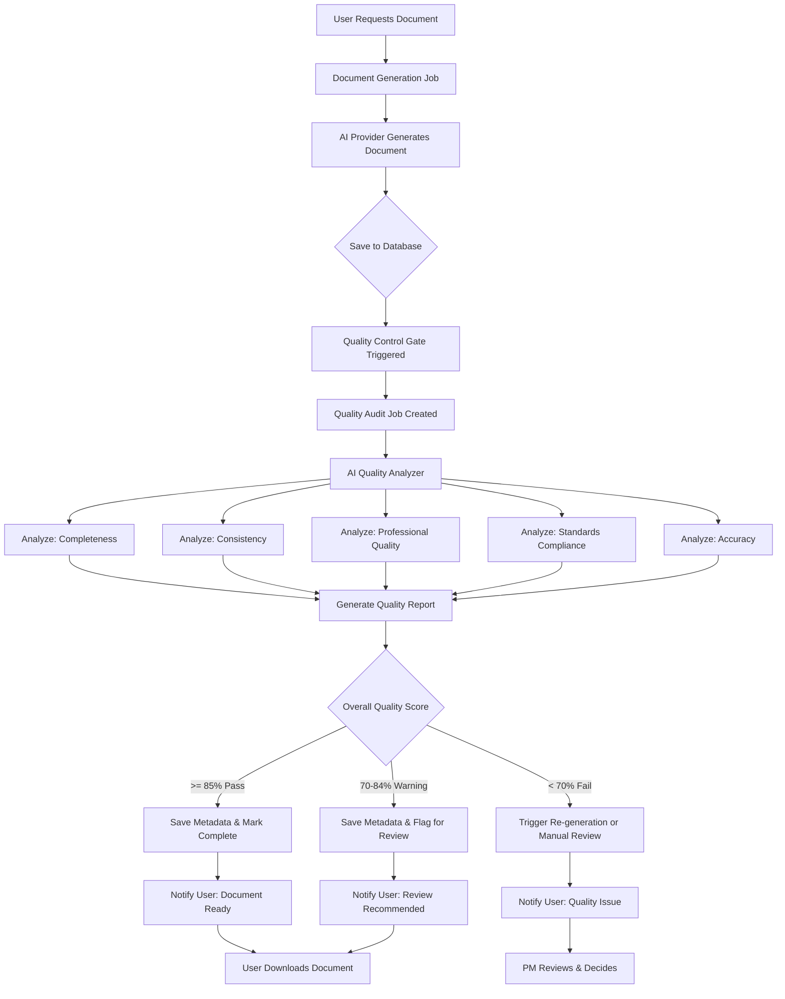

# Quality Control Gate Architecture
## Automated Document Quality Audit System

**Version**: 1.0  
**Date**: November 3, 2025  
**Status**: Design Phase  
**Priority**: High

---

## 1. Overview

### Purpose
Implement an automated **Quality Control Gate** that runs immediately after AI document generation to:
1. Analyze document quality against defined criteria
2. Generate a comprehensive quality report
3. Save quality metrics as document metadata
4. Trigger corrective actions if quality is below threshold
5. Provide continuous feedback for system improvement

### Design Principle
> "Quality is not inspected in, but it can be validated out."

The Quality Control Gate acts as a **second AI agent** that reviews the work of the first, similar to a peer review process in software development.

---

## 2. System Architecture



---

## 3. Quality Metrics Framework

### 3.1 Quality Dimensions

| Dimension | Weight | Description | Measurement Method |
|-----------|--------|-------------|-------------------|
| **Completeness** | 20% | All required sections present and populated | AI + Template matching |
| **Consistency** | 15% | Terminology, names, dates consistent throughout | AI + Pattern analysis |
| **Professional Quality** | 20% | Writing quality, tone, formatting | AI + Style analysis |
| **Standards Compliance** | 20% | PMBOK/BABOK/DMBOK principles applied | AI + Checklist validation |
| **Accuracy** | 15% | Data correctly extracted from context | AI + Fact checking |
| **Context Relevance** | 10% | Content aligns with project objectives | AI + Semantic analysis |

**Total**: 100%

---

### 3.2 Scoring Rubric

#### Completeness (20 points)
- **18-20 points (90-100%)**: All sections present, fully populated, no placeholders
- **14-17 points (70-85%)**: Most sections complete, minor gaps
- **10-13 points (50-65%)**: Several sections incomplete or superficial
- **0-9 points (<50%)**: Major sections missing or placeholder-heavy

#### Consistency (15 points)
- **14-15 points (93-100%)**: Perfect consistency across all elements
- **11-13 points (73-87%)**: Minor inconsistencies (1-3 issues)
- **7-10 points (47-67%)**: Moderate inconsistencies (4-7 issues)
- **0-6 points (<47%)**: Significant inconsistencies throughout

#### Professional Quality (20 points)
- **18-20 points (90-100%)**: Executive-ready, polished, clear, concise
- **14-17 points (70-85%)**: Good quality, minor editing needed
- **10-13 points (50-65%)**: Acceptable but needs significant polish
- **0-9 points (<50%)**: Unprofessional, requires major rewrite

#### Standards Compliance (20 points)
- **18-20 points (90-100%)**: All principles applied, fully compliant
- **14-17 points (70-85%)**: Most principles applied, minor gaps
- **10-13 points (50-65%)**: Partial compliance, major gaps
- **0-9 points (<50%)**: Non-compliant or incorrect application

#### Accuracy (15 points)
- **14-15 points (93-100%)**: All data accurate, no hallucinations
- **11-13 points (73-87%)**: Minor errors (1-2 issues)
- **7-10 points (47-67%)**: Several errors (3-5 issues)
- **0-6 points (<47%)**: Significant inaccuracies or hallucinations

#### Context Relevance (10 points)
- **9-10 points (90-100%)**: Perfect alignment with project context
- **7-8 points (70-80%)**: Good alignment, minor drift
- **5-6 points (50-60%)**: Partial alignment, some irrelevant content
- **0-4 points (<50%)**: Significant drift or irrelevant content

---

### 3.3 Overall Quality Grades

| Grade | Score Range | Quality Level | Action |
|-------|-------------|---------------|--------|
| A | 90-100% | Excellent | ✅ Approved - Ready for use |
| B | 80-89% | Good | ✅ Approved - Minor polish recommended |
| C | 70-79% | Acceptable | ⚠️ Warning - Review recommended |
| D | 60-69% | Below Standard | 🔴 Failed - Significant revision needed |
| F | < 60% | Unsatisfactory | 🔴 Failed - Re-generation required |

---

## 4. Implementation Design

### 4.1 Database Schema

#### Quality Audit Table
```sql
CREATE TABLE quality_audits (
  id UUID PRIMARY KEY DEFAULT gen_random_uuid(),
  document_id UUID NOT NULL REFERENCES documents(id) ON DELETE CASCADE,
  audit_job_id UUID REFERENCES jobs(id),
  
  -- Overall Metrics
  overall_score INTEGER CHECK (overall_score >= 0 AND overall_score <= 100),
  overall_grade VARCHAR(2) CHECK (overall_grade IN ('A', 'B', 'C', 'D', 'F')),
  quality_level VARCHAR(20) CHECK (quality_level IN ('Excellent', 'Good', 'Acceptable', 'Below Standard', 'Unsatisfactory')),
  
  -- Dimensional Scores (0-100)
  completeness_score INTEGER CHECK (completeness_score >= 0 AND completeness_score <= 100),
  consistency_score INTEGER CHECK (consistency_score >= 0 AND consistency_score <= 100),
  professional_quality_score INTEGER CHECK (professional_quality_score >= 0 AND professional_quality_score <= 100),
  standards_compliance_score INTEGER CHECK (standards_compliance_score >= 0 AND standards_compliance_score <= 100),
  accuracy_score INTEGER CHECK (accuracy_score >= 0 AND accuracy_score <= 100),
  context_relevance_score INTEGER CHECK (context_relevance_score >= 0 AND context_relevance_score <= 100),
  
  -- Detailed Findings
  findings JSONB NOT NULL DEFAULT '{}', -- Structured findings per dimension
  issues JSONB DEFAULT '[]', -- Array of identified issues
  recommendations JSONB DEFAULT '[]', -- Array of improvement recommendations
  
  -- AI Analysis
  ai_provider VARCHAR(50), -- Which AI analyzed (e.g., 'openai', 'google')
  ai_model VARCHAR(100), -- Model used (e.g., 'gpt-4', 'gemini-2.5-flash')
  analysis_tokens INTEGER, -- Tokens used for analysis
  analysis_cost DECIMAL(10, 6), -- Cost of quality analysis
  analysis_time INTEGER, -- Time in milliseconds
  
  -- Metadata
  audited_at TIMESTAMP DEFAULT NOW(),
  audited_by UUID REFERENCES users(id),
  
  -- Indexes
  INDEX idx_quality_audits_document (document_id),
  INDEX idx_quality_audits_grade (overall_grade),
  INDEX idx_quality_audits_date (audited_at DESC)
);
```

#### Update Documents Table
```sql
ALTER TABLE documents 
ADD COLUMN quality_audit_id UUID REFERENCES quality_audits(id),
ADD COLUMN quality_status VARCHAR(20) CHECK (quality_status IN ('pending', 'passed', 'warning', 'failed', 'not_audited')),
ADD COLUMN quality_score INTEGER CHECK (quality_score >= 0 AND quality_score <= 100);

CREATE INDEX idx_documents_quality_status ON documents(quality_status);
CREATE INDEX idx_documents_quality_score ON documents(quality_score DESC);
```

---

### 4.2 Service Architecture

#### Quality Audit Service (`server/src/services/qualityAuditService.ts`)

```typescript
import { pool } from '../database/connection';
import { aiService } from './aiService';
import { logger } from '../utils/logger';

interface QualityAuditResult {
  overallScore: number;
  overallGrade: string;
  qualityLevel: string;
  dimensionalScores: {
    completeness: number;
    consistency: number;
    professionalQuality: number;
    standardsCompliance: number;
    accuracy: number;
    contextRelevance: number;
  };
  findings: Record<string, any>;
  issues: Array<{
    severity: 'critical' | 'major' | 'minor';
    dimension: string;
    description: string;
    location?: string;
    recommendation?: string;
  }>;
  recommendations: string[];
}

class QualityAuditService {
  /**
   * Perform comprehensive quality audit on a generated document
   */
  async auditDocument(
    documentId: string,
    documentContent: string,
    documentType: string,
    projectContext: any,
    userId: string
  ): Promise<QualityAuditResult> {
    logger.info('[QUALITY-AUDIT] Starting audit', { documentId, documentType });

    try {
      // 1. Create audit job record
      const auditJobId = await this.createAuditJob(documentId, userId);

      // 2. Perform multi-dimensional analysis
      const analysisResults = await this.performAnalysis(
        documentContent,
        documentType,
        projectContext
      );

      // 3. Calculate overall score
      const overallScore = this.calculateOverallScore(analysisResults);
      const overallGrade = this.calculateGrade(overallScore);
      const qualityLevel = this.getQualityLevel(overallScore);

      // 4. Generate findings and recommendations
      const findings = this.generateFindings(analysisResults);
      const issues = this.extractIssues(analysisResults);
      const recommendations = this.generateRecommendations(analysisResults, overallScore);

      // 5. Save audit results
      await this.saveAuditResults({
        documentId,
        auditJobId,
        overallScore,
        overallGrade,
        qualityLevel,
        dimensionalScores: analysisResults,
        findings,
        issues,
        recommendations,
        aiProvider: 'google', // Use Gemini for analysis (cost-effective)
        aiModel: 'gemini-2.5-flash'
      });

      // 6. Update document quality status
      await this.updateDocumentQualityStatus(documentId, overallScore, overallGrade);

      logger.info('[QUALITY-AUDIT] Audit completed', {
        documentId,
        overallScore,
        overallGrade
      });

      return {
        overallScore,
        overallGrade,
        qualityLevel,
        dimensionalScores: analysisResults,
        findings,
        issues,
        recommendations
      };
    } catch (error) {
      logger.error('[QUALITY-AUDIT] Audit failed', {
        documentId,
        error: error instanceof Error ? error.message : String(error)
      });
      throw error;
    }
  }

  /**
   * Perform AI-powered analysis across all quality dimensions
   */
  private async performAnalysis(
    documentContent: string,
    documentType: string,
    projectContext: any
  ): Promise<Record<string, number>> {
    const analysisPrompt = this.buildAnalysisPrompt(
      documentContent,
      documentType,
      projectContext
    );

    const result = await aiService.generate({
      provider: 'google',
      model: 'gemini-2.5-flash', // Fast and cost-effective for analysis
      systemPrompt: this.getSystemPrompt(),
      userPrompt: analysisPrompt,
      temperature: 0.3, // Lower temperature for consistent analysis
      responseFormat: 'json' // Request structured JSON response
    });

    // Parse AI response into dimensional scores
    const scores = JSON.parse(result.content);

    return {
      completeness: scores.completeness || 0,
      consistency: scores.consistency || 0,
      professionalQuality: scores.professional_quality || 0,
      standardsCompliance: scores.standards_compliance || 0,
      accuracy: scores.accuracy || 0,
      contextRelevance: scores.context_relevance || 0
    };
  }

  /**
   * Build comprehensive analysis prompt for AI
   */
  private buildAnalysisPrompt(
    documentContent: string,
    documentType: string,
    projectContext: any
  ): string {
    return `
# Quality Audit Task

You are an expert document quality auditor. Analyze the following ${documentType} document and provide a comprehensive quality assessment.

## Document Type: ${documentType}

## Project Context:
${JSON.stringify(projectContext, null, 2)}

## Document to Analyze:
${documentContent}

## Your Task:
Analyze the document across 6 quality dimensions and provide scores (0-100) for each:

1. **Completeness (0-100)**:
   - Are all required sections present?
   - Is content fully populated (no placeholders like "[Insert X]")?
   - Are tables, charts, and appendices complete?
   - Score: High (90-100) = Fully complete, Medium (70-89) = Minor gaps, Low (<70) = Significant gaps

2. **Consistency (0-100)**:
   - Are stakeholder names consistent throughout?
   - Are dates formatted consistently?
   - Is terminology used consistently (acronyms expanded on first use)?
   - Are cross-references accurate?
   - Score: High (90-100) = Perfect consistency, Medium (70-89) = 1-3 issues, Low (<70) = Many inconsistencies

3. **Professional Quality (0-100)**:
   - Is the writing clear, concise, and professional?
   - Is tone appropriate for executive audience?
   - Are there grammar, spelling, or formatting errors?
   - Is the document well-structured and easy to navigate?
   - Score: High (90-100) = Executive-ready, Medium (70-89) = Minor polish needed, Low (<70) = Significant rewrite needed

4. **Standards Compliance (0-100)**:
   - For PMBOK 8: Are all 12 principles referenced? Are all 8 performance domains addressed?
   - For BABOK v3: Are BA techniques properly applied?
   - Is the document outcome-focused (not just process-focused)?
   - Score: High (90-100) = Fully compliant, Medium (70-89) = Minor gaps, Low (<70) = Non-compliant

5. **Accuracy (0-100)**:
   - Is all data correctly extracted from project context?
   - Are there any hallucinations or fabricated information?
   - Do numbers, dates, and names match the source?
   - Score: High (90-100) = 100% accurate, Medium (70-89) = 1-2 errors, Low (<70) = Multiple errors

6. **Context Relevance (0-100)**:
   - Does content align with stated project objectives?
   - Is there scope creep or irrelevant content?
   - Are all sections relevant to the project type?
   - Score: High (90-100) = Perfect alignment, Medium (70-89) = Minor drift, Low (<70) = Significant irrelevance

## Response Format (JSON):
{
  "completeness": <score>,
  "consistency": <score>,
  "professional_quality": <score>,
  "standards_compliance": <score>,
  "accuracy": <score>,
  "context_relevance": <score>,
  "findings": {
    "completeness": "<detailed findings>",
    "consistency": "<detailed findings with examples>",
    "professional_quality": "<detailed findings>",
    "standards_compliance": "<detailed findings>",
    "accuracy": "<detailed findings>",
    "context_relevance": "<detailed findings>"
  },
  "issues": [
    {
      "severity": "critical|major|minor",
      "dimension": "<dimension name>",
      "description": "<issue description>",
      "location": "<section or page reference>",
      "recommendation": "<how to fix>"
    }
  ],
  "recommendations": [
    "<actionable recommendation 1>",
    "<actionable recommendation 2>",
    "<actionable recommendation 3>"
  ]
}

Be thorough, specific, and constructive. Provide examples of issues found.
`;
  }

  /**
   * Get system prompt for quality auditor AI
   */
  private getSystemPrompt(): string {
    return `You are an expert document quality auditor with 20+ years of experience in project management, business analysis, and technical writing. 

Your role is to perform rigorous, constructive quality audits of project management and business analysis documents. You evaluate documents against industry standards (PMBOK, BABOK, DMBOK) and best practices.

You are thorough but fair, identifying both strengths and weaknesses. Your feedback is specific, actionable, and professional.

CRITICAL: Respond ONLY with valid JSON. Do not include any explanatory text before or after the JSON.`;
  }

  /**
   * Calculate weighted overall score
   */
  private calculateOverallScore(scores: Record<string, number>): number {
    const weights = {
      completeness: 0.20,
      consistency: 0.15,
      professionalQuality: 0.20,
      standardsCompliance: 0.20,
      accuracy: 0.15,
      contextRelevance: 0.10
    };

    const weightedScore =
      scores.completeness * weights.completeness +
      scores.consistency * weights.consistency +
      scores.professionalQuality * weights.professionalQuality +
      scores.standardsCompliance * weights.standardsCompliance +
      scores.accuracy * weights.accuracy +
      scores.contextRelevance * weights.contextRelevance;

    return Math.round(weightedScore);
  }

  /**
   * Calculate letter grade from score
   */
  private calculateGrade(score: number): string {
    if (score >= 90) return 'A';
    if (score >= 80) return 'B';
    if (score >= 70) return 'C';
    if (score >= 60) return 'D';
    return 'F';
  }

  /**
   * Get quality level description
   */
  private getQualityLevel(score: number): string {
    if (score >= 90) return 'Excellent';
    if (score >= 80) return 'Good';
    if (score >= 70) return 'Acceptable';
    if (score >= 60) return 'Below Standard';
    return 'Unsatisfactory';
  }

  /**
   * Save audit results to database
   */
  private async saveAuditResults(auditData: any): Promise<void> {
    await pool.query(
      `INSERT INTO quality_audits (
        document_id, audit_job_id, overall_score, overall_grade, quality_level,
        completeness_score, consistency_score, professional_quality_score,
        standards_compliance_score, accuracy_score, context_relevance_score,
        findings, issues, recommendations, ai_provider, ai_model
      ) VALUES ($1, $2, $3, $4, $5, $6, $7, $8, $9, $10, $11, $12, $13, $14, $15, $16)`,
      [
        auditData.documentId,
        auditData.auditJobId,
        auditData.overallScore,
        auditData.overallGrade,
        auditData.qualityLevel,
        auditData.dimensionalScores.completeness,
        auditData.dimensionalScores.consistency,
        auditData.dimensionalScores.professionalQuality,
        auditData.dimensionalScores.standardsCompliance,
        auditData.dimensionalScores.accuracy,
        auditData.dimensionalScores.contextRelevance,
        JSON.stringify(auditData.findings),
        JSON.stringify(auditData.issues),
        JSON.stringify(auditData.recommendations),
        auditData.aiProvider,
        auditData.aiModel
      ]
    );
  }

  /**
   * Update document with quality status
   */
  private async updateDocumentQualityStatus(
    documentId: string,
    score: number,
    grade: string
  ): Promise<void> {
    let status: string;
    if (score >= 85) status = 'passed';
    else if (score >= 70) status = 'warning';
    else status = 'failed';

    await pool.query(
      `UPDATE documents 
       SET quality_status = $1, quality_score = $2, updated_at = NOW()
       WHERE id = $3`,
      [status, score, documentId]
    );
  }

  /**
   * Create audit job record
   */
  private async createAuditJob(documentId: string, userId: string): Promise<string> {
    const result = await pool.query(
      `INSERT INTO jobs (type, status, data, created_by)
       VALUES ($1, $2, $3, $4)
       RETURNING id`,
      [
        'quality-audit',
        'processing',
        JSON.stringify({ documentId }),
        userId
      ]
    );
    return result.rows[0].id;
  }

  /**
   * Generate structured findings
   */
  private generateFindings(analysisResults: any): Record<string, any> {
    return {
      completeness: analysisResults.findings?.completeness || 'No detailed findings',
      consistency: analysisResults.findings?.consistency || 'No detailed findings',
      professionalQuality: analysisResults.findings?.professional_quality || 'No detailed findings',
      standardsCompliance: analysisResults.findings?.standards_compliance || 'No detailed findings',
      accuracy: analysisResults.findings?.accuracy || 'No detailed findings',
      contextRelevance: analysisResults.findings?.context_relevance || 'No detailed findings'
    };
  }

  /**
   * Extract issues from analysis
   */
  private extractIssues(analysisResults: any): any[] {
    return analysisResults.issues || [];
  }

  /**
   * Generate actionable recommendations
   */
  private generateRecommendations(analysisResults: any, overallScore: number): string[] {
    const recommendations = analysisResults.recommendations || [];

    // Add score-specific recommendations
    if (overallScore < 70) {
      recommendations.unshift('CRITICAL: Overall quality is below acceptable standards. Consider re-generation with improved prompts or different AI provider.');
    } else if (overallScore < 85) {
      recommendations.unshift('Recommend professional review and polish before submission to stakeholders.');
    }

    return recommendations;
  }
}

export const qualityAuditService = new QualityAuditService();
```

---

### 4.3 Integration with Document Generation

#### Update Process Flow Service

```typescript
// server/src/services/processFlowService.ts

async function handleDocumentGeneration(job: Job) {
  try {
    // ... existing document generation logic ...
    
    // After document is saved
    const savedDocument = await saveDocument(generatedContent);
    
    // QUALITY CONTROL GATE: Trigger automatic audit
    logger.info('[PROCESS-FLOW] Triggering quality audit', {
      documentId: savedDocument.id
    });
    
    await qualityAuditService.auditDocument(
      savedDocument.id,
      generatedContent,
      documentType,
      projectContext,
      userId
    );
    
    logger.info('[PROCESS-FLOW] Quality audit completed', {
      documentId: savedDocument.id
    });
    
    // ... rest of workflow ...
  } catch (error) {
    // ... error handling ...
  }
}
```

---

### 4.4 API Endpoints

#### Quality Audit Routes (`server/src/routes/qualityAuditRoutes.ts`)

```typescript
import express from 'express';
import { authenticateToken } from '../middleware/auth';
import { qualityAuditService } from '../services/qualityAuditService';
import { pool } from '../database/connection';

const router = express.Router();

/**
 * GET /api/quality-audits/document/:documentId
 * Get quality audit results for a document
 */
router.get(
  '/document/:documentId',
  authenticateToken,
  async (req, res, next) => {
    try {
      const { documentId } = req.params;

      const result = await pool.query(
        `SELECT qa.*, d.title as document_title
         FROM quality_audits qa
         JOIN documents d ON qa.document_id = d.id
         WHERE qa.document_id = $1
         ORDER BY qa.audited_at DESC
         LIMIT 1`,
        [documentId]
      );

      if (result.rows.length === 0) {
        return res.status(404).json({
          success: false,
          error: 'No quality audit found for this document'
        });
      }

      res.json({
        success: true,
        audit: result.rows[0]
      });
    } catch (error) {
      next(error);
    }
  }
);

/**
 * POST /api/quality-audits/trigger
 * Manually trigger quality audit for a document
 */
router.post(
  '/trigger',
  authenticateToken,
  async (req, res, next) => {
    try {
      const { documentId } = req.body;
      const userId = (req as any).user?.id;

      // Get document content
      const docResult = await pool.query(
        'SELECT content, type, project_id FROM documents WHERE id = $1',
        [documentId]
      );

      if (docResult.rows.length === 0) {
        return res.status(404).json({
          success: false,
          error: 'Document not found'
        });
      }

      const document = docResult.rows[0];

      // Get project context
      const projectResult = await pool.query(
        'SELECT * FROM projects WHERE id = $1',
        [document.project_id]
      );

      // Trigger audit
      const auditResult = await qualityAuditService.auditDocument(
        documentId,
        document.content,
        document.type,
        projectResult.rows[0],
        userId
      );

      res.json({
        success: true,
        audit: auditResult
      });
    } catch (error) {
      next(error);
    }
  }
);

/**
 * GET /api/quality-audits/stats
 * Get quality audit statistics
 */
router.get(
  '/stats',
  authenticateToken,
  async (req, res, next) => {
    try {
      const result = await pool.query(`
        SELECT 
          COUNT(*) as total_audits,
          AVG(overall_score) as average_score,
          COUNT(CASE WHEN overall_grade = 'A' THEN 1 END) as grade_a_count,
          COUNT(CASE WHEN overall_grade = 'B' THEN 1 END) as grade_b_count,
          COUNT(CASE WHEN overall_grade = 'C' THEN 1 END) as grade_c_count,
          COUNT(CASE WHEN overall_grade = 'D' THEN 1 END) as grade_d_count,
          COUNT(CASE WHEN overall_grade = 'F' THEN 1 END) as grade_f_count,
          AVG(completeness_score) as avg_completeness,
          AVG(consistency_score) as avg_consistency,
          AVG(professional_quality_score) as avg_professional_quality,
          AVG(standards_compliance_score) as avg_standards_compliance,
          AVG(accuracy_score) as avg_accuracy,
          AVG(context_relevance_score) as avg_context_relevance
        FROM quality_audits
        WHERE audited_at > NOW() - INTERVAL '30 days'
      `);

      res.json({
        success: true,
        stats: result.rows[0]
      });
    } catch (error) {
      next(error);
    }
  }
);

export default router;
```

---

## 5. Frontend Integration

### 5.1 Quality Audit Display Component

```typescript
// app/components/QualityAuditBadge.tsx

interface QualityAuditBadgeProps {
  documentId: string;
  score?: number;
  grade?: string;
  status?: 'passed' | 'warning' | 'failed' | 'not_audited';
}

export function QualityAuditBadge({ documentId, score, grade, status }: QualityAuditBadgeProps) {
  const [showDetails, setShowDetails] = useState(false);
  const [auditData, setAuditData] = useState<any>(null);

  const getBadgeColor = () => {
    if (!status || status === 'not_audited') return 'bg-gray-500';
    if (status === 'passed') return 'bg-green-500';
    if (status === 'warning') return 'bg-yellow-500';
    return 'bg-red-500';
  };

  const loadAuditDetails = async () => {
    const response = await fetch(`/api/quality-audits/document/${documentId}`);
    const data = await response.json();
    setAuditData(data.audit);
    setShowDetails(true);
  };

  return (
    <>
      <button
        onClick={loadAuditDetails}
        className={`${getBadgeColor()} text-white px-3 py-1 rounded-full text-sm font-medium hover:opacity-80`}
      >
        Quality: {grade || 'N/A'} {score ? `(${score}%)` : ''}
      </button>

      {showDetails && auditData && (
        <QualityAuditModal
          audit={auditData}
          onClose={() => setShowDetails(false)}
        />
      )}
    </>
  );
}
```

### 5.2 Quality Audit Modal

```typescript
// app/components/QualityAuditModal.tsx

export function QualityAuditModal({ audit, onClose }: { audit: any; onClose: () => void }) {
  return (
    <Dialog open onOpenChange={onClose}>
      <DialogContent className="max-w-4xl max-h-[80vh] overflow-y-auto">
        <DialogHeader>
          <DialogTitle>Quality Audit Report</DialogTitle>
          <DialogDescription>
            Automated quality analysis of document generation
          </DialogDescription>
        </DialogHeader>

        <div className="space-y-6">
          {/* Overall Score */}
          <div className="text-center">
            <div className="text-6xl font-bold text-blue-600">{audit.overall_score}%</div>
            <div className="text-2xl font-semibold">Grade: {audit.overall_grade}</div>
            <div className="text-lg text-gray-600">{audit.quality_level}</div>
          </div>

          {/* Dimensional Scores */}
          <div className="grid grid-cols-2 gap-4">
            <QualityMetric
              name="Completeness"
              score={audit.completeness_score}
              weight="20%"
            />
            <QualityMetric
              name="Consistency"
              score={audit.consistency_score}
              weight="15%"
            />
            <QualityMetric
              name="Professional Quality"
              score={audit.professional_quality_score}
              weight="20%"
            />
            <QualityMetric
              name="Standards Compliance"
              score={audit.standards_compliance_score}
              weight="20%"
            />
            <QualityMetric
              name="Accuracy"
              score={audit.accuracy_score}
              weight="15%"
            />
            <QualityMetric
              name="Context Relevance"
              score={audit.context_relevance_score}
              weight="10%"
            />
          </div>

          {/* Issues */}
          {audit.issues && audit.issues.length > 0 && (
            <div>
              <h3 className="font-semibold text-lg mb-2">Issues Identified</h3>
              <div className="space-y-2">
                {audit.issues.map((issue: any, index: number) => (
                  <IssueCard key={index} issue={issue} />
                ))}
              </div>
            </div>
          )}

          {/* Recommendations */}
          {audit.recommendations && audit.recommendations.length > 0 && (
            <div>
              <h3 className="font-semibold text-lg mb-2">Recommendations</h3>
              <ul className="list-disc list-inside space-y-1">
                {audit.recommendations.map((rec: string, index: number) => (
                  <li key={index} className="text-sm text-gray-700">{rec}</li>
                ))}
              </ul>
            </div>
          )}

          {/* Metadata */}
          <div className="text-xs text-gray-500 border-t pt-4">
            <div>Analyzed by: {audit.ai_provider} ({audit.ai_model})</div>
            <div>Audited at: {new Date(audit.audited_at).toLocaleString()}</div>
          </div>
        </div>
      </DialogContent>
    </Dialog>
  );
}
```

---

## 6. Quality Gate Workflow

### 6.1 Automatic Workflow

```
1. Document Generated → Save to DB
                      ↓
2. Quality Audit Job Created
                      ↓
3. AI Quality Analyzer Reviews Document
                      ↓
4. Quality Report Generated
                      ↓
5. Scores Calculated & Saved
                      ↓
6. Decision Point:
   - Score >= 85%: ✅ Mark as "passed", notify user
   - Score 70-84%: ⚠️ Mark as "warning", recommend review
   - Score < 70%:  🔴 Mark as "failed", trigger alert
                      ↓
7. User Receives Notification with Quality Badge
                      ↓
8. User Can View Detailed Audit Report
```

---

## 7. Continuous Improvement Loop

### 7.1 Feedback Mechanism

Quality audit data feeds back into the system to improve future generations:

```typescript
// Analyze quality trends
const trends = await pool.query(`
  SELECT 
    ai_provider,
    ai_model,
    AVG(overall_score) as avg_quality,
    COUNT(*) as generation_count
  FROM quality_audits qa
  JOIN documents d ON qa.document_id = d.id
  WHERE qa.audited_at > NOW() - INTERVAL '30 days'
  GROUP BY ai_provider, ai_model
  ORDER BY avg_quality DESC
`);

// Recommend best provider/model combinations
logger.info('[QUALITY-INSIGHTS] Provider performance', {
  trends: trends.rows
});
```

### 7.2 Template Improvement

Track quality issues by template:

```sql
SELECT 
  d.template_id,
  t.name as template_name,
  AVG(qa.overall_score) as avg_quality,
  AVG(qa.completeness_score) as avg_completeness,
  COUNT(*) as usage_count
FROM quality_audits qa
JOIN documents d ON qa.document_id = d.id
JOIN document_templates t ON d.template_id = t.id
WHERE qa.audited_at > NOW() - INTERVAL '30 days'
GROUP BY d.template_id, t.name
HAVING COUNT(*) > 5
ORDER BY avg_quality ASC;
```

Identify templates that consistently produce lower quality and improve prompts.

---

## 8. Performance Considerations

### 8.1 Cost Optimization

- **Use Gemini Flash** for quality analysis (ultra-cheap: $0.00001/1K tokens)
- **Batch audits** if processing multiple documents
- **Cache common analysis patterns**

**Estimated Cost per Audit**:
- Input tokens: ~10,000 (document content + prompts)
- Output tokens: ~2,000 (quality report)
- Total tokens: 12,000
- Cost: $0.12 (with OpenAI GPT-4) or **$0.01 (with Gemini Flash)**

**Recommendation**: Use Gemini Flash for cost-effectiveness

### 8.2 Performance Optimization

- Run audits **asynchronously** (background job)
- Don't block document delivery on audit completion
- Cache audit results (no need to re-audit unchanged documents)

---

## 9. Monitoring & Analytics

### 9.1 Quality Dashboard

Track system-wide quality metrics:

```typescript
// Dashboard queries
const qualityMetrics = {
  // Overall trends
  averageQuality: await getAverageQuality(),
  qualityImprovement: await getQualityTrend(),
  
  // By dimension
  dimensionalAverages: await getDimensionalAverages(),
  
  // By provider
  providerPerformance: await getProviderQualityComparison(),
  
  // By template
  templateQuality: await getTemplateQualityRanking(),
  
  // Issues tracking
  commonIssues: await getCommonIssues(),
  
  // User satisfaction
  manualOverrides: await getManualOverrideRate()
};
```

### 9.2 Alerts

Set up alerts for quality issues:

```typescript
// Alert if quality drops below threshold
if (overallScore < 70) {
  await sendAlertToTeam({
    severity: 'high',
    message: `Document quality failed audit: ${documentTitle} (Score: ${overallScore}%)`,
    documentId,
    auditId
  });
}

// Alert if consistent quality degradation
if (qualityTrend.slope < -5) {
  await sendAlertToTeam({
    severity: 'medium',
    message: 'Quality trend declining over past 7 days',
    data: qualityTrend
  });
}
```

---

## 10. Implementation Roadmap

### Phase 1: Foundation (Week 1)
- ✅ Design architecture (this document)
- [ ] Create database schema (migrations)
- [ ] Implement `QualityAuditService` core logic
- [ ] Basic API endpoints

### Phase 2: Integration (Week 2)
- [ ] Integrate with document generation workflow
- [ ] Implement automatic audit triggering
- [ ] Build quality audit UI components
- [ ] Test with generated documents

### Phase 3: Refinement (Week 3)
- [ ] Fine-tune scoring rubric based on results
- [ ] Optimize prompts for quality analysis
- [ ] Add manual audit trigger functionality
- [ ] Implement quality trends dashboard

### Phase 4: Advanced Features (Week 4)
- [ ] Continuous improvement loop
- [ ] Template quality tracking
- [ ] Provider performance comparison
- [ ] Automated re-generation on failure

---

## 11. Success Metrics

### Key Performance Indicators (KPIs)

| KPI | Target | Measurement |
|-----|--------|-------------|
| **Average Quality Score** | 85%+ | Mean of all audits over 30 days |
| **Pass Rate** | 90%+ | % of documents scoring >= 85% |
| **Audit Coverage** | 100% | % of generated documents audited |
| **Audit Speed** | < 30s | Average time to complete audit |
| **Audit Cost** | < $0.02 | Average cost per audit (using Gemini) |
| **Re-generation Rate** | < 5% | % of documents requiring re-generation |
| **User Override Rate** | < 10% | % of failed audits manually approved |

---

## 12. Conclusion

The Quality Control Gate provides:

1. **Automated Quality Assurance**: Every document receives a comprehensive audit
2. **Consistent Standards**: Objective, AI-powered evaluation
3. **Continuous Improvement**: Feedback loop to improve templates and prompts
4. **Cost-Effective**: ~$0.01 per audit using Gemini Flash
5. **Transparent**: Users see quality scores and detailed reports
6. **Actionable**: Clear recommendations for improvement

**Next Step**: Begin Phase 1 implementation (database schema and core service)

---

**Document Version**: 1.0  
**Status**: Design Complete, Ready for Implementation  
**Estimated Implementation Time**: 4 weeks  
**Est. Cost per Audit**: $0.01 (Gemini Flash) to $0.12 (GPT-4)  
**Expected Quality Improvement**: 15-20% increase in average document quality

---

**Prepared by**: AI Agent (ADPA Development Team)  
**Date**: November 3, 2025  
**Reviewed by**: Pending implementation review

