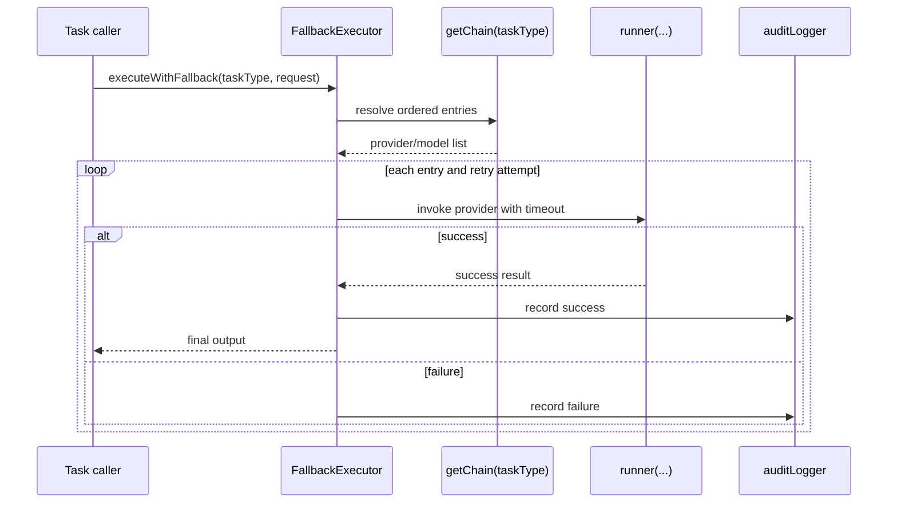

ADPA does not treat AI as one SDK call wired into one environment variable. It models providers as operational resources, keeps them in the database, and routes work through connectors that can fail over when a provider is unavailable, rate-limited, or misconfigured.

## What This Concept Is

The main exported AI surface comes from `server/src/modules/ai/index.ts`:

- `openaiConnector`
- `googleConnector`
- `ollamaConnector`
- `FallbackExecutor`

Each part solves a slightly different problem:

- `openaiConnector` manages a prioritized pool of OpenAI-compatible providers.
- `googleConnector` does the same for Google AI and delays initialization until the database pool is safe.
- `ollamaConnector` exposes helper functions for local model inference.
- `FallbackExecutor` is provider-agnostic and can run any task against an ordered chain of models.

## How It Relates To Other Concepts

- [Context Injection](/docs/context-injection) and [Context Orchestration](/docs/context-orchestration) both eventually depend on an AI provider to turn prompt-plus-context into output.
- [Document Generation](/docs/document-generation) may use AI-generated intermediate content before exporting to a file.
- The AI provider REST routes mounted at `/api/ai-providers` and `/api/ai` let operators configure providers without changing code.

## How It Works Internally

`OpenAIConnector` in `server/src/modules/ai/openai.ts` reads `ai_providers` rows with `provider_type = 'openai'`, decodes the stored API key, builds native clients, and sorts providers by `priority`. `generateCompletion(...)` then walks the available providers, checks in-memory rate-limit counters, tries a request, records usage, and returns the first success.

`GoogleConnector` in `server/src/modules/ai/google.ts` follows a similar pattern but is more defensive during startup. It waits for the database pool to become available, validates API keys when adding providers, and can temporarily disable a provider after a rate-limit error before re-enabling it later.

`ollama.ts` is intentionally lighter. It exports plain functions:

- `generateTextWithOllama(...)`
- `streamTextWithOllama(...)`
- `checkOllamaStatus(...)`
- `getRecommendedOllamaModel(...)`

That difference reflects reality: a local Ollama endpoint is not managed in the same way as a table of hosted-provider configurations.

`FallbackExecutor` is the abstraction that makes the provider layer reusable:



This class is useful when you want fallback behavior without committing to one provider module’s internal control flow.

## Basic Usage

Configure a provider through the API:

```bash
curl -X POST http://localhost:5000/api/ai-providers \
  -H "Content-Type: application/json" \
  -d '{
    "name": "primary-openai",
    "provider_type": "openai",
    "api_key": "sk-your-key",
    "configuration": {
      "model": "gpt-4o",
      "priority": 1
    }
  }'
```

Use the generic fallback executor in server code:

```ts
import { FallbackExecutor } from '@/modules/ai';

const executor = new FallbackExecutor({
  defaultTimeoutMs: 30000,
  getChain: async (taskType) => ({
    id: `chain:${taskType}`,
    taskType,
    entries: [
      { provider: 'openai', modelId: 'gpt-4o', priority: 1, retryAttempts: 2 },
      { provider: 'google', modelId: 'gemini-1.5-pro', priority: 2, retryAttempts: 1 }
    ]
  }),
  runner: async ({ provider, modelId, request }) => {
    return {
      success: true,
      provider,
      modelId,
      output: { provider, modelId, request }
    };
  }
});
```

## Advanced Usage

Use local Ollama for long-context document work and stream the answer:

```ts
import {
  checkOllamaStatus,
  getRecommendedOllamaModel,
  streamTextWithOllama
} from '@/modules/ai/ollama';

const config = { baseURL: process.env.OLLAMA_BASE_URL || 'http://127.0.0.1:11434' };
const status = await checkOllamaStatus(config);

if (!status.available) throw new Error('Ollama is not reachable');

const model = getRecommendedOllamaModel('document analysis');

for await (const chunk of streamTextWithOllama({
  model,
  messages: [{ role: 'user', content: 'Summarize the uploaded governance pack.' }],
  max_tokens: 1024
}, config)) {
  process.stdout.write(chunk);
}
```

## Common Pitfalls

<Callout type="warn">The OpenAI route currently “encrypts” API keys with base64 in `server/src/routes/ai-providers.ts`. That is obfuscation, not strong secret management. Treat the current storage model as operationally convenient but not as a finished security boundary.</Callout>

<Callout type="warn">Google provider initialization depends on database readiness. If the pool is unavailable for long enough, the connector logs a warning and skips DB-backed initialization instead of crashing the server.</Callout>

<Callout type="warn">Ollama success depends entirely on `OLLAMA_BASE_URL` and the local model inventory. The connector can recommend a model ID, but it does not guarantee that the model has actually been pulled into the local Ollama instance.</Callout>

## Trade-offs

<Accordions>
<Accordion title="Failover resilience vs response consistency">
Fallback behavior improves uptime because the system can route around a failing provider or a temporary rate limit. The trade-off is semantic drift: different providers and models do not respond identically, even when the prompt is the same. For exploratory drafting that is acceptable and often desirable. For compliance-sensitive generation, prefer a narrower approved chain and log which provider actually served the response.
</Accordion>
<Accordion title="Local Ollama vs hosted APIs">
Local models reduce external dependency and can be attractive for privacy-sensitive or offline-adjacent workflows. They also make long-context experimentation cheaper once the hardware is in place. The downside is operational responsibility: model downloads, memory pressure, throughput, and local availability all become your problem. Hosted APIs are simpler to operate, but they move cost, latency, and outage risk to a remote service boundary.
</Accordion>
</Accordions>
