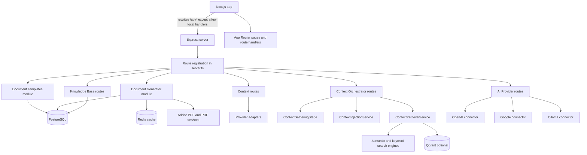
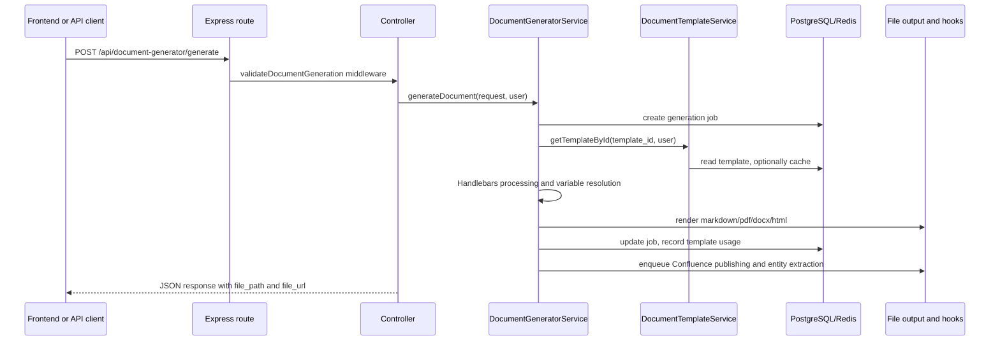

ADPA is organized as a monorepo with a Next.js application at the repository root and an Express server under `server/`. The frontend is not a thin static shell: it owns pages, route handlers, and selected AI/chat endpoints. The backend owns the broad domain API surface, database work, background jobs, and most of the reusable service modules.

## Key Design Decisions

### 1. The frontend proxies to the backend instead of duplicating business logic

`next.config.mjs` rewrites most `/api/*` requests to the backend, while allowing paths that begin with `morphic`, `auth`, `chat`, and `openui-chat` after `/api/` to remain in the Next.js app. That distinction matters: `/api/openui-chat/threads` is handled by a local Next.js proxy route, but `/api/v1/openui-chat/threads` begins with the `v1` segment and is rewritten to the Express backend. The effect is visible in the rewrite rule and in the broad `app.use(...)` registration list inside `server/src/server.ts`.

The OpenUI chat feature intentionally uses both sides of that boundary. The primary shell in `components/openui-chat/openui-chat-shell.tsx` calls `/api/v1/openui-chat/...` with a bearer token, while `app/api/chat/route.ts` and `app/api/openui-chat/threads/*` provide cookie-backed server-side proxies for clients that should not construct the backend authorization header directly. See [OpenUI Chat](/docs/openui-chat) for the route and payload contract.

### 2. Most backend features are module-shaped, not feature-flag spaghetti

The major backend domains follow the same pattern:

- an `index.ts` file that re-exports the module surface,
- a `routes.ts` file that binds HTTP endpoints,
- a `controller.ts` file for request/response mapping,
- a `service.ts` file that owns domain logic,
- a `types.ts` file for contracts and shared data structures.

You can see this clearly in `server/src/modules/documentTemplates`, `server/src/modules/documentGenerator`, and `server/src/modules/knowledgeBase`. That structure matters because it makes the internal API referenceable even when there is no npm package export map.

### 3. ADPA currently carries two generations of context infrastructure

The older context system lives in `server/src/modules/context`. It is centered on static utilities like `ContextInjector`, `ContextPrioritizer`, and `TokenManager`. It gathers project, document, template, user, and integration context directly from database-backed extractors, then injects a synthesized context block into a prompt.

The newer orchestrated path lives in `server/src/modules/contextOrchestrator`, `contextGathering`, `contextInjection`, and `contextRetrieval`. It adds explicit access control, freshness validation, source logging, metrics collection, and an optional Qdrant-backed retrieval layer. The repo still exposes both systems because different routes and services were built at different times.

### 4. AI providers are treated as operational infrastructure, not hard-coded SDK calls

`server/src/modules/ai/openai.ts` and `google.ts` initialize provider pools from the `ai_providers` table, preserve priority ordering, and implement failover. `ollama.ts` is simpler because it talks directly to a local HTTP endpoint, but the exported `ollamaConnector` still fits the same “provider utility” role. `FallbackExecutor.ts` generalizes the retry-and-switch behavior so higher-level services can describe a task type and a chain instead of writing custom failover loops.

### 5. Generation is template-first and export-second

`DocumentGeneratorService` in `server/src/modules/documentGenerator/service.ts` resolves variables, compiles the template with Handlebars, and only then branches into PDF, DOCX, Markdown, or HTML generation. That keeps template logic independent from output rendering and explains why the same generation request can later be extended with new exporters without changing the request contract.

## Request and Data Lifecycle

For the main document-generation path, the lifecycle is:

For context-heavy requests, the flow depends on which system you call:

- `ContextInjector` directly extracts and prioritizes context, estimates token usage, truncates if necessary, and returns an enhanced prompt.
- `ContextOrchestrator` delegates to `ContextGatheringStage`, validates access and freshness, logs every source, and can separately run `ContextInjectionService`.

## How The Pieces Fit Together

The repo is opinionated about ownership boundaries:

- The Next.js app owns presentation, selected local route handlers, and the user-facing shell.
- The Express server owns domain APIs and the service layer.
- PostgreSQL is the source of truth for templates, providers, documents, and knowledge-base data.
- Redis is used for cache-like concerns such as template or generation lookups.
- Optional systems such as Qdrant, MongoDB, Pinecone, Neo4j, RabbitMQ, and Ollama extend capability rather than defining the core contract.

That division is why ADPA scales as a platform instead of a single-purpose generator. A new output format belongs in the generator service. A new provider belongs in the AI module. A new retrieval source belongs in the context stack. The source tree already reflects those seams.
