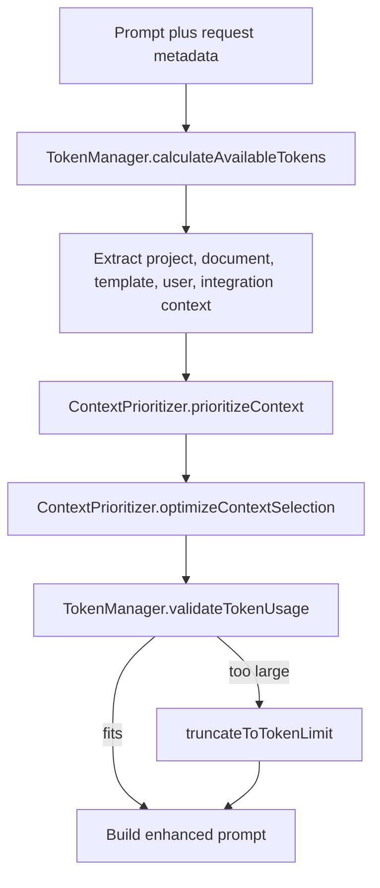

The original ADPA context system is a static, composable prompt-enrichment pipeline. It exists to improve AI output without forcing every caller to manually assemble project state, recent documents, templates, user info, and integration metadata.

## What This Concept Is

The public surface is exported from `server/src/modules/context/index.ts` and centered on these pieces:

- `ContextInjector`
- `ProjectContextExtractor`, `DocumentContextExtractor`, `TemplateContextExtractor`, `UserContextExtractor`, `IntegrationContextExtractor`
- `ContextPrioritizer`
- `TokenManager`
- `ContextAwareAIService`

The core question this system answers is simple: “Given a prompt and a user, what context should be added, and how do we keep it within model limits?”

## How It Relates To Other Concepts

- Templates can suggest which context should matter most.
- Document generation can consume AI output that was produced through this enriched path.
- The [Context Orchestration](/docs/context-orchestration) system is the newer, heavier-weight alternative when you need freshness validation, source logs, and retrieval metrics.

## How It Works Internally

`ContextInjector.injectContext(...)` in `server/src/modules/context/injector.ts` is the main entry point. It:

1. merges caller config with a default config,
2. estimates available context tokens via `TokenManager.calculateAvailableTokens(...)`,
3. extracts context data from database-backed extractors,
4. prioritizes sections with `ContextPrioritizer`,
5. validates token usage,
6. truncates when the estimate is too high,
7. returns an `enhanced_prompt`, a summary, and token-usage metadata.

The extractors in `server/src/modules/context/extractors.ts` are not generic stubs. They query real tables like `projects`, `documents`, and `templates`, enforce ownership or admin checks, and optionally summarize or outline long document content before it enters the prompt.

`ContextPrioritizer` turns raw context objects into `ContextSection` instances. It scores them by:

- explicit priority,
- prompt relevance,
- section size,
- token efficiency.

`TokenManager` is the budget guardrail. It estimates model limits per provider and model, reserves room for the response, and throws when the combined prompt and context exceed the available budget. The injector catches that scenario and falls back to truncation instead of failing immediately.



## Basic Usage

Use the high-level integration wrapper for a normal AI call:

```ts
import { ContextAwareAIService } from '@/modules/context';

const result = await ContextAwareAIService.generateWithContext({
  user_id: '0d26b695-3be7-44e2-9c8f-26f2bb74f50a',
  provider: 'openai',
  model: 'gpt-4o',
  prompt: 'Draft an executive summary for the latest project status.',
  project_id: '7d9d7de9-c4cd-4bf4-a973-8e183d8ff0a1',
  include_integrations: false,
});
```

Preview what would be injected before spending tokens:

```ts
const preview = await ContextAwareAIService.getContextPreview({
  user_id: '0d26b695-3be7-44e2-9c8f-26f2bb74f50a',
  prompt: 'Summarize the main project risks.',
  project_id: '7d9d7de9-c4cd-4bf4-a973-8e183d8ff0a1',
  template_id: '6c3f6d4e-1a2b-4af9-a5d1-5f5b0d3d4b20',
});
```

## Advanced Usage

Override priorities and impose a stricter token ceiling:

```ts
import { ContextAwareAIService, ContextPriority } from '@/modules/context';

const result = await ContextAwareAIService.generateWithContext({
  user_id: '0d26b695-3be7-44e2-9c8f-26f2bb74f50a',
  provider: 'google',
  model: 'gemini-1.5-pro',
  prompt: 'Write a change-impact assessment.',
  project_id: '7d9d7de9-c4cd-4bf4-a973-8e183d8ff0a1',
  document_ids: [
    '6a26c4ae-f92b-41dd-b5aa-dab1f54ef901',
    '88cf15cb-0a9e-47be-b860-1e0cedca5b73'
  ],
  max_context_tokens: 1800,
  context_priority: {
    project: ContextPriority.HIGH,
    documents: ContextPriority.HIGH,
    templates: ContextPriority.MEDIUM,
    user: ContextPriority.LOW,
    integrations: ContextPriority.LOW,
    custom: ContextPriority.CRITICAL
  },
  custom_context: {
    releaseWindow: 'Production freeze begins in 12 days.',
    boardConstraint: 'Budget increase requests must be approved this quarter.'
  }
});
```

## Common Pitfalls

<Callout type="warn">Token estimates are approximate. `TokenManager` uses a practical estimate rather than provider-native tokenizer calls for every model, so a request that fits the ADPA estimate can still run close to the real model limit when you choose unusually verbose source documents.</Callout>

<Callout type="warn">Documents are included automatically for a project when `document_ids` are omitted. That is useful for convenience, but it can also drag in irrelevant recent documents and dilute the prompt if your project has noisy history.</Callout>

<Callout type="warn">`ContextAwareAIService` silently falls back to plain AI generation if context injection fails. That keeps the request alive, but it means a superficially successful response may have been generated without any project context unless you inspect `context_summary` and `context_warnings`.</Callout>

## Trade-offs

<Accordions>
<Accordion title="Static injector vs orchestrated context pipeline">
The static injector is easy to call, easy to unit test, and fast to reason about. It works well when the main goal is to enrich prompts with data already stored in ADPA’s own tables. The trade-off is visibility: you do not get per-source freshness analysis, source logs, or the richer health model of the orchestrator. Use the static injector when simplicity matters more than observability.
</Accordion>
<Accordion title="Full content vs summarized or outlined content">
The extractor layer can pass full content, summaries, or outlines. Full content preserves nuance and gives large models more evidence, but it burns through token budgets quickly and can crowd out higher-priority context. Summaries and outlines are cheaper and often more useful for executive-style generation, yet they can drop the exact phrasing or evidence a compliance-heavy answer needs. Pick the cheapest representation that still preserves the decision-critical facts.
</Accordion>
</Accordions>
