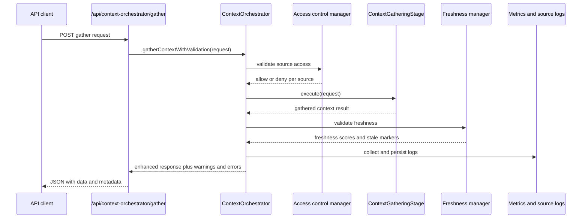

The context orchestrator is ADPA’s second-generation context stack. It exists because prompt enrichment eventually needed stronger operational guarantees than the original static injector could provide.

## What This Concept Is

`ContextOrchestrator` from `server/src/modules/contextOrchestrator/contextOrchestrator.ts` wraps several subsystems:

- `ContextGatheringStage`
- `ContextInjectionService`
- `ContextAccessControlManager`
- `ContextFreshnessManager`
- `ContextRetrievalService`

Its job is not only to collect context, but also to explain what happened during collection: which sources were attempted, which were denied, which were stale, how much data was gathered, and how long it took.

## How It Relates To Other Concepts

- It can gather richer context for [Document Templates](/docs/document-templates) and [Document Generation](/docs/document-generation) requests.
- It complements, rather than fully replaces, the older [Context Injection](/docs/context-injection) utilities.
- It depends on the retrieval contracts in `server/src/modules/contextRetrieval/types.ts`, including search strategy and relevance scoring configuration.

## How It Works Internally

The constructor wires together all of its dependencies with opinionated defaults:

- access control enabled,
- freshness validation enabled,
- logging and metrics enabled,
- caching enabled,
- a 10 MB context-size cap,
- a 30 second processing-time target,
- optional Qdrant search if `QDRANT_URL` is configured.

`gatherContextWithValidation(...)` is the main orchestration path. It:

1. creates or normalizes a request ID,
2. validates access to the requested context sources,
3. runs `ContextGatheringStage.execute(...)`,
4. validates freshness scores,
5. logs per-source retrieval details,
6. computes aggregate metrics,
7. stores metrics and logs when enabled,
8. returns both gathered context and the audit trail around it.

`injectContextWithValidation(...)` is intentionally thinner. It delegates actual bundle creation to `ContextInjectionService`, then adds orchestration-side logging and timing around the result.



The route layer in `server/src/routes/contextOrchestrator.ts` exposes:

- `POST /api/context-orchestrator/gather`
- `POST /api/context-orchestrator/inject`
- `GET /api/context-orchestrator/health`
- `GET /api/context-orchestrator/metrics`

Unlike the lighter context tools, the orchestrator route accepts knobs like `freshness_threshold`, `required_permissions`, and `context_size_limit`.

## Basic Usage

Gather context for a template-aware request:

```bash
curl -X POST http://localhost:5000/api/context-orchestrator/gather \
  -H "Content-Type: application/json" \
  -H "Authorization: Bearer $TOKEN" \
  -d '{
    "project_id": "7d9d7de9-c4cd-4bf4-a973-8e183d8ff0a1",
    "template_id": "6c3f6d4e-1a2b-4af9-a5d1-5f5b0d3d4b20",
    "document_type": "charter"
  }'
```

Check subsystem health:

```bash
curl http://localhost:5000/api/context-orchestrator/health \
  -H "Authorization: Bearer $TOKEN"
```

## Advanced Usage

Tighten freshness and access requirements for a regulated workflow:

```json
{
  "request_id": "ctx_governance_review_001",
  "project_id": "7d9d7de9-c4cd-4bf4-a973-8e183d8ff0a1",
  "template_id": "6c3f6d4e-1a2b-4af9-a5d1-5f5b0d3d4b20",
  "document_type": "governance_pack",
  "enable_access_control": true,
  "enable_freshness_validation": true,
  "freshness_threshold": 43200000,
  "required_permissions": ["read", "governance.review"],
  "context_size_limit": 2097152,
  "enable_rag": true,
  "enable_baseline": true,
  "enable_external_sources": false
}
```

Run the injection half directly when a template already knows its context settings:

```bash
curl -X POST http://localhost:5000/api/context-orchestrator/inject \
  -H "Content-Type: application/json" \
  -H "Authorization: Bearer $TOKEN" \
  -d '{
    "template_id": "6c3f6d4e-1a2b-4af9-a5d1-5f5b0d3d4b20",
    "project_id": "7d9d7de9-c4cd-4bf4-a973-8e183d8ff0a1"
  }'
```

## Common Pitfalls

<Callout type="warn">The `gather` route requires at least one of `template_id` or `project_id`. That rule is enforced by Joi with `.or('template_id', 'project_id')`, so empty orchestration requests fail before any stage work happens.</Callout>

<Callout type="warn">Large `context_size_limit` values do not override downstream model budgets. The orchestrator guards bytes and processing cost, while the injector and AI provider still have token and provider-specific limits afterwards.</Callout>

<Callout type="warn">Qdrant is optional. If `QDRANT_URL` is not set, the orchestrator still works, but retrieval falls back to the engines initialized without a Qdrant backend. That can change relevance behavior without producing a startup failure.</Callout>

## Trade-offs

<Accordions>
<Accordion title="Operational visibility vs implementation complexity">
The orchestrator gives you source logs, health data, freshness scoring, and metrics that the original context stack does not provide. That is valuable for governance-heavy environments where you need to explain why specific context entered a prompt. The cost is a wider dependency graph and more moving parts during startup. If your use case is simple drafting inside one project, the lighter injector may be the better default.
</Accordion>
<Accordion title="Strict validation vs graceful degradation">
The orchestrator validates access and freshness before it returns success, which raises trust in the result. It also tries to preserve partial information by returning warnings, source logs, and even partial metrics when gathering fails. That balance is useful, but it means clients must read more than a boolean `success` flag if they care about quality. Treat orchestrator responses as diagnostic payloads, not just content payloads.
</Accordion>
</Accordions>
