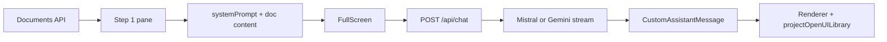

The **document GenUI workspace** lets users read an extracted governance document on the left and chat with an AI advisor on the right. The advisor can return **OpenUI Lang**, which the UI renders as interactive components (cards, tables, charts, tabs, steps).

This page is **not** the same as [OpenUI Chat](/docs/openui-chat), which is project-scoped chat backed by `server/src/modules/openuiChat` with thread persistence and RAG. The document workspace uses `POST /api/chat` with `systemPrompt` (Mistral or Gemini via `GENUI_LLM_PROVIDER`).

**Any document** in the project stack can use this route (`docId` in the query string). Layout rules are driven by the **user’s message** and markdown structure, not by a fixed document type.

For agent-driven maintenance, see `.agents/skills/adpa-genui-workspace/SKILL.md` and the **Document GenUI workspace** section in `AGENTS.md`.

## User-facing URL

```txt
/projects/{projectId}/documents/genui?docId={documentId}
```

Helper: `getProjectDocumentGenUIPath(projectId, documentId)` in `lib/documents/document-routes.ts`.

Navigation from other document modes (View, Source, Report) uses `DocumentPageToolbar` with mode `genui`.

## Layout

| Pane | Purpose |
| --- | --- |
| **Step 1 — Source document** | Title, metadata, word count, full extracted `doc.content` from the documents API |
| **Step 2 — Component report** | OpenUI `FullScreen`: **Render document** CTA, starters, streaming OpenUI Lang in **report surface**, **Export report** bar (PDF / Word / HTML) |
| **Step 3 — Published presentations** | *Planned* — snapshot + blob artifacts + optional publish to **Confluence / Jira / SharePoint / ProjectWise**; see [design spec](../superpowers/specs/2026-05-21-genui-step3-presentations-design.md) |

Right pane uses ~62% width. Light theme is default; dark report is an explicit conversation starter (`GENUI_RENDER_FULL_DOCUMENT_DARK_PROMPT`), not automatic.

Styling lives in `app/projects/[id]/documents/genui/genui-workspace.css` (light theme, panel-sized OpenUI shell, sidebar hidden inside the embed).

## Source map

| Concern | Files |
| --- | --- |
| Main page | `app/projects/[id]/documents/genui/page.tsx` |
| Workspace CSS | `app/projects/[id]/documents/genui/genui-workspace.css` |
| Error UI | `app/projects/[id]/documents/genui/error.tsx` |
| Chat proxy (Mistral) | `app/api/chat/route.ts` |
| Assistant rendering | `components/openui-chat/AssistantMessage.tsx` (re-exported from `components/Chat/AssistantMessage.tsx`) |
| Lang → components | `components/openui-chat/DynamicComponentRenderer.tsx` |
| Canonical library | `lib/openui/projectOpenUILibrary.ts`, `lib/openui/adpaGenuiExtensionDefs.ts`, `lib/openui/systemPrompt.ts` |
| Layout planner | `lib/openui/layoutPlan.ts` (focused vs full report, shell selection) |
| Report surface | `components/genui/GenuiReportSurfaceContext.tsx` |
| Fence stripping / detection | `lib/openui/library.ts` — `extractOpenUILangText()`, `looksLikeOpenUILang()` |
| Conversation starters | `lib/documents/document-chat-prompts.ts`, `lib/documents/genui-prompts.ts` |
| Render CTA bridge | `components/genui/GenuiPromptBridge.tsx` (`useThread().processMessage`) |
| Route IDs | `lib/documents/use-project-document-route-ids.ts` |
| Toolbar / GenUI button | `components/documents/DocumentPageToolbar.tsx` |

## Request and rendering flow

1. The page loads the document via the authenticated documents API (`projectId` + `documentId`).
2. It builds a **system prompt** from `buildOpenUISystemPrompt()` (`projectOpenUILibrary.prompt()` + layout rules in `lib/openui/systemPrompt.ts`) plus the full document body and metadata.
3. `FullScreen` posts to `POST /api/chat` with `{ systemPrompt, messages }`. The page passes **`lastUserLayoutPrompt`** (latest user text) into `CustomAssistantMessage` for layout repair — not only the default full-document string.
4. `buildLayoutPlan({ prompt, sourceText: doc.content, documentId })` runs before the executor LLM; output is injected as `=== REQUIRED LAYOUT PLAN ===` via `enrichOpenUIApiMessages()`.
5. When `systemPrompt` is present, `app/api/chat/route.ts` streams from **Mistral** or **Google Gemini** (`GENUI_LLM_PROVIDER`). Without `systemPrompt`, the route proxies to backend OpenUI chat.
6. The model should reply in **OpenUI Lang** (e.g. `root = Stack([...])`), sometimes wrapped in ` ```openui-lang ` fences.
7. `CustomAssistantMessage` detects Lang, strips fences, and renders with `@openuidev/react-lang` `Renderer` and **`projectOpenUILibrary`** (GenUI catalog + ADPA extensions).



### Rendering pitfalls

- **`assistantMessage={CustomAssistantMessage}` overrides** the default `FullScreen` assistant renderer. If the custom component only shows markdown, users see raw Lang in a code block.
- Use **`projectOpenUILibrary`** for this page (not bare `openuiLibrary` — Bullets will fail; not `adpaLibrary` — legacy Report grammar).
- Prompts should request **Card / Stack / Accordion / Table** layouts, not a single top-level `Bullets` (see `systemPrompt.ts`).
- Always run model output through **`extractOpenUILangText()`** before `looksLikeOpenUILang()` / `Renderer`.

## Focused vs full document layout

| Mode | Typical user prompt | Result |
| --- | --- | --- |
| **Focused detail** | Timeline/gantt/kanban from a section; `no cover`, `no table of contents`; follow-ups like “from this report, gantt chart” | Single **Timeline** or **Table** in `root = Stack([...])` — **no** cover or TOC |
| **Full report** | `GENUI_RENDER_FULL_DOCUMENT_PROMPT`, “render the full document”, cover + chapters | Cover + optional TOC + **Card per chapter** when the doc has enough `##` headings |

Prompt constants: `lib/documents/genui-prompts.ts`. Schedule-related starters: keyword bucket in `document-chat-prompts.ts`.

**Current mapping (until dedicated Lang widgets exist):**

| User intent | Lang output |
| --- | --- |
| Timeline / milestones | `Timeline` |
| “Gantt chart” | `Table` (activities, dates, dependencies) |
| Kanban-style | `Table` with status columns |

Planner helpers: `wantsGenuiFocusedDetailRender()`, `wantsGenuiFullDocumentLayout()` in `layoutPlan.ts`. Tests: `__tests__/lib/layoutPlan.test.ts`.

## Environment variables

Set in `.env.local` (see `.env.local.example`):

| Variable | Required for Step 2 | Notes |
| --- | --- | --- |
| `GENUI_LLM_PROVIDER` | No | `mistral` (default) or `google` for Gemini |
| `MISTRAL_API_KEY` | When provider is Mistral | Missing key → 503 from `/api/chat` |
| `MISTRAL_MODEL` | No | Default `mistral-large-latest` |
| `GOOGLE_AI_API_KEY` / `GOOGLE_GENERATIVE_AI_API_KEY` | When provider is `google` | Same keys as server Gemini |
| `BACKEND_URL` | Step 1 | Document fetch via Express proxy |
| Auth (`auth_token` cookie / Firebase) | Yes | Page requires login |

OpenUI package styles are imported on the page:

```ts
import "@openuidev/react-ui/defaults.css";
import "@openuidev/react-ui/components.css";
```

## Export and Step 3 (publish)

### Step 2 — client export (shipped)

Rendered `.genui-lang-render` DOM — not raw Lang. See `lib/genui/reportExport.ts` and `components/genui/GenuiReportExportBar.tsx`.

| Format | Mechanism |
| --- | --- |
| PDF | Browser print dialog |
| Word | HTML wrapped as `.doc` |
| HTML | Standalone download |
| More | Plain text, OpenUI Lang source, Step 1 markdown |

Server `GET /api/v1/documents/:id/export/pdf` still exports **markdown** only — different audience.

### Step 3 — reserved (not implemented)

**Canonical document:** `documents.content` (markdown). **Published report:** snapshot row + blobs (PDF, optional Lang replay). Full design: [2026-05-21-genui-step3-presentations-design.md](../superpowers/specs/2026-05-21-genui-step3-presentations-design.md).

Code reserve: `lib/genui/presentationSnapshot.ts` (`buildPresentationSnapshotDraft`, API path helpers). Enable future UI with `NEXT_PUBLIC_GENUI_STEP3_PUBLISH=true`.

## Persistence and sessions

- **Threads:** Not stored in `openui_chat_threads` today. Chat state is in-memory in `FullScreen`.
- **New chat:** Increments `chatSessionKey` to remount `FullScreen`; also resets when `documentId` changes.
- **Copy toolbar:** Copies raw document text (Step 1), not the chat transcript.

## Extending the workspace

| Goal | Where to change |
| --- | --- |
| Suggested questions | `lib/documents/document-chat-prompts.ts`, `lib/documents/genui-prompts.ts` |
| Focused vs full planner rules | `lib/openui/layoutPlan.ts`, `lib/openui/componentSelector.ts` |
| Grounding / executor instructions | `lib/openui/systemPrompt.ts` |
| Layout / contrast / OpenUI embed | `genui-workspace.css` |
| **New Lang component (stack-wide)** | See checklist in `.agents/skills/adpa-genui-workspace/SKILL.md` — register in `adpaGenuiExtensionDefs.ts` (not only `DynamicComponentRenderer` JSON) |
| Thread history per document | New persistence design — do not break `/api/v1/openui-chat` without a migration plan |
| RAG for large documents | Chunk retrieval from existing server RAG; watch context limits |

Adding a component does **not** require changing `docId` routing or document fetch — only the shared OpenUI library, planner, prompts, and tests.

Future PM dashboards are described in `docs/superpowers/specs/2026-05-18-genui-personalized-dashboards-design.md`; that is a separate route from this document workspace.

## Manual test checklist

1. Log in; open `/projects/{id}/documents/genui?docId={uuid}` for a document with body text.
2. Confirm Step 1 shows title, metrics, and extracted content.
3. Confirm Step 2 shows welcome text and conversation starters; input is centered in the right panel.
4. Send a starter (e.g. risks table) — response should be **rendered UI**, not a fenced code block.
5. Use **View source** / **Show rendered** on an assistant message.
6. **New chat** clears the thread; changing document in the toolbar loads the new doc and resets chat.
7. Toolbar links: View, Source, Report, GenUI.

## Troubleshooting

| Symptom | Likely cause |
| --- | --- |
| Raw `openui-lang` code block | Assistant path not using `Renderer` + `projectOpenUILibrary` |
| Broken or empty widgets | Wrong library (`adpaLibrary` or bare `openuiLibrary`) |
| `unknown-component` Bullets | Use `projectOpenUILibrary` on renderer |
| Only Bullets in UI | Model chose minimal layout; adjust prompt or user request |
| 503 on send | API key missing for `GENUI_LLM_PROVIDER` |
| 401 on send | Not logged in |
| Empty Step 1 | Document API or missing `doc.content` |
| Chat layout broken | `genui-workspace.css` overrides under `.genui-openui-root` |
| Model ignores document | Empty content or weak system prompt |
| Full SMP after “gantt from report” | Follow-up not treated as focused — avoid “full document” on chart follow-ups; see `wantsGenuiFocusedDetailRender` |
| Gantt shows as table | Expected until a Gantt Lang extension is registered |

## Related documentation

- [OpenUI Chat](/docs/openui-chat) — backend module, threads, SSE payloads
- `docs/superpowers/specs/2026-05-14-openui-chat-design.md` — GenUI strategy for project chat
- `docs/superpowers/specs/2026-05-18-genui-personalized-dashboards-design.md` — future dashboards
- `.agents/skills/adpa-genui-workspace/SKILL.md` — agent maintenance skill
