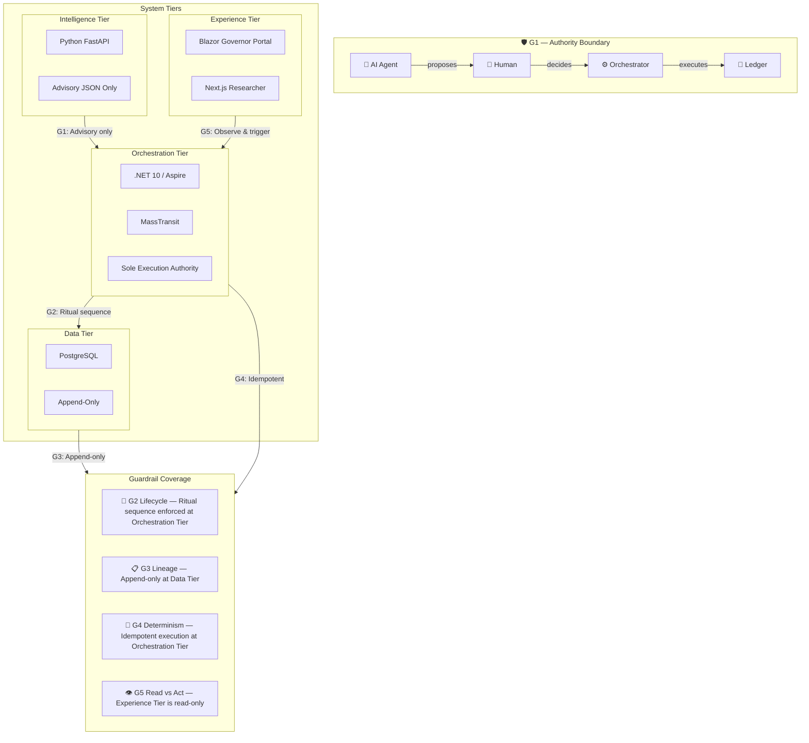

# ✅ RPAS‑CM Governance Sheet

### RPAS‑CM‑GRA‑001 v2.0.0 (CSR‑42) — Quick Reference

> **Canonical Source**: [RPAS.md](file:///f:/Source/Repos/adpa/RPAS.md)
> **AEV Workflow**: [CONTRIBUTING.md](file:///f:/Source/Repos/adpa/CONTRIBUTING.md)
> **Agent Envelope**: [GEMINI.md](file:///f:/Source/Repos/adpa/GEMINI.md)

***

## 🛡️ Governance Guardrails (G1–G5)

| ID | Guardrail | Principle | Purpose |
|----|-----------|-----------|---------|
| **G1** | **Authority Boundary** | AI proposes → Humans decide → Orchestrator executes | Prevent unauthorized mutation |
| **G2** | **Lifecycle Integrity** | No skipping rituals; canonical sequence enforced | Protect process correctness |
| **G3** | **Evidence & Lineage** | Append‑only, fully traceable, audit‑safe | Forensic reconstruction |
| **G4** | **Determinism** | Idempotent, predictable, CSR‑stamped once | Prevent state divergence |
| **G5** | **Read vs Act** | UI/AI observe; only Orchestrator acts | Separate view from authority |

***

## 🏗️ Tier Enforcement Matrix

| Tier | Role | May Propose | May Decide | May Execute | May Mutate Ledger |
|------|------|:-----------:|:----------:|:-----------:|:-----------------:|
| **Intelligence** (Python/FastAPI) | RTM Research Advisor | ✅ Advisory JSON | ❌ | ❌ | ❌ |
| **Orchestration** (C#/.NET 10/Aspire) | Sole Execution Authority | ❌ | ❌ | ✅ | ✅ (via ritual) |
| **Experience — Governor** (Blazor) | Decision Interface | ❌ | ✅ | ✅ (triggers) | ❌ (via Orchestrator) |
| **Experience — Researcher** (Next.js) | Advisory Dashboard | ✅ Draft only | ❌ | ❌ | ❌ |
| **Data** (PostgreSQL) | Governance Ledger | ❌ | ❌ | ❌ | Append‑only store |

***

## 🔄 Lifecycle Ritual Sequence (G2)

```
Ideation
  → Business Case
    → Approval
      → RTM Seed
        → Amendment Proposal
          → Amendment Decision
            → Execution
              → CSR‑Certified Baseline
```

> [!CAUTION]
> No skipping steps. No fast‑tracking. No retroactive mutation. Every artifact must reflect its correct lifecycle stage.

***

## ☁️ Cloud‑Ready Criteria (CR1–CR5)

| ID | Criterion | Requirement |
|----|-----------|-------------|
| **CR1** | Deterministic Execution | All rituals are idempotent and safe for distributed retries |
| **CR2** | Authority‑Gated Mutation | No mutation without explicit human‑attributed decision artifacts |
| **CR3** | Append‑Only History | All superseded state remains queryable; history never rewritten |
| **CR4** | Failure Safety | Safe under restarts, retry storms, multi‑region duplication |
| **CR5** | Experience Decoupling | UI is replaceable; governance lives in the core, not the interface |

***

## 🚦 AEV Validation Gates (Summary)

| Gate | Name | Validates | On Failure |
|------|------|-----------|------------|
| 🟢 **1** | Mechanical Integrity | Only declared files changed, no untracked artifacts | Rollback |
| 🟢 **2** | Build Integrity | All projects compile, no DI/namespace breaks | Rollback |
| 🟢 **3** | Orchestration Integrity | Aspire resolves all services, no startup exceptions | Rollback (no debug) |
| 🟢 **4** | Governance Invariants | Append‑only ledger, immutable amendments, idempotent events | Rollback |
| 🟢 **5** | Proof‑of‑Life | One happy‑path scenario passes end‑to‑end | Rollback |

> [!IMPORTANT]
> If **any** gate fails: revert to last `SAFE` commit. Do not debug in a dirty state. Do not layer fixes. Restart from baseline.

***

## 📊 Visual: Guardrail Enforcement Across Tiers



***

## 📝 Amendment Protocol

**Format**: `AMD‑YYYY‑MM‑DD‑#### (Semantic Description)`

| Code | Change Type |
|------|-------------|
| `EXP` | Expansion |
| `REP` | Replacement |
| `FIX` | Hotfix |
| `DEL` | Deprecation |
| `INT` | Integration |
| `NEW` | New governance artifact |

***

## 🏷️ Version Maturity Levels

| Version | Maturity |
|---------|----------|
| `v0.x` | Exploration (not governed) |
| `v1.x` | ADPA Baseline |
| `v2.x` | RPAS‑Aligned Governance |
| `v3.x` | DRACO‑Supervised & Lineage Bound |
| `v4.x` | Fully deterministic AI‑assisted governance |

***

> [!NOTE]
> This sheet is a **read‑only reference** extracted from the authoritative [RPAS.md](file:///f:/Source/Repos/adpa/RPAS.md). All amendments must be applied to the canonical source first, then propagated here.
