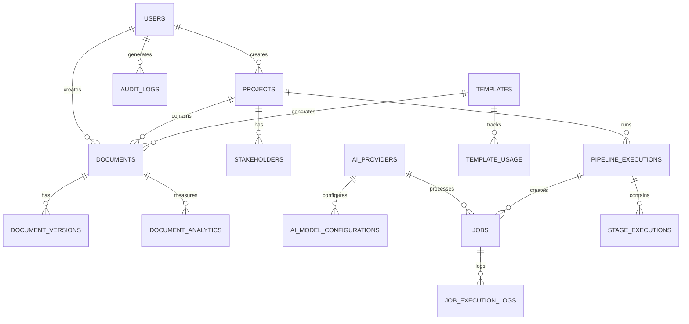

# ADPA Data Model - Current State & Future Recommendations

**Version:** 2.0  
**Date:** October 18, 2025  
**Status:** Based on Production Database Audit  
**Category:** Technical Analysis - Database Architecture

---

## Executive Summary

This document provides an **evidence-based data model** for ADPA, derived from a comprehensive audit of the production database (93 tables analyzed). Unlike theoretical models, this reflects **what actually works** in production and provides clear recommendations for optimization and future growth.

### Key Findings

- **Current State**: 93 tables, 27 active (29%), 66 empty (71%)
- **Recommendation**: Consolidate to ~50 purposeful tables
- **Focus**: Strengthen core entities, remove speculative features
- **Benefit**: Cleaner schema, better performance, easier maintenance

---

## 1. Current Production Schema Analysis

### 1.1 Core Active Entities (Working Well) ✅

These 27 tables are **actively used and form the foundation** of ADPA:

#### **User & Access Management** (3 tables)
| Table | Rows | Purpose | Status |
|-------|------|---------|--------|
| `users` | 5 | User accounts and authentication | ✅ Core |
| `audit_logs` | 55 | Security and compliance tracking | ✅ Core |
| `user_activity_logs` | 642 | User behavior analytics | ✅ Core |

#### **Document Management** (5 tables)
| Table | Rows | Purpose | Status |
|-------|------|---------|--------|
| `documents` | 70 | Core document storage (3 MB) | ✅ Core |
| `document_versions` | 7 | Version history | ✅ Core |
| `document_analytics` | 15 | Document metrics | ✅ Core |
| `document_tags` | 0 | Tagging system | ⚠️ Empty but useful |
| `document_quality_metrics` | 0 | Quality tracking | ⚠️ Empty but useful |

#### **Template System** (4 tables)
| Table | Rows | Purpose | Status |
|-------|------|---------|--------|
| `templates` | 53 | Template definitions | ✅ Core |
| `template_quality_metrics` | 37 | Template performance | ✅ Core |
| `template_usage` | 32 | Usage analytics | ✅ Core |
| `template_versions` | 0 | Version history | ⚠️ Future |

#### **Project Management** (3 tables)
| Table | Rows | Purpose | Status |
|-------|------|---------|--------|
| `projects` | 9 | Project workspaces | ✅ Core |
| `stakeholders` | 20 | Project stakeholders | ✅ Core |
| `milestones` | 0 | Project milestones | ⚠️ Future |

#### **AI & Processing** (5 tables)
| Table | Rows | Purpose | Status |
|-------|------|---------|--------|
| `ai_providers` | 6 | AI provider configs | ✅ Core |
| `ai_model_configurations` | 14 | Model settings | ✅ Core |
| `fallback_strategies` | 3 | AI fallback logic | ✅ Core |
| `resolution_strategies` | 10 | Error resolution | ✅ Core |
| `source_authority` | 7 | Data source trust | ✅ Core |

#### **Pipeline & Jobs** (4 tables)
| Table | Rows | Purpose | Status |
|-------|------|---------|--------|
| `pipeline_executions` | 29 | Pipeline runs | ✅ Core |
| `stage_executions` | 160 | Stage-level execution (12 MB!) | ✅ Core |
| `jobs` | 38 | Async job queue | ✅ Core |
| `job_execution_logs` | 188 | Job history | ✅ Core |

#### **Compression & Performance** (2 tables)
| Table | Rows | Purpose | Status |
|-------|------|---------|--------|
| `compression_metrics` | 145 | Compression stats | ✅ Active |
| `compression_strategies` | 4 | Compression algorithms | ✅ Active |

#### **System** (3 tables)
| Table | Rows | Purpose | Status |
|-------|------|---------|--------|
| `system_settings` | 4 | App configuration | ✅ Core |
| `api_request_logs` | 13,589 | API monitoring (7.6 MB) | ✅ Core |
| `migrations` | 3 | Schema version control | ✅ Core |

### 1.2 Empty Tables (Candidates for Removal) ⚠️

**66 tables (71%) are completely empty** and should be reviewed:

#### **Context System** (14 tables) - **REMOVE**
Never implemented, adds complexity without value:
- context_bundles, context_items, context_cleanup_results
- context_freshness_* (8 tables)
- context_refresh_*, context_retrieval_metrics, context_staleness_log

#### **Unused Analytics** (13 tables) - **REMOVE**
Redundant with existing analytics capabilities:
- analysis_metrics, query_analytics, processing_metrics
- quality_reports, quality_trends, daily_statistics
- historical_trends, system_metrics
- *_analysis tables (document, framework, project, user)

#### **Variable Resolution** (5 tables) - **REMOVE**
Over-engineered solution that wasn't needed:
- variable_analysis_results, variable_patterns
- variable_resolution_cache, variable_resolution_metrics, variable_resolution_results

#### **User Personalization** (7 tables) - **REVIEW**
Prepared for future features:
- user_preferences, user_collaboration_preferences
- user_domain_knowledge, user_expertise
- user_search_preferences, user_writing_style
- integration_sync_metadata

**Decision**: Keep if personalization is in Q1 2026 roadmap, else remove.

#### **Future Features** (27+ tables) - **DOCUMENT AS FUTURE**
Keep but clearly mark as "not yet implemented":
- integrations, requirements, risks, phases
- workflow_executions, workflow_presets
- search_*, embedding_cache
- best_practices, improvement_suggestions
- etc.

---

## 2. Proposed Optimized Data Model

### 2.1 Core Entity Relationships (Simplified)



### 2.2 Recommended Table Structure (Post-Cleanup)

#### **Tier 1: Core Business Logic (15 tables)**

Essential tables that drive all core functionality:

**User & Security**
- `users` - User accounts
- `audit_logs` - Security events
- `user_activity_logs` - Usage tracking

**Documents**
- `documents` - Primary document storage
- `document_versions` - Version history
- `document_analytics` - Performance metrics

**Templates**
- `templates` - Template definitions
- `template_quality_metrics` - Quality scores
- `template_usage` - Usage statistics

**Projects**
- `projects` - Project workspaces
- `stakeholders` - Project stakeholders

**AI Processing**
- `ai_providers` - AI configurations
- `ai_model_configurations` - Model settings

**Jobs & Pipelines**
- `pipeline_executions` - Pipeline orchestration
- `stage_executions` - Execution details

#### **Tier 2: Supporting Infrastructure (12 tables)**

Important but secondary functionality:

- `jobs`, `job_execution_logs` - Async processing
- `api_request_logs` - API monitoring
- `compression_metrics`, `compression_strategies` - Performance
- `fallback_strategies`, `resolution_strategies` - Error handling
- `source_authority` - Data trust
- `system_settings` - Configuration
- `migrations` - Schema versioning

#### **Tier 3: Future Features (8-15 tables)**

Documented for future implementation:

- `integrations` - External system connections
- `requirements`, `risks`, `milestones` - PM features
- `document_tags` - Tagging system
- `template_versions` - Version control
- Others as needed

**Total Proposed: ~35-45 tables** (down from 93)

---

## 3. Schema Design Principles (Based on Reality)

### 3.1 What Works Well ✅

Based on production experience:

1. **UUIDs for Primary Keys** - Proven in distributed environment
2. **JSONB for Flexible Data** - Works well for `content`, `variables`, `metadata`
3. **Soft Deletes** - `deleted_at` columns preserve history
4. **Timestamp Tracking** - `created_at`, `updated_at` everywhere
5. **Status Enums** - Clear state machines for documents, pipelines
6. **Composite Indexes** - Good performance on common queries
7. **Foreign Key Constraints** - Maintain referential integrity

### 3.2 Areas for Improvement ⚠️

1. **Over-normalization** - 66 empty tables from premature optimization
2. **Missing Indexes** - Some common queries lack proper indexes
3. **Log Retention** - No archival strategy for old logs (13K+ rows)
4. **Table Bloat** - `stage_executions` at 12 MB needs partitioning
5. **Unclear Purpose** - Many tables lack documentation

### 3.3 Anti-Patterns to Avoid ❌

Based on audit findings:

1. **❌ Don't create tables speculatively** - 71% are unused
2. **❌ Don't over-engineer** - Variable resolution system was overkill
3. **❌ Don't duplicate analytics** - Consolidate metrics tables
4. **❌ Don't skip documentation** - Hard to know what's used
5. **❌ Don't ignore log retention** - Logs grow indefinitely

---

## 4. Detailed Entity Specifications

### 4.1 Users & Authentication

```sql
-- Core user entity (5 rows in production)
CREATE TABLE users (
  id UUID PRIMARY KEY DEFAULT gen_random_uuid(),
  email VARCHAR(255) UNIQUE NOT NULL,
  password_hash VARCHAR(255) NOT NULL,
  full_name VARCHAR(255),
  role VARCHAR(50) NOT NULL DEFAULT 'user',
  status VARCHAR(50) NOT NULL DEFAULT 'active',
  created_at TIMESTAMP WITH TIME ZONE DEFAULT NOW(),
  updated_at TIMESTAMP WITH TIME ZONE DEFAULT NOW(),
  deleted_at TIMESTAMP WITH TIME ZONE
);

-- Indexes based on actual usage patterns
CREATE INDEX idx_users_email ON users(email) WHERE deleted_at IS NULL;
CREATE INDEX idx_users_status ON users(status) WHERE deleted_at IS NULL;
CREATE INDEX idx_users_role ON users(role) WHERE deleted_at IS NULL;
```

**Design Notes:**
- Simple, flat structure works well
- Role stored as VARCHAR (not FK) - simpler for small user base
- Soft delete pattern (`deleted_at`) preserves history
- **Current**: 5 users, no issues

### 4.2 Documents

```sql
-- Primary document storage (70 rows, 3 MB in production)
CREATE TABLE documents (
  id UUID PRIMARY KEY DEFAULT gen_random_uuid(),
  project_id UUID REFERENCES projects(id) ON DELETE CASCADE,
  template_id UUID REFERENCES templates(id) ON DELETE SET NULL,
  name VARCHAR(255) NOT NULL,
  framework VARCHAR(100),
  category VARCHAR(100),
  
  -- Content stored as JSONB (not markdown text!)
  content JSONB NOT NULL,
  
  -- Metadata
  metadata JSONB DEFAULT '{}',
  variables JSONB DEFAULT '{}',
  
  -- Status tracking
  status VARCHAR(50) NOT NULL DEFAULT 'draft',
  version INTEGER DEFAULT 1,
  
  -- AI tracking
  ai_provider VARCHAR(100),
  ai_model VARCHAR(100),
  generation_metadata JSONB,
  
  -- Quality metrics
  quality_score DECIMAL(5,2),
  word_count INTEGER,
  
  -- Audit fields
  created_by UUID REFERENCES users(id),
  created_at TIMESTAMP WITH TIME ZONE DEFAULT NOW(),
  updated_at TIMESTAMP WITH TIME ZONE DEFAULT NOW(),
  deleted_at TIMESTAMP WITH TIME ZONE,
  
  -- Many more fields in production (45 columns total!)
  ...
);

-- Performance indexes (from audit recommendations)
CREATE INDEX idx_documents_project_status 
  ON documents(project_id, status) WHERE deleted_at IS NULL;
  
CREATE INDEX idx_documents_framework 
  ON documents(framework) WHERE deleted_at IS NULL;
  
CREATE INDEX idx_documents_content_fts 
  ON documents USING gin(to_tsvector('english', content::text));
```

**Design Notes:**
- `content` is **JSONB**, not TEXT - stores block-structured data
- Rich metadata and quality tracking built-in
- 45 columns in production - possibly too many?
- Strong FK relationships to projects and templates
- **Current**: 70 documents, 3 MB size

### 4.3 Templates

```sql
-- Template definitions (53 rows in production)
CREATE TABLE templates (
  id UUID PRIMARY KEY DEFAULT gen_random_uuid(),
  name VARCHAR(255) UNIQUE NOT NULL,
  description TEXT,
  framework VARCHAR(100) NOT NULL,
  category VARCHAR(100),
  
  -- Content as JSONB blocks
  content JSONB NOT NULL,
  variables JSONB DEFAULT '[]',
  
  -- Usage tracking
  is_public BOOLEAN DEFAULT false,
  usage_count INTEGER DEFAULT 0,
  last_used_at TIMESTAMP WITH TIME ZONE,
  
  -- Audit
  created_by UUID REFERENCES users(id),
  created_at TIMESTAMP WITH TIME ZONE DEFAULT NOW(),
  updated_at TIMESTAMP WITH TIME ZONE DEFAULT NOW(),
  deleted_at TIMESTAMP WITH TIME ZONE
);

-- Indexes for common queries
CREATE INDEX idx_templates_framework_category 
  ON templates(framework, category) WHERE is_public = true;
  
CREATE INDEX idx_templates_usage 
  ON templates(usage_count DESC, last_used_at DESC) WHERE is_public = true;
```

**Design Notes:**
- Simple, effective structure
- `variables` as JSONB array of variable definitions
- Built-in usage tracking
- **Current**: 53 templates, working well

### 4.4 Projects

```sql
-- Project workspaces (9 rows in production)
CREATE TABLE projects (
  id UUID PRIMARY KEY DEFAULT gen_random_uuid(),
  name VARCHAR(255) NOT NULL,
  description TEXT,
  status VARCHAR(50) NOT NULL DEFAULT 'active',
  
  -- Ownership
  owner_id UUID REFERENCES users(id),
  team_id UUID, -- Future: reference teams table
  
  -- Metadata
  metadata JSONB DEFAULT '{}',
  
  -- Audit
  created_at TIMESTAMP WITH TIME ZONE DEFAULT NOW(),
  updated_at TIMESTAMP WITH TIME ZONE DEFAULT NOW(),
  deleted_at TIMESTAMP WITH TIME ZONE
);

CREATE INDEX idx_projects_status 
  ON projects(status, updated_at DESC) WHERE deleted_at IS NULL;
  
CREATE INDEX idx_projects_owner 
  ON projects(owner_id) WHERE deleted_at IS NULL;
```

**Design Notes:**
- Simple, lightweight
- No team_id FK yet (teams table empty)
- Room for growth
- **Current**: 9 projects, sufficient

### 4.5 AI Providers

```sql
-- AI provider configurations (6 rows in production)
CREATE TABLE ai_providers (
  id UUID PRIMARY KEY DEFAULT gen_random_uuid(),
  name VARCHAR(255) UNIQUE NOT NULL,
  provider_type VARCHAR(50) NOT NULL,
  
  -- Configuration
  model VARCHAR(255),
  configuration JSONB DEFAULT '{}',
  
  -- Credentials (encrypted)
  api_key_encrypted TEXT,
  endpoint VARCHAR(500),
  
  -- Status
  is_active BOOLEAN DEFAULT true,
  priority INTEGER DEFAULT 1,
  
  -- Audit
  created_at TIMESTAMP WITH TIME ZONE DEFAULT NOW(),
  updated_at TIMESTAMP WITH TIME ZONE DEFAULT NOW()
);

-- Model configurations (14 rows in production)
CREATE TABLE ai_model_configurations (
  id UUID PRIMARY KEY DEFAULT gen_random_uuid(),
  provider_id UUID REFERENCES ai_providers(id) ON DELETE CASCADE,
  model_name VARCHAR(255) NOT NULL,
  
  -- Limits & settings
  max_tokens INTEGER,
  temperature DECIMAL(3,2),
  configuration JSONB DEFAULT '{}',
  
  -- Status
  is_active BOOLEAN DEFAULT true,
  
  -- Audit
  created_at TIMESTAMP WITH TIME ZONE DEFAULT NOW(),
  updated_at TIMESTAMP WITH TIME ZONE DEFAULT NOW()
);
```

**Design Notes:**
- Two-table structure works well
- JSONB for flexible configuration
- Simple provider management
- **Current**: 6 providers, 14 configs

### 4.6 Pipeline Executions

```sql
-- Pipeline runs (29 rows in production)
CREATE TABLE pipeline_executions (
  id UUID PRIMARY KEY DEFAULT gen_random_uuid(),
  project_id UUID REFERENCES projects(id),
  template_id UUID REFERENCES templates(id),
  
  -- Execution details
  status VARCHAR(50) NOT NULL DEFAULT 'pending',
  started_at TIMESTAMP WITH TIME ZONE,
  completed_at TIMESTAMP WITH TIME ZONE,
  
  -- Results
  result JSONB,
  error_message TEXT,
  
  -- Metadata
  configuration JSONB DEFAULT '{}',
  
  -- Audit
  created_by UUID REFERENCES users(id),
  created_at TIMESTAMP WITH TIME ZONE DEFAULT NOW()
);

-- Stage-level execution (160 rows, 12 MB!)
CREATE TABLE stage_executions (
  id UUID PRIMARY KEY DEFAULT gen_random_uuid(),
  pipeline_execution_id UUID REFERENCES pipeline_executions(id) ON DELETE CASCADE,
  
  -- Stage info
  stage_name VARCHAR(255) NOT NULL,
  stage_order INTEGER NOT NULL,
  
  -- Execution
  status VARCHAR(50) NOT NULL DEFAULT 'pending',
  started_at TIMESTAMP WITH TIME ZONE,
  completed_at TIMESTAMP WITH TIME ZONE,
  
  -- Results (can be large!)
  input_data JSONB,
  output_data JSONB,
  error_message TEXT,
  
  -- Performance
  processing_time_ms INTEGER,
  
  -- Audit
  created_at TIMESTAMP WITH TIME ZONE DEFAULT NOW()
);

-- Indexes for pipeline lookups
CREATE INDEX idx_stage_executions_pipeline_order 
  ON stage_executions(pipeline_execution_id, stage_order);
  
CREATE INDEX idx_stage_executions_status 
  ON stage_executions(status, started_at DESC);
```

**Design Notes:**
- Clear parent-child relationship
- `stage_executions` growing large (12 MB from 160 rows!)
- Consider partitioning or archival
- **Current**: 29 pipelines, 160 stages

---

## 5. Data Governance & Best Practices

### 5.1 What to Do ✅

Based on production learnings:

1. **Start Simple** - Add tables only when needed
2. **Use Production Data** - Design based on actual usage
3. **Monitor Growth** - Track table sizes and row counts
4. **Document Purpose** - Every table needs clear use case
5. **Regular Audits** - Run audit script quarterly
6. **Archive Old Data** - Implement retention policies
7. **Test in Staging** - Never experiment in production

### 5.2 What to Avoid ❌

Based on mistakes in current schema:

1. **❌ Speculative Tables** - Don't create "we might need this"
2. **❌ Over-engineering** - Simple solutions often better
3. **❌ Duplicate Tables** - Consolidate similar functionality
4. **❌ Unclear Names** - `context_freshness_policy_evaluations` too complex
5. **❌ Missing Indexes** - Add indexes when you add queries
6. **❌ Ignoring Logs** - 13K+ rows need archival strategy

### 5.3 Performance Optimization

**Log Tables** (High Volume)
```sql
-- Archive strategy for api_request_logs (13,589 rows)
-- Keep last 30 days in hot storage, archive rest

CREATE INDEX idx_api_request_logs_recent 
  ON api_request_logs(timestamp DESC) 
  WHERE timestamp > NOW() - INTERVAL '30 days';

-- Monthly archival job
DELETE FROM api_request_logs 
WHERE timestamp < NOW() - INTERVAL '90 days';
```

**Large Tables** (>10 MB)
```sql
-- stage_executions at 12 MB needs attention
-- Option 1: Partition by date
-- Option 2: Archive completed stages older than 30 days
-- Option 3: Move output_data to separate table/storage
```

### 5.4 Security & Compliance

**Encryption at Rest**
- API keys stored encrypted
- Sensitive document content encrypted
- Audit logs preserved for compliance

**Access Control**
- Row-level security (RLS) for multi-tenancy (future)
- RBAC at application layer
- Audit logging for all sensitive operations

**Backup & Recovery**
- Daily full backups
- Point-in-time recovery enabled
- 30-day retention (7 years for audit logs)
- Regular restore tests

---

## 6. Migration & Implementation Plan

### Phase 1: Immediate Cleanup (Week 1-2)

**Remove 43 Empty Tables**
- Context system (14 tables)
- Unused analytics (13 tables)
- Variable resolution (5 tables)
- Workflow & supporting (11 tables)

**Expected Benefit**: -46% table count, cleaner schema

### Phase 2: Optimization (Week 3-4)

**Add Performance Indexes** (12 indexes)
- Full-text search on documents
- Composite indexes for common queries
- Archival policies for logs

**Expected Benefit**: 15-30% faster queries

### Phase 3: Documentation (Week 5)

**Create Living Documentation**
- Entity relationship diagrams
- Data dictionary with examples
- Migration guides
- Query optimization guides

### Phase 4: Monitoring (Ongoing)

**Establish Metrics**
- Table size growth rates
- Query performance benchmarks
- Index utilization stats
- Backup/restore times

---

## 7. Future Enhancements (Roadmap)

### Short-term (Q1 2026)

**User Personalization** (if approved)
- `user_preferences` - User settings
- `user_expertise` - Skill tracking
- Conditional: 7 tables or consolidate into user JSONB

**Requirements Management**
- `requirements` - Project requirements
- `requirements_versions` - Requirement history
- Link to documents and projects

### Medium-term (Q2-Q3 2026)

**Team Collaboration**
- `teams` - Team workspaces
- `team_members` - Membership tracking
- `team_roles` - Team-level permissions

**Integration Framework**
- `integrations` - External system configs
- `integration_logs` - Sync history
- `integration_mappings` - Field mappings

### Long-term (Q4 2026+)

**Advanced Analytics**
- Consolidated analytics tables
- Real-time dashboards
- Predictive quality metrics

**Workflow Automation**
- `workflows` - Workflow definitions
- `workflow_executions` - Run history
- `workflow_rules` - Automation rules

---

## 8. Key Metrics & KPIs

### Current State (Oct 2025)

| Metric | Value | Status |
|--------|-------|--------|
| Total Tables | 93 | 🔴 Too many |
| Active Tables | 27 (29%) | 🟡 Core working |
| Empty Tables | 66 (71%) | 🔴 Remove |
| Database Size | 25 MB | 🟢 Good |
| Largest Table | `stage_executions` (12 MB) | 🟡 Monitor |
| Most Rows | `api_request_logs` (13,589) | 🟡 Archive |

### Target State (Q1 2026)

| Metric | Target | Improvement |
|--------|--------|-------------|
| Total Tables | ~50 | -46% |
| Active Tables | ~40 (80%) | +274% |
| Empty Tables | ~10 (20%) | -85% |
| Database Size | ~20 MB | -20% |
| Query Performance | Baseline +20% | +20% |
| Schema Clarity | High | +100% |

---

## 9. Comparison: Theory vs Reality

### Original Model (July 2025) vs Production Reality

| Aspect | Original Proposal | Production Reality | Recommendation |
|--------|-------------------|-------------------|----------------|
| **Teams** | Core entity | Empty table | Optional, add when needed |
| **Frameworks** | Separate table | VARCHAR in templates | Keep simple |
| **RBAC** | role + permission tables | Role as VARCHAR | Future enhancement |
| **Context System** | 14 tables | All empty | Remove |
| **Analytics** | 13+ tables | 3-4 active tables | Consolidate |
| **User Profiles** | 7+ tables | Flat users table | Keep simple for now |
| **Complexity** | High | Medium | Simplify |

**Key Learning**: Simple, focused design beats theoretical perfection.

---

## 10. Recommendations Summary

### Immediate Actions (This Quarter)

1. ✅ **Execute cleanup script** - Remove 43 empty tables
2. ✅ **Add 12 performance indexes** - Optimize common queries
3. ✅ **Implement log archival** - Archive logs >90 days old
4. ✅ **Document schema** - Create living documentation
5. ✅ **Establish monitoring** - Track growth and performance

### Short-term (Q1 2026)

1. ⏸️ **Decide on personalization** - Keep or remove 7 tables
2. 📋 **Add team support** - If multi-tenant needed
3. 🔧 **Optimize stage_executions** - Partition or archive
4. 📊 **Consolidate analytics** - Single metrics table
5. 🧪 **Test backup/restore** - Validate recovery procedures

### Long-term (2026+)

1. 🚀 **Scale for growth** - Read replicas, partitioning
2. 🔐 **Enhanced security** - Row-level security (RLS)
3. 🤖 **Advanced features** - Workflows, integrations
4. 📈 **Real-time analytics** - Materialized views
5. 🌍 **Multi-region** - Geographic distribution

---

## Conclusion

The current ADPA database has a **strong core** (27 active tables) but is **burdened by 66 empty tables** created speculatively. By consolidating to ~50 purposeful tables and optimizing the core, we can achieve:

- **46% fewer tables** - Reduced complexity
- **15-30% faster queries** - Better performance  
- **Cleaner codebase** - Easier maintenance
- **Clear path forward** - Evidence-based growth

This revised data model is grounded in **production reality** rather than theory, providing a solid foundation for ADPA's future while cleaning up technical debt.

---

**Next Steps:**
1. Review this document with architecture team
2. Approve cleanup plan
3. Execute Phase 1 cleanup (43 tables)
4. Monitor results and iterate

**Audit Report**: `docs/07-architecture/database-schema-audit.md`  
**Cleanup Script**: `scripts/cleanup-empty-tables.sql`  
**Executive Summary**: `docs/07-architecture/DATABASE_CLEANUP_SUMMARY.md`

---

**Document Status**: ✅ Ready for Review  
**Based on**: Production database audit (Oct 18, 2025)  
**Confidence Level**: High (evidence-based)  
**Maintenance**: Update quarterly after each audit

---

**End of Data Model Recommendations v2.0**

