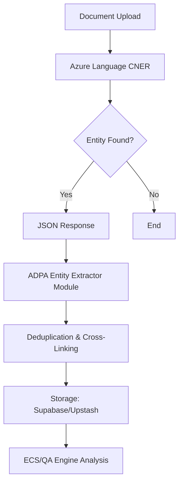

# Implementation Guide: Project Management Entity Extraction with Azure Custom NER

## Overview
This document outlines the implementation strategy for integrating **Azure Custom Named Entity Recognition (CNER)** into the ADPA framework. The goal is to automatically extract domain-specific project management entities from unstructured text (project charters, status reports, meeting minutes) and store them in structured registries (Stakeholders, Tasks, Risks, etc.).

## 1. Target Entities (PM Domain)
Azure Custom NER will be utilized to extract both existing and new entity types. Below is the comprehensive list of entities currently handled within the ADPA framework, which the CNER model will be trained to recognize:

### A. Core Project Governance & Info
| Entity Category | Description |
| :--- | :--- |
| **Project_Info** | Name, Description, Purpose, Business Case, and Expected Benefits. |
| **Stakeholder** | Name, Role, Organization, Interest/Influence level, and Engagement Strategy. |
| **Authority_Role** | Project Sponsor, Project Manager, and Approval Requirements. |
| **Governance_Process** | Change Control Process, Escalation Path, and Reporting Requirements. |

### B. Project Objectives & Success
| Entity Category | Description |
| :--- | :--- |
| **Project_Objective** | Names, descriptions, and measurable targets for project goals. |
| **Success_Criterion** | KPIs, measurement methods, and target/baseline values. |
| **Best_Practice** | PMBOK/Agile standards, applicability, and compliance notes. |

### C. Scope & Schedule
| Entity Category | Description |
| :--- | :--- |
| **Scope_Item** | In-scope features and explicitly excluded "Out-of-scope" items. |
| **Milestone** | Key dates, names, deliverables, and completion criteria. |
| **Timeline_Info** | Start/End dates and total duration estimates. |
| **Dependency** | Logical relationships (FS, SS, etc.) between tasks/milestones. |

### D. Financials & Resources
| Entity Category | Description |
| :--- | :--- |
| **Budget_Info** | Estimates, currency, and detailed budget notes. |
| **Resource** | Equipment, software, or human capital required for execution. |

### E. Uncertainty & Constraints
| Entity Category | Description |
| :--- | :--- |
| **PM_Risk** | Probability, impact, mitigation strategy, and contingency plans. |
| **PM_Issue** | Title, category, priority, status, and root cause/resolution. |
| **Constraint** | Technical, budget, or legal limitations and their impact areas. |
| **Assumption** | Statements assumed true and their risk-if-false impact. |

### F. PMBOK 6 Process Entities (ITTOs)
| Entity Category | Description |
| :--- | :--- |
| **Business_Doc** | Business Case, Benefits Management Plan, and Agreements (SLA/MOU). |
| **Env_Factor** | Enterprise Environmental Factors (EEFs) and Organizational Process Assets (OPAs). |
| **Requirement** | Requirements Documentation and Requirements Traceability Matrix (RTM). |
| **Performance_Data** | Work Performance Data, Information, and formal Performance Reports. |
| **Registry_Artifact** | Lessons Learned Register, Quality Metrics, and Resource Breakdown Structure. |

### G. Governance & Playbook Entities
| Entity Category | Description |
| :--- | :--- |
| **Severity_Level** | Classification rules (Critical to Info) and Escalation Thresholds. |
| **Escalation_Rule** | Trigger conditions, specific Escalation Paths, and notification timing. |
| **Compliance_Ref** | Regulatory Frameworks, Requirement IDs, and specific mapping clauses. |
| **Playbook_Action** | Responsible Roles, Prerequisites, and specific Success Criteria. |

## 2. Integration Architecture
The extraction process fits into the standard ADPA processing pipeline:



## 3. Implementation Workflow

### Phase 1: Model Training (Language Studio)
1. **Data Collection**: Gather 50-100 sample project documents (Charters, SOPs, Emails).
2. **Labeling**: Use Azure Language Studio to label instances of "Stakeholder", "Risk", and "Task" across the dataset.
3. **Training**: Train the CNER model using the Neural (standard) or Long-form (if documents exceed 4KB) model.
4. **Deployment**: Deploy the model to an "adpa-pm-extractor" endpoint.

### Phase 2: Backend Integration (`server/src/modules/entities/`)
We will create a new service `AzureNERService.ts` to handle the API calls to Azure.

**Example CNER API Request:**
```typescript
async function extractEntities(text: string) {
  const result = await azureLanguageClient.beginAnalyzeConversation({
    kind: "CustomNamedEntityRecognition",
    projectName: "adpa-pm-extractor",
    deploymentName: "production",
    stringIndexType: "Utf16CodeUnit",
    tasks: [{
      parameters: {
        projectName: "adpa-pm-extractor",
        deploymentName: "production"
      }
    }],
    analysisInput: {
      documents: [{ id: "1", text: text, language: "en" }]
    }
  });
  return result;
}
```

**Example JSON Response Mapping:**
```json
{
  "entities": [
    {
      "text": "John Doe",
      "category": "Stakeholder",
      "offset": 42,
      "length": 8,
      "confidenceScore": 0.98
    }
  ]
}
```

### Critical Note on Offsets & Lengths
*   **Definition**: `offset` is the 0-indexed starting position and `length` is the character count of the entity.
*   **Clean Text Dependency**: These values are relative to the **Clean Text** sent to the API, *not* the original Markdown version. 
*   **JS Compatibility**: In ADPA, we must set `stringIndexType: "Utf16CodeUnit"` in the Azure request. This ensures the offsets match JavaScript's native string indexing, preventing misalignments with special Unicode characters or emojis.
*   **Offset Remapping**: If ADPA needs to "highlight" the entity in the original Markdown UI, the `EntityExtractionModule` must maintain an **Offset Map** to translate the Clean Text position back to the raw Markdown position.

### Phase 3: Registration & Persistence
The extracted JSON is processed by the `EntityRegistryService`:
- **Stakeholders**: Upserted into `stakeholders` table in Supabase.
- **Tasks**: Inserted into `project_tasks` table.
- **Deltas**: If an entity changed (e.g., a new "Risk" appeared in a follow-up document), the **Governance Board (DRACO)** is notified of a delta.

## 4. Technical Limitations & Service Limits
When implementing Azure Custom NER, the following technical boundaries of the Azure Language Service must be factored into the ADPA architecture:

### A. Document & Data Constraints
*   **Maximum Document Size**: Up to **125,000 characters** per document. 
    *   *Impact*: ADPA must implement a **Chunking Engine** for large project charters or long-form documentation that exceeds this limit.
*   **Training File Format**: Only **.txt** files are supported for training. 
    *   *ADPA Implementation*: While ADPA stores primary documents in **Markdown**, a dedicated **"Markdown to Clean Text"** pre-processing step is required for training. This step strips structural characters (e.g., `#`, `**`, `[]()`) to ensure the model focuses purely on semantic content.
    *   *Accuracy Impact*: Training on raw Markdown can introduce "noise" where the model may incorrectly include formatting characters in entity spans (e.g., extracting `**John Doe**` instead of `John Doe`), lowering confidence scores and precision.
*   **Minimum Training Data**: A minimum of **10 distinct files** (labeled) is required to trigger a training job.
*   **Entity Types**: Support for up to **200 different entity types** per project.

### B. API Throughput & Batching
*   **Batch Request Limit**: Up to **25 documents** per single API call.
*   **Prediction API Rate**: Standard S-tier supports up to **1,000 requests per minute**.
*   **Authoring API Rate**: Limited to **10 requests per minute**.

### C. Resource Management
*   **Storage Connection**: A Language Resource can only be connected to **one Azure Storage Account**.
*   **Deployment Slots**: Maximum of **10 deployment names** (slots) per project.

## 7. Entity Traceability & Offset Mapping
To maintain absolute traceability back to the original documents in the database, ADPA will implement a **Source-Mapping Parser** for the extraction pipeline. This solves the "Shifted Offset" problem where Markdown characters are removed.

### The Problem
*   **Original Source (MD)**: `[Task] **Review Budget** by Friday.`
*   **Clean Text (Sent to Azure)**: `[Task] Review Budget by Friday.`
*   **Azure Extraction**: `offset: 7, length: 13` (Points to "Review Budget").
*   **Reality in DB**: Index 7 in the Markdown file is `**R`, not the start of the entity.

### The Solution: Mapping Engine
We will use the **`remark` (unified)** AST parser to generate a character-to-character mapping table during the "Clean Text" generation step.

1.  **Parse MD to AST**: Use `remark-parse` to identify all formatting nodes.
2.  **Generate Clean Text + Offset Map**:
    *   Iterate through the string.
    *   For every non-Markdown character, append to Clean Text and record: `CleanIndex[i] -> GlobalMarkdownIndex[j]`.
    *   Skip Markdown markers (e.g., `**`, `*`, `__`).
3.  **Remap Azure Result**:
    *   When Azure returns `CleanOffset: 121`, look up `Map[121]` in the table.
    *   **Result**: The application correctly points to the specific character in the original database record.

This ensures **100% Traceability** and allows the UI to highlight the exact entity in the original document view.

## 8. Data Integrity & Separation of Concerns
To ensure that the visual feedback loop (highlighting) does not obstruct the extraction pipeline, ADPA maintains a strict **Separation of Concerns**:

*   **Source of Truth (Database)**: The database stores the **Original Markdown** exactly as it was uploaded. This ensures that the `SourceIndex` mapping is always stable and reliable.
*   **Extraction Layer**: This layer converts the DB source to "Clean Text" on-the-fly for Azure requests. IT NEVER WRITES MARKERS BACK TO THE PRIMARY SOURCE FILE.
*   **Presentation Layer (UI)**: The **`h5`/`h6`** highlighting is applied **transiently** during the rendering process in the `MarkdownDocumentViewer`. 
    *   The UI takes the stored entity offsets and wraps the text in `h5` tags only for the user's screen.
    *   This **"In-Memory Rendering"** approach prevents **Marker Noise** — we never save `#####` into the original document, so future AI scans remain accurate and unobstructed.

This design guarantees that the extraction engine and the UI feedback loop work in parallel without interference.

## 9. Key Benefits for ADPA
- **Automated Registry Population**: Reduces manual entry for project managers.
- **Consistent Governance**: Ensures that risks and dependencies are formally tracked as soon as they are mentioned in writing.
- **Auditability**: Every entity is linked back to the source document and offset for verification.

## 10. Next Steps
1. Provision Azure Language resource in the `rg-ADPA` resource group.
2. Initialize the `adpa-pm-extractor` project in Language Studio.
3. Update the `EntityExtractionModule` in ADPA to call the new Azure endpoint alongside existing LLM-based extractions (hybrid approach).
4. Implement the **Traceability Mapper** utility using `remark` for Markdown-to-Text offset translation.

---
*Updated: April 2026*
*Author: ADPA AI Governance Team*
