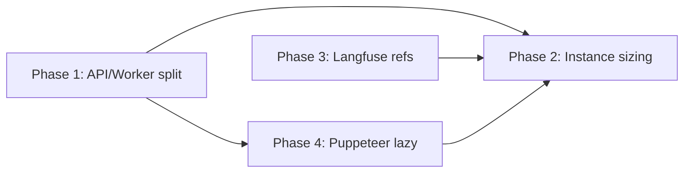

# API / Worker Split, Langfuse Observability, and Lazy PDF Export

**Status:** Proposed  
**Date:** 2026-06-06  
**Context:** Production OOM on a 512MB instance (Render/Northflank) — single Node process runs Express API, all RabbitMQ consumers, LLM jobs, and Puppeteer-capable PDF paths together.

---

## Executive summary

| Priority | Change | Expected win |
|----------|--------|--------------|
| 1 | Split API and worker processes | Removes concurrent job handlers from API memory profile |
| 2 | Right-size instances after split | API on 512MB; worker 512MB–1GB with low prefetch |
| 3 | Langfuse for full prompts/responses | Stop bloating `jobs.data.llm_insights` in Postgres |
| 3b | Langfuse scope = AI calls only | Stop non-LLM telemetry filling Langfuse DB (currently at capacity) |
| 4 | Puppeteer load only on explicit PDF export | Markdown-only default; Chromium on demand, then unload |

**Rollout order:** Phase 1 + Phase 4 first (one PR), then Phase 3 (including 3b telemetry filter), then deploy tuning (Phase 2).

**Langfuse capacity (current):** The self-hosted Langfuse database is at or near its storage limit and is **rejecting or blocking new ingest**. Do not send additional non-AI telemetry until capacity is restored. Ingestion must be limited to **AI provider messages** (prompts, completions, token usage) only.

Related existing docs:

- [`server/docs/LANGFUSE_INCREMENTAL_IMPLEMENTATION_PLAN.md`](../../../server/docs/LANGFUSE_INCREMENTAL_IMPLEMENTATION_PLAN.md) — Langfuse naming and incremental rollout (cross-links back to §3.0 here)
- `docs/07-architecture/BULL_QUEUES_COMPLETE_GUIDE.md` — queue architecture reference

---

## Current architecture (why 512MB breaks)

Today one Node process does everything:

| Layer | What runs | Memory impact |
|-------|-----------|---------------|
| HTTP API | Express + ~50 route modules | ~80–150MB |
| Queue consumers | 14 Rabbit queues, `QUEUE_PREFETCH=4` each | Up to ~56 concurrent handlers |
| Heavy jobs | `ai-generate`, GKG sync, extraction | LLM + parsing spikes |
| Postgres blobs | `recordLLMPromptSnapshot()` writes full prompt+response per section | Multi-MB per job in `jobs.data` |
| Puppeteer | Top-level `import puppeteer` in `pdfService.ts` | Package loaded even when idle; Chromium ~200–400MB when launched |

Workers register at **module load** in `server/src/services/queueService.ts` (`.process()` calls from line 245 onward). Any route that imports `queueService` starts consumers in the API process. There is no `RUN_WORKERS` or process-role flag yet.

**Key files**

| Path | Role |
|------|------|
| `server/src/server.ts` | API entry; 503 gate until deps ready |
| `server/src/services/queueService.ts` | All queue workers in same process; `QUEUE_PREFETCH` default 4 |
| `server/src/services/documentGenerationService.ts` | `recordLLMPromptSnapshot()` → `llm_insights` in `jobs.data` |
| `server/src/routes/jobs.ts` | Slim list SQL; detail still returns full `llmInsights` |
| `server/src/services/pdfService.ts` | Singleton Puppeteer browser; lazy launch on `getBrowser()` |
| `server/src/services/unifiedAIService.ts` | Langfuse native SDK traces + generations |
| `server/src/startup/dependencies/workers.ts` | Requires `queueService` at startup |
| `server/Dockerfile` | Single `CMD` → `server.js` |
| `render.yaml` | Frontend only; backend on Northflank (per comments) |

---

## Phase 1 — Split API and workers (biggest win)

**Goal:** API enqueues only; a separate process consumes queues.

### 1.1 Process role environment variable

```env
ADPA_PROCESS_ROLE=api      # default for server.ts
ADPA_PROCESS_ROLE=worker   # new worker.ts entry
ADPA_PROCESS_ROLE=all      # local dev convenience (current behavior)
```

### 1.2 Split `queueService.ts`

| New file | Responsibility |
|----------|----------------|
| `server/src/services/queue/queueClient.ts` | Rabbit connection, queue definitions, `addJob`, `getJobStatus`, `cancelJob`, `updateJobStatus` — **no** `.process()` |
| `server/src/services/queue/registerWorkers.ts` | All `.process()` handlers (moved from `queueService.ts`) |
| `server/src/services/queueService.ts` | Thin re-export of client; calls `registerWorkers()` only when `role === 'worker' \| 'all'` |

**Critical rule:** API routes import the client facade that never registers consumers. Today `documentGeneration.ts`, `gkg.ts`, `pipeline.ts`, and others pull in full `queueService` and trigger workers.

**Queues with registered processors today** (14 Rabbit queues):

- `ai-processing` — `ai-generate`
- `document-processing` — `document-convert`
- `document-upload` — `file-process`
- `baseline-processing` — `baseline-extract`
- `process-flow-processing` — `process-flow`
- `document-regeneration` — `document-regeneration`
- `confluence-publishing` — `publish-to-confluence`
- `quality-audit` — `quality-audit`
- `project-data-extraction` — `extract-project-data` + per-entity `extract-entity-*`
- `digital-twin-events` — `process-event`
- `digital-twin-triggers` — `process-trigger`
- `gkg-sync` — `gkg-bootstrap`, `gkg-sync-project`, `gkg-sync-document`, `gkg-reconcile`
- `semantic-processing` — `semantic-process-document`, `semantic-process-batch`

### 1.3 New worker entry point

```
server/src/worker.ts
```

- Connect DB + Redis + Rabbit (same dependency graph, minus full HTTP route surface).
- Call `registerWorkers()`.
- Optional minimal HTTP on `:5001` for `/health` and `/metrics` only (no auth surface).
- **No** full Express app, **no** Socket.io on worker (progress via DB + Redis; API forwards via existing `io`).

Update `server/src/startup/dependencies/workers.ts` so worker registration and `documentConversionJob` require only run when `ADPA_PROCESS_ROLE` is `worker` or `all`.

### 1.4 Package scripts and Docker

```json
"start:api": "node -r tsconfig-paths/register dist/server/src/server.js",
"start:worker": "node -r tsconfig-paths/register dist/server/src/worker.js"
```

Same image, different `CMD`:

| Service | CMD | Env |
|---------|-----|-----|
| `adpa-api` | `start:api` | `ADPA_PROCESS_ROLE=api` |
| `adpa-worker` | `start:worker` | `ADPA_PROCESS_ROLE=worker`, `QUEUE_PREFETCH=1` |

Deploy as two services on Northflank (or Render) from `server/Dockerfile`.

### 1.5 Migration steps (low risk)

1. Add role flag + split files; default `all` so local `pnpm dev` behavior is unchanged.
2. Deploy worker service with `ROLE=worker`; keep API as `all` briefly if needed (duplicate consumers — acceptable short-term), or set API to `api` immediately once worker is verified.
3. Set API to `ROLE=api`; verify enqueue + consume end-to-end.
4. Tune `QUEUE_PREFETCH` on worker (start at `1`, raise to `2` if stable).

### 1.6 Acceptance criteria

- [ ] API pod with `ADPA_PROCESS_ROLE=api` logs **no** `[QUEUE] Registered ai-generate processor` lines.
- [ ] Worker pod logs those registration lines and completes an `ai-generate` job.
- [ ] API memory stays under ~400MB under Job Monitor polling.
- [ ] Job enqueue from UI still works; status updates reach the frontend.

---

## Phase 2 — Right-size instances after split

### Expected memory (rough)

| Process | Idle | Under load |
|---------|------|------------|
| **API only** | ~120–200MB | ~250–400MB (auth, jobs list, sockets) |
| **Worker** | ~150–250MB | 400MB–1GB+ (`ai-generate`, parallel sections) |

### Sizing recommendation

| Service | Instance | Notes |
|---------|----------|-------|
| **API** | 512MB plan | Comfortable headroom without workers or Puppeteer |
| **Worker** | 512MB–1GB | Start 512MB + `QUEUE_PREFETCH=1`; bump if OOM on `ai-generate` |
| **Worker scale** | 0→1 manual or queue-depth trigger | Spin worker when `pending > N`; scale to 0 when idle |

### Worker env tuning (small instance)

```env
QUEUE_PREFETCH=1
ADPA_DOC_GEN_DRAFT_CONCURRENCY=2
```

Optional later: **two worker profiles** — `worker-heavy` (`ai-generate` only) and `worker-light` (GKG, extraction, audit). Same codebase; filter via `ADPA_WORKER_QUEUES=ai-processing,gkg-sync` in `registerWorkers.ts`.

### Acceptance criteria

- [ ] API stable on 512MB with no worker role.
- [ ] Worker completes `ai-generate` without OOM at chosen prefetch/concurrency.
- [ ] Queue depth returns to zero after backlog cleanup.

---

## Phase 3 — Langfuse for prompts/responses (not Postgres blobs)

**Intent:** Full prompt/response content lives in Langfuse (self-hosted or cloud). Postgres stores only references and metadata for the Job Monitor.

### 3.0 Langfuse telemetry scope — AI calls only (capacity constraint)

**Problem:** ADPA currently exports far more than LLM traffic to Langfuse. OpenTelemetry auto-instrumentation (`server/src/tracing.ts`), queue job spans (`queueService.ts` attachTracing), HTTP/API spans, health checks, and other non-AI operations all become traces when `ENABLE_LANGFUSE_TRACING=true`. That volume is **too large** for Langfuse to hold alongside LLM generations and has pushed the Langfuse database to capacity — **new metrics/traces are blocked until storage is expanded or data is pruned**.

**Policy (effective immediately for production):**

| Send to Langfuse | Do **not** send to Langfuse |
|------------------|----------------------------|
| LLM **generations** (prompt + completion + token usage) via native SDK in `unifiedAIService.ts` | OpenTelemetry OTLP export of all HTTP/Express/Postgres/Redis spans |
| Optional: thin **trace** wrapper per AI request (session/user/metadata for Job Monitor linking) | RabbitMQ job lifecycle spans (`job.ai-generate`, `job.document-convert`, etc.) |
| Structured output / tool calls that are part of an AI provider round-trip | Health checks, auth middleware, cron, GKG sync, extraction (no LLM), PDF export |
| | Metrics, scores, or custom events unrelated to a provider message |

**Until Langfuse DB accepts new ingest again:** treat Langfuse as **read-mostly + AI-only writes**. Do not enable broad OTLP export to Langfuse. Wait for DBA/ops to free capacity (retention, partition prune, or disk upgrade) before considering any wider telemetry.

**Implementation (code changes):**

1. **Disable OTLP → Langfuse in production**

   ```env
   ENABLE_LANGFUSE_TRACING=false
   ENABLE_LANGFUSE_NATIVE_SDK=true
   ```

   Keep `TRACING_ENABLED=true` only if exporting OTLP to a **non-Langfuse** sink (local collector, Datadog, etc.) — not Langfuse.

2. **Remove or gate queue OTLP spans** — `attachTracing()` in `queueService.ts` should not export to Langfuse; either disable when `ENABLE_LANGFUSE_TRACING=false` or tag spans `telemetry.destination=internal` and filter at export (prefer not registering job spans for Langfuse at all).

3. **Single ingestion path** — Only `unifiedAIService.ts` (and equivalent direct provider wrappers) may call `langfuse.trace()` / `generation.end()`. Audit and remove ad-hoc `langfuse` usage in non-AI modules (`foundry-local.ts`, `ollama.ts`, etc.) unless they represent a real provider call.

4. **No new Langfuse features until capacity** — Defer Phase 3 Job Monitor fetch expansion, new tags, scores, and session analytics until the Langfuse DB quota is cleared. Phase 3 slim `llm_insights` refs can still ship to Postgres; full prompt fetch from Langfuse UI/API is fine for **existing** traces.

5. **Monitoring elsewhere** — Non-AI operational telemetry (API latency, queue depth, worker memory) stays in Postgres job rows, Redis, Northflank/Render metrics, or a separate observability stack — **not** Langfuse.

**Acceptance criteria (3.0):**

- [ ] With production env, Langfuse ingest rate drops to **AI generation events only** (order of magnitude below current OTLP flood).
- [ ] `ENABLE_LANGFUSE_TRACING=false` in production; no OTLP batches to Langfuse endpoint.
- [ ] New AI document-generation runs still create trace + generation rows in Langfuse when native SDK is enabled.
- [ ] No new non-AI spans appear in Langfuse after deploy (verify in UI: no `GET /health`, no `job.gkg-sync`, etc.).
- [ ] Team confirms Langfuse DB has headroom before re-enabling any broader export.

### Current duplication

- `unifiedAIService.ts` already sends traces/generations to Langfuse (`langfuse.trace()` + `generation.end()` with input/output).
- `documentGenerationService.recordLLMPromptSnapshot()` **also** appends full `prompt` and `response` to `jobs.data.llm_insights.requests[]` on every LLM phase.

That duplication caused slow job list queries and large `GET /jobs/:id` payloads.

### Target `jobs.data` shape

```json
{
  "llm_insights": {
    "traceId": "...",
    "sessionId": "...",
    "requests": [
      {
        "phase": "drafting",
        "label": "Section 3 — Risks",
        "traceName": "agentic-doc-draft",
        "langfuseTraceId": "...",
        "langfuseObservationId": "...",
        "provider": "mistral",
        "model": "...",
        "characterCount": 12400,
        "capturedAt": "2026-06-06T..."
      }
    ]
  }
}
```

No `prompt` or `response` fields on new jobs.

### Implementation steps

**Prerequisite:** Complete **§3.0** (AI-only Langfuse ingest) before adding new Langfuse-backed Job Monitor fetch paths, so new code does not increase non-AI volume.

1. **Return trace IDs from AI layer** — Extend `AIGenerateResponse` (and structured variant) with optional `langfuseTraceId` / `langfuseObservationId` from `langfuseTrace.id` and `langfuseGeneration.id`.
2. **Slim `recordLLMPromptSnapshot()`** — Stop writing `prompt` and `response`; store refs + metadata only. Gate legacy behavior with `LLM_INSIGHTS_STORE_BLOBS=false` (default off in production).
3. **Job Monitor API** — New endpoint `GET /api/jobs/:id/llm-insights/:index` (or batch) that fetches observation content from Langfuse Public API using `LANGFUSE_PUBLIC_KEY` / `LANGFUSE_SECRET_KEY`.
4. **Frontend** (`app/jobs/page.tsx`) — On `<details>` expand, call Langfuse-backed endpoint instead of relying on inline list/detail blobs.
5. **Backfill / legacy** — Old jobs keep blobs in DB; UI shows “legacy inline” vs “Open in Langfuse” link: `{LANGFUSE_BASE_URL}/project/.../traces/{traceId}`.

### Production Langfuse env

```env
# AI provider messages only — see §3.0
ENABLE_LANGFUSE_NATIVE_SDK=true
ENABLE_LANGFUSE_TRACING=false
LANGFUSE_PUBLIC_KEY=...
LANGFUSE_SECRET_KEY=...
LANGFUSE_BASE_URL=https://your-langfuse-host
```

Do **not** set `ENABLE_LANGFUSE_TRACING=true` until Langfuse DB capacity is restored and ops explicitly approves wider ingest. Local dev may use OTLP to a local collector; still avoid pointing OTLP at production Langfuse.

Align with `server/docs/LANGFUSE_INCREMENTAL_IMPLEMENTATION_PLAN.md` for naming and validation.

### Acceptance criteria

- [ ] New `ai-generate` jobs add &lt;5KB to `jobs.data` for `llm_insights`.
- [ ] Job Monitor expand still shows full prompt/response via Langfuse fetch.
- [ ] `GET /jobs/admin/all` list remains fast (no parsing huge JSON arrays per row).
- [ ] Link to Langfuse trace works for new jobs.

---

## Phase 4 — Puppeteer on-demand only (markdown default)

**Design intent:** Documents are markdown in DB across generation, storage, and API. PDF is an **explicit** user action only.

### Problems today

```typescript
// server/src/services/pdfService.ts — line 1
import puppeteer, { Browser, PDFOptions } from 'puppeteer';
```

Static import loads the Puppeteer package when **any** file imports `pdfService`, including:

- `server/src/modules/documents/DocumentsController.ts`
- `server/src/modules/documentGenerator/service.ts`
- `server/src/api/governance/councilRouter.ts`
- `server/src/services/ibabsUploadService.ts`
- Others

Browser launch is lazy (`getBrowser()`), but the dependency is not.

### Target behavior

1. **Dynamic import** inside `getBrowser()`:

   ```typescript
   const puppeteer = await import('puppeteer');
   ```

2. **Lazy singleton** — Keep `UnifiedPdfService` but do not touch Puppeteer until first PDF call.

3. **Unload after export** — In `exportPdf`, `bulkExportPdf`, and `getPdfPreview`, use `try/finally { await pdfService.cleanup() }` so Chromium exits and memory is released.

4. **Optional slim API image** — `Dockerfile.api` without Chromium/`PUPPETEER_EXECUTABLE_PATH` when API role never exports PDF (PDF routes can proxy to worker or stay on API with lazy load only).

5. **Long-term optional** — `pdf-export` queue on a dedicated micro-worker; only if lazy load on API still OOMs under bulk export.

### Explicit PDF-only paths (must load Puppeteer)

| Route / service | Path |
|-----------------|------|
| Single document PDF | `GET /api/v1/documents/:id/export/pdf` |
| Bulk PDF zip | `POST /api/v1/documents/bulk-export/pdf` |
| iBabs upload (if PDF) | `ibabsUploadService.ts` |
| Governance council export | `councilRouter.ts` |

### Not PDF (markdown only — no Puppeteer)

- Document generation pipeline (`documentGenerationService.ts`)
- GKG sync, extraction, quality audit workers
- Default document CRUD and GenUI workspace

### Acceptance criteria

- [ ] API process RSS does not spike on startup (no Chromium).
- [ ] `GET .../export/pdf` produces valid PDF.
- [ ] Memory returns toward baseline within ~30s after export (`cleanup()`).
- [ ] Bulk export works; browser closed after zip completes.

---

## Suggested rollout order



| Order | Phase | Effort | Impact |
|-------|-------|--------|--------|
| 1 | API/worker split | 2–3 days | Fixes OOM root cause |
| 2 | Puppeteer lazy + cleanup | 0.5 day | Drops API baseline ~50–100MB |
| 3 | Langfuse refs + AI-only telemetry (3.0) | 1–2 days | Stops Postgres bloat; stops Langfuse DB fill |
| 4 | Deploy sizing + `QUEUE_PREFETCH` | 0.5 day | Stable production |

---

## Out of scope (for now)

- **Dedicated PDF microservice** — Defer until lazy Puppeteer + split is measured.
- **Removing `llm_insights` from Postgres entirely** — Keep slim index for Job Monitor; content in Langfuse.
- **Serverless queue consumers** — Rabbit needs long-lived connections; use small always-on worker or scale 0→1 with queue-depth watcher.
- **Full OpenTelemetry export to Langfuse** — Blocked until Langfuse DB capacity is restored; only AI provider generations belong there.
- **Langfuse metrics/scores for non-LLM events** — Use ADPA Postgres, Redis, or platform metrics instead.

---

## Validation checklist (post Phase 1 deploy)

1. API: `ADPA_PROCESS_ROLE=api` → no worker registration logs.
2. Worker: registration logs present; one `ai-generate` completes end-to-end.
3. API memory &lt; 400MB under Job Monitor load.
4. Worker stable with `QUEUE_PREFETCH=1`.
5. PDF export on demand; no Chromium at API idle.

---

## Open decisions

| Question | Options |
|----------|---------|
| Deploy target | Northflank only, Render worker add-on, or both |
| Socket.io on worker | DB-only progress vs Redis bridge to API `io` |
| PDF on API vs worker | Lazy on API first; move to worker if bulk export OOMs |
| Langfuse host | Self-hosted monorepo `langfuse-repo/` vs Langfuse Cloud |
| Langfuse DB capacity | When to prune/expand storage before any new ingest types |
| OTLP destination | Local/dev collector only until Langfuse headroom confirmed |

---

## References

- Render OOM incident: single 512MB instance, `tjsg8` (~2026-06-07)
- Prior cleanup: `server/scripts/cleanup-job-backlog.mjs` (zombie `ai-generate`, duplicate `gkg-sync-project`)
- Job Monitor slim list: `SLIM_JOB_DATA_SQL` in `server/src/routes/jobs.ts`
- OTLP → Langfuse: `server/src/tracing.ts` (`ENABLE_LANGFUSE_TRACING`)
- Native AI-only ingest: `server/src/services/unifiedAIService.ts`
- Queue span noise: `server/src/services/queueService.ts` (`attachTracing`)
