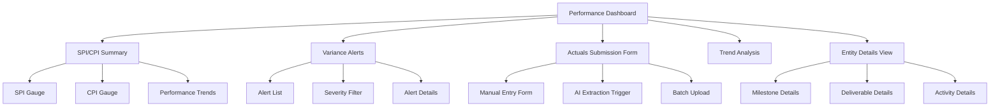

# Performance Actuals & Measurement Domain Implementation Plan

## 📌 Overview
**Status**: 🔴 **Critical Priority (P0)**
**Target Domain**: Measurement Performance Domain (PMBOK 8th Edition)
**Goal**: Close the "Actuals Gap" by tracking what actually happened (cost, schedule, scope) vs. what was planned. Enable automated SPI/CPI calculation and variance alerts.

### 🎯 Objectives
- Implement manual actuals submission interface (immediate usability)
- Build AI extraction for actuals from project documents (automation)
- Design database schema for performance actuals storage
- Develop SPI/CPI calculation engine and variance analysis
- Create frontend dashboard for performance metrics and alerts
- Integrate with baseline extraction for actuals vs. planned comparison

### 🔄 Hybrid Implementation Approach
1. **Phase 1**: Manual entry interface (immediate usability)
2. **Phase 2**: AI extraction integration (automation)
3. **Phase 3**: Advanced analytics and forecasting

---

## 🏗️ Architecture & Design

### 📊 Database Schema
```sql
-- Core performance actuals table with variance calculations
CREATE TABLE performance_actuals (
  id UUID PRIMARY KEY,
  project_id UUID REFERENCES projects(id),
  entity_type VARCHAR(20) NOT NULL CHECK (entity_type IN ('milestone', 'deliverable', 'activity', 'phase', 'resource')),
  entity_id UUID NOT NULL,
  planned_start_date TIMESTAMP,
  actual_start_date TIMESTAMP,
  planned_end_date TIMESTAMP,
  actual_end_date TIMESTAMP,
  schedule_variance_days INTEGER,
  schedule_variance_percent DECIMAL(5,2),
  planned_cost DECIMAL(15,2),
  actual_cost DECIMAL(15,2),
  cost_variance DECIMAL(15,2),
  cost_variance_percent DECIMAL(5,2),
  planned_progress_percent DECIMAL(5,2),
  actual_progress_percent DECIMAL(5,2),
  progress_variance DECIMAL(5,2),
  quality_score DECIMAL(3,1),
  measurement_date TIMESTAMP NOT NULL,
  measurement_method VARCHAR(20) NOT NULL CHECK (measurement_method IN ('manual', 'automated', 'extracted', 'reported')),
  source_document_id UUID REFERENCES documents(id),
  notes TEXT,
  created_at TIMESTAMP DEFAULT NOW(),
  updated_at TIMESTAMP DEFAULT NOW(),
  INDEX idx_performance_actuals_project (project_id),
  INDEX idx_performance_actuals_entity (entity_type, entity_id),
  INDEX idx_performance_actuals_dates (measurement_date)
);

-- Trigger for auto-calculating variances
CREATE OR REPLACE FUNCTION calculate_performance_variances()
RETURNS TRIGGER AS $$
BEGIN
  -- Schedule Variance
  IF NEW.planned_end_date IS NOT NULL AND NEW.actual_end_date IS NOT NULL THEN
    NEW.schedule_variance_days := EXTRACT(DAY FROM (NEW.actual_end_date - NEW.planned_end_date));
    IF NEW.planned_end_date != NEW.actual_end_date THEN
      NEW.schedule_variance_percent := (NEW.schedule_variance_days / EXTRACT(DAY FROM (NEW.planned_end_date - NEW.planned_start_date))) * 100;
    END IF;
  END IF;

  -- Cost Variance
  IF NEW.planned_cost IS NOT NULL AND NEW.actual_cost IS NOT NULL THEN
    NEW.cost_variance := NEW.earned_value - NEW.actual_cost;
    NEW.cost_variance_percent := (NEW.cost_variance / NEW.planned_cost) * 100;
  END IF;

  -- Progress Variance
  IF NEW.planned_progress_percent IS NOT NULL AND NEW.actual_progress_percent IS NOT NULL THEN
    NEW.progress_variance := NEW.actual_progress_percent - NEW.planned_progress_percent;
  END IF;

  RETURN NEW;
END;
$$ LANGUAGE plpgsql;

CREATE TRIGGER trg_calculate_variances
BEFORE INSERT OR UPDATE ON performance_actuals
FOR EACH ROW EXECUTE FUNCTION calculate_performance_variances();
```

### 🔄 SPI/CPI Calculation Engine
```typescript
// services/performance/PerformanceCalculatorService.ts
class PerformanceCalculatorService {
  async calculateSPI(projectId: string, reportingDate: Date): Promise<number> {
    const actuals = await this.actualsRepository.findByProjectAndDate(projectId, reportingDate);
    const baselines = await this.baselineRepository.findByProject(projectId);

    // Calculate Earned Value (EV) and Planned Value (PV)
    const ev = actuals.reduce((sum, actual) => sum + this.calculateEV(actual, baselines), 0);
    const pv = baselines.reduce((sum, baseline) => sum + baseline.plannedValue, 0);

    return pv > 0 ? ev / pv : 1.0; // SPI = EV / PV
  }

  async calculateCPI(projectId: string, reportingDate: Date): Promise<number> {
    const actuals = await this.actualsRepository.findByProjectAndDate(projectId, reportingDate);

    // Calculate Earned Value (EV) and Actual Cost (AC)
    const ev = actuals.reduce((sum, actual) => sum + this.calculateEV(actual), 0);
    const ac = actuals.reduce((sum, actual) => sum + (actual.actual_cost || 0), 0);

    return ac > 0 ? ev / ac : 1.0; // CPI = EV / AC
  }

  private calculateEV(actual: PerformanceActual, baselines?: Baseline[]): number {
    // Implementation for calculating Earned Value
    // Based on actual progress, planned cost, and quality score
    return (actual.actual_progress_percent || 0) * (actual.planned_cost || 0) * (actual.quality_score || 1.0) / 100;
  }
}
```

### 📡 API Specifications
| Endpoint | Method | Description | Request Body | Response |
|----------|--------|-------------|--------------|----------|
| `/api/performance-actuals/{projectId}` | POST | Submit actuals (manual entry) | `{ entityType, entityId, actualStartDate, actualEndDate, actualCost, actualProgress, qualityScore, notes }` | `{ id, status, variances }` |
| `/api/performance-actuals/{projectId}/extract` | POST | Trigger AI extraction | `{ documentId, extractionScope }` | `{ jobId, status }` |
| `/api/performance-actuals/{projectId}/summary` | GET | Retrieve performance summary | `?reportingDate=YYYY-MM-DD` | `{ spi, cpi, variances, trends }` |
| `/api/performance-actuals/{projectId}/alerts` | GET | Retrieve variance alerts | `?threshold=10` | `{ alerts: [{ entityType, entityId, varianceType, severity }] }` |

### 🖥️ Frontend Components


### 🤖 AI Extraction Integration
```typescript
// services/jobs/PerformanceActualsExtractionJobService.ts
class PerformanceActualsExtractionJobService {
  async extractActualsFromDocument(documentId: string, projectId: string): Promise<PerformanceActual[]> {
    // 1. Retrieve document content
    const document = await this.documentRepository.findById(documentId);
    
    // 2. Call AI provider with extraction prompt
    const prompt = this.buildExtractionPrompt(document.content);
    const aiResponse = await this.aiProvider.generate(prompt);
    
    // 3. Parse and validate extracted data
    const extractedData = this.parseAIResponse(aiResponse);
    
    // 4. Enrich with project context
    const enrichedData = await this.enrichWithProjectContext(extractedData, projectId);
    
    // 5. Store actuals with 'extracted' measurement method
    return this.actualsRepository.createMany(enrichedData);
  }

  private buildExtractionPrompt(documentContent: string): string {
    return `Extract performance actuals from the following project document:
    
    Document Content:
    ${documentContent}
    
    Extract the following for each entity (milestones, deliverables, activities):
    - Entity type and name/identifier
    - Actual start date
    - Actual end date (if completed)
    - Actual cost
    - Actual progress percentage
    - Quality score (if mentioned)
    - Any variance explanations
    
    Return in JSON format with this structure:
    {
      "actuals": [
        {
          "entityType": "milestone|deliverable|activity",
          "entityName": "string",
          "actualStartDate": "YYYY-MM-DD",
          "actualEndDate": "YYYY-MM-DD",
          "actualCost": number,
          "actualProgress": number,
          "qualityScore": number,
          "notes": "string"
        }
      ]
    }`;
  }
}
```

---

## 📅 Implementation Roadmap

### 🚀 Phase 1: Manual Entry Foundation (Week 1-2)
- [ ] Design and implement `performance_actuals` database schema
- [ ] Create API endpoints for manual actuals submission
- [ ] Build frontend form for manual actuals entry with validation
- [ ] Implement basic SPI/CPI calculation logic
- [ ] Create variance alerting thresholds
- [ ] Build initial performance dashboard

### 🤖 Phase 2: AI Extraction Integration (Week 3-4)
- [ ] Implement `PerformanceActualsExtractionJobService`
- [ ] Create extraction prompts for different document types
- [ ] Build document selection interface for extraction
- [ ] Implement extraction job monitoring
- [ ] Create extraction results review interface
- [ ] Integrate extracted actuals into performance dashboard

### 📊 Phase 3: Advanced Analytics (Week 5-6)
- [ ] Implement trend analysis and forecasting
- [ ] Build EVM (Earned Value Management) metrics
- [ ] Create variance root cause analysis
- [ ] Implement predictive analytics for schedule/cost risks
- [ ] Build executive reporting and export functionality
- [ ] Integrate with portfolio-level dashboards

---

## 🔗 Integration Points

### 🔄 Baseline Extraction Integration
```typescript
// services/jobs/BaselineExtractionJobService.ts (extended)
class BaselineExtractionJobService {
  async extractBaselineAndCompareActuals(projectId: string) {
    // 1. Extract baseline (existing functionality)
    const baseline = await this.extractBaseline(projectId);
    
    // 2. Retrieve actuals for comparison
    const actuals = await this.actualsRepository.findByProject(projectId);
    
    // 3. Calculate variances
    const variances = this.calculateVariances(baseline, actuals);
    
    // 4. Trigger alerts if thresholds exceeded
    if (variances.costVariancePercent > 10 || variances.scheduleVarianceDays > 5) {
      await this.alertService.triggerPerformanceAlert(projectId, variances);
    }
    
    return { baseline, actuals, variances };
  }
}
```

### 📊 Job Queue Integration
```typescript
// server/src/queues/performanceQueue.ts
import { Queue } from 'bull';
import { PerformanceActualsExtractionJobService } from '../services/jobs/PerformanceActualsExtractionJobService';

export const performanceQueue = new Queue('performance', process.env.REDIS_URL);

// Add job for AI extraction
performanceQueue.add('extract-actuals', {
  documentId: 'doc_123',
  projectId: 'proj_456',
  extractionScope: 'full'
});

// Process extraction jobs
performanceQueue.process('extract-actuals', async (job) => {
  const { documentId, projectId } = job.data;
  const service = new PerformanceActualsExtractionJobService();
  return service.extractActualsFromDocument(documentId, projectId);
});
```

### 📈 Frontend Integration
```typescript
// hooks/usePerformanceActuals.ts
import { useApi } from './use-api';

export function usePerformanceActuals(projectId: string) {
  const { data: actuals, loading } = useApi(`/api/performance-actuals/${projectId}`);
  const { data: alerts } = useApi(`/api/performance-actuals/${projectId}/alerts`);
  const { data: summary } = useApi(`/api/performance-actuals/${projectId}/summary`);
  
  const submitActuals = async (actualData: PerformanceActualInput) => {
    return useApi.post(`/api/performance-actuals/${projectId}`, actualData);
  };
  
  const triggerExtraction = async (documentId: string) => {
    return useApi.post(`/api/performance-actuals/${projectId}/extract`, { documentId });
  };
  
  return { actuals, alerts, summary, submitActuals, triggerExtraction, loading };
}
```

---

## ⚠️ Risks & Mitigation

| Risk | Impact | Mitigation Strategy |
|------|--------|---------------------|
| **Data Quality Issues** | Low trust in metrics | Implement validation rules, data quality checks, and manual override capability |
| **AI Extraction Errors** | Incorrect actuals | Provide extraction review interface, confidence scoring, and manual correction |
| **Performance Impact** | Slow dashboard response | Implement caching, pagination, and optimized queries for large datasets |
| **User Adoption** | Low engagement | Create onboarding tutorials, tooltip guidance, and highlight quick wins |
| **Integration Complexity** | Delays in implementation | Modular design, comprehensive testing, and phased rollout |

---

## 📚 Documentation & Training
- **User Guide**: How to submit actuals, interpret SPI/CPI, and respond to alerts
- **API Documentation**: Endpoints for integration with other systems
- **Administrator Guide**: Configuration of thresholds, extraction settings, and alert rules
- **Training Materials**: Video tutorials and interactive demos
- **FAQ**: Common issues and troubleshooting

---

## 📅 Success Metrics
| Metric | Target | Measurement Method |
|--------|--------|-------------------|
| Actuals Coverage | 90% of active projects | % of projects with actuals submitted in last 30 days |
| SPI/CPI Accuracy | 95% accuracy | % of variance calculations matching manual review |
| User Engagement | 75% of PMs | % of PMs submitting actuals weekly |
| Alert Response Time | <24 hours | Average time to acknowledge/resolve alerts |
| Extraction Success Rate | 85% | % of extraction jobs completing successfully |

---

## 🔄 Next Steps
1. **Database Setup**: Implement `performance_actuals` schema and triggers
2. **API Development**: Build manual submission endpoints
3. **Frontend Development**: Create actuals submission form and dashboard
4. **AI Integration**: Implement extraction job service
5. **Testing**: Validate variance calculations and alerting logic
6. **Documentation**: Create user and admin guides