# Smart Document Versioning Implementation Plan

## 📌 Overview
**Status**: 🔵 **Planned (P1 - High Priority)**
**Target Domain**: Development Approach & Life Cycle Performance Domain (PMBOK 8th Edition)
**Goal**: Implement enterprise-grade version control to prevent "Document Clutter" and maintain clear audit trails during AI regeneration. Enable template conflict detection, semantic versioning, and governance workflows.

### 🎯 Objectives
- Implement template conflict detection with resolution workflows
- Build semantic versioning (MAJOR.MINOR.PATCH) with auto-increment logic
- Create version history tracking and comparison tools
- Integrate with drift detection and AI regeneration
- Implement governance workflows for change approvals
- Build audit trails for all document modifications

### 🔄 Combined Implementation Approach
1. **Phase 1**: Conflict detection + versioning foundation (backend + UX)
2. **Phase 2**: Governance workflows + audit trails
3. **Phase 3**: Advanced features (diffing, branching, rollback)

---

## 🏗️ Architecture & Design

### 📊 Database Schema
```sql
-- Document versions table
CREATE TABLE document_versions (
  id UUID PRIMARY KEY,
  document_id UUID NOT NULL REFERENCES documents(id),
  version_number INTEGER NOT NULL,
  semantic_version VARCHAR(20) NOT NULL,
  change_description TEXT,
  content TEXT NOT NULL,
  content_hash VARCHAR(64) NOT NULL,
  created_by UUID REFERENCES users(id),
  created_at TIMESTAMP DEFAULT NOW(),
  change_type VARCHAR(20) NOT NULL CHECK (change_type IN ('initial', 'ai_regeneration', 'manual_edit', 'template_update', 'rollback')),
  parent_version_id UUID REFERENCES document_versions(id),
  approval_status VARCHAR(20) DEFAULT 'pending' CHECK (approval_status IN ('pending', 'approved', 'rejected', 'auto_approved')),
  approved_by UUID REFERENCES users(id),
  approved_at TIMESTAMP,
  metadata JSONB,
  UNIQUE(document_id, version_number),
  UNIQUE(document_id, semantic_version),
  INDEX idx_document_versions_document (document_id),
  INDEX idx_document_versions_semantic (document_id, semantic_version),
  INDEX idx_document_versions_created (created_at)
);

-- Document templates table (enhanced)
CREATE TABLE document_templates (
  id UUID PRIMARY KEY,
  name VARCHAR(255) NOT NULL,
  description TEXT,
  template_type VARCHAR(50) NOT NULL,
  current_version VARCHAR(20) NOT NULL,
  status VARCHAR(20) NOT NULL DEFAULT 'active' CHECK (status IN ('active', 'deprecated', 'archived')),
  conflict_resolution_strategy VARCHAR(50) DEFAULT 'prompt_user' CHECK (
    conflict_resolution_strategy IN ('prompt_user', 'auto_create_new', 'auto_overwrite', 'deny')
  ),
  governance_level VARCHAR(20) DEFAULT 'standard' CHECK (
    governance_level IN ('standard', 'review_required', 'approval_required')
  ),
  created_at TIMESTAMP DEFAULT NOW(),
  updated_at TIMESTAMP DEFAULT NOW(),
  INDEX idx_templates_type (template_type),
  INDEX idx_templates_status (status)
);

-- Version conflicts table
CREATE TABLE document_version_conflicts (
  id UUID PRIMARY KEY,
  document_id UUID NOT NULL REFERENCES documents(id),
  template_id UUID NOT NULL REFERENCES document_templates(id),
  existing_version_id UUID REFERENCES document_versions(id),
  new_version_id UUID REFERENCES document_versions(id),
  detected_at TIMESTAMP DEFAULT NOW(),
  resolved_at TIMESTAMP,
  resolution_method VARCHAR(50) CHECK (
    resolution_method IN ('create_new', 'overwrite', 'merge', 'cancel', 'archive_existing')
  ),
  resolved_by UUID REFERENCES users(id),
  notes TEXT,
  INDEX idx_conflicts_document (document_id),
  INDEX idx_conflicts_template (template_id),
  INDEX idx_conflicts_detected (detected_at)
);

-- Audit trail table
CREATE TABLE document_audit_trail (
  id UUID PRIMARY KEY,
  document_id UUID NOT NULL REFERENCES documents(id),
  version_id UUID REFERENCES document_versions(id),
  action_type VARCHAR(50) NOT NULL CHECK (
    action_type IN ('create', 'update', 'delete', 'regenerate', 'approve', 'reject', 'rollback', 'conflict_detected', 'conflict_resolved')
  ),
  performed_by UUID REFERENCES users(id),
  performed_at TIMESTAMP DEFAULT NOW(),
  ip_address VARCHAR(45),
  user_agent TEXT,
  metadata JSONB,
  INDEX idx_audit_document (document_id),
  INDEX idx_audit_version (version_id),
  INDEX idx_audit_action (action_type),
  INDEX idx_audit_time (performed_at)
);
```

### 🔄 Versioning Logic
```typescript
// services/document/VersioningService.ts
class VersioningService {
  private readonly MAJOR_THRESHOLD = 0.3; // 30% structural change
  private readonly MINOR_THRESHOLD = 0.1; // 10% content change

  async createVersion(documentId: string, changeType: ChangeType, options: {
    content: string,
    userId: string,
    changeDescription?: string,
    parentVersionId?: string,
    metadata?: any
  }): Promise<DocumentVersion> {
    // 1. Get current version
    const currentVersion = await this.getCurrentVersion(documentId);
    
    // 2. Calculate semantic version increment
    const semanticVersion = await this.calculateSemanticVersion(
      currentVersion,
      changeType,
      options.content
    );
    
    // 3. Create new version
    const newVersion = await this.versionRepository.create({
      document_id: documentId,
      version_number: currentVersion ? currentVersion.version_number + 1 : 1,
      semantic_version: semanticVersion,
      change_description: options.changeDescription || this.generateChangeDescription(changeType),
      content: options.content,
      content_hash: this.generateContentHash(options.content),
      created_by: options.userId,
      change_type: changeType,
      parent_version_id: options.parentVersionId || currentVersion?.id,
      metadata: options.metadata || {}
    });
    
    // 4. Update document record
    await this.documentRepository.update(documentId, {
      current_version_id: newVersion.id,
      updated_at: new Date()
    });
    
    // 5. Create audit trail entry
    await this.auditService.logAction({
      document_id: documentId,
      version_id: newVersion.id,
      action_type: this.mapChangeTypeToAction(changeType),
      performed_by: options.userId,
      metadata: { changeType, semanticVersion }
    });
    
    return newVersion;
  }

  private async calculateSemanticVersion(
    currentVersion: DocumentVersion | null,
    changeType: ChangeType,
    newContent: string
  ): Promise<string> {
    if (!currentVersion) return "1.0.0";
    
    const currentSemVer = currentVersion.semantic_version;
    const [major, minor, patch] = currentSemVer.split('.').map(Number);
    
    switch (changeType) {
      case 'template_update':
        return `${major + 1}.0.0`;
      
      case 'ai_regeneration':
        const contentDiff = this.calculateContentDifference(
          currentVersion.content,
          newContent
        );
        
        if (contentDiff > this.MAJOR_THRESHOLD) {
          return `${major + 1}.0.0`;
        } else if (contentDiff > this.MINOR_THRESHOLD) {
          return `${major}.${minor + 1}.0`;
        } else {
          return `${major}.${minor}.${patch + 1}`;
        }
        
      case 'manual_edit':
        return `${major}.${minor}.${patch + 1}`;
        
      case 'rollback':
        return `${major}.${minor}.${patch + 1}`;
        
      default:
        return currentSemVer;
    }
  }

  private calculateContentDifference(oldContent: string, newContent: string): number {
    // Implement content diffing algorithm (e.g., Levenshtein distance)
    // Return percentage difference between 0 and 1
    return diffAlgorithms.levenshtein(oldContent, newContent);
  }
}
```

### ⚠️ Conflict Detection System
```typescript
// services/document/ConflictDetectionService.ts
class ConflictDetectionService {
  async detectTemplateConflicts(
    templateId: string,
    projectId: string,
    options: { userId: string }
  ): Promise<ConflictDetectionResult> {
    // 1. Get template configuration
    const template = await this.templateRepository.findById(templateId);
    
    // 2. Find existing documents from this template
    const existingDocuments = await this.documentRepository.findByTemplateAndProject(
      templateId,
      projectId
    );
    
    if (existingDocuments.length === 0) {
      return { conflict: false };
    }
    
    // 3. Check template conflict resolution strategy
    switch (template.conflict_resolution_strategy) {
      case 'deny':
        return {
          conflict: true,
          resolutionOptions: ['cancel'],
          existingDocuments
        };
        
      case 'auto_create_new':
        return { conflict: false, autoResolution: 'create_new' };
        
      case 'auto_overwrite':
        return { conflict: false, autoResolution: 'overwrite' };
        
      case 'prompt_user':
      default:
        return {
          conflict: true,
          resolutionOptions: ['create_new', 'overwrite', 'merge', 'cancel'],
          existingDocuments,
          template
        };
    }
  }

  async resolveConflict(
    conflictId: string,
    resolutionMethod: ConflictResolutionMethod,
    options: { userId: string, notes?: string }
  ): Promise<ConflictResolutionResult> {
    // 1. Get conflict record
    const conflict = await this.conflictRepository.findById(conflictId);
    
    // 2. Apply resolution method
    let result: ConflictResolutionResult;
    
    switch (resolutionMethod) {
      case 'create_new':
        result = await this.handleCreateNew(conflict, options);
        break;
        
      case 'overwrite':
        result = await this.handleOverwrite(conflict, options);
        break;
        
      case 'merge':
        result = await this.handleMerge(conflict, options);
        break;
        
      case 'archive_existing':
        result = await this.handleArchiveExisting(conflict, options);
        break;
        
      case 'cancel':
        result = await this.handleCancel(conflict, options);
        break;
    }
    
    // 3. Update conflict record
    await this.conflictRepository.update(conflictId, {
      resolved_at: new Date(),
      resolution_method: resolutionMethod,
      resolved_by: options.userId,
      notes: options.notes
    });
    
    // 4. Create audit trail entry
    await this.auditService.logAction({
      document_id: conflict.document_id,
      action_type: 'conflict_resolved',
      performed_by: options.userId,
      metadata: { resolutionMethod, conflictId }
    });
    
    return result;
  }
}
```

### 📡 API Specifications
| Endpoint | Method | Description | Request Body | Response |
|----------|--------|-------------|--------------|----------|
| `/api/documents/{id}/versions` | GET | List document versions | `?limit=10&offset=0` | `{ versions: DocumentVersion[], total: number }` |
| `/api/documents/{id}/versions` | POST | Create new version | `{ content, changeType, changeDescription }` | `{ version: DocumentVersion, conflict?: ConflictResult }` |
| `/api/documents/{id}/versions/{versionId}` | GET | Get version content | | `{ content, metadata, diff?: ContentDiff }` |
| `/api/documents/{id}/versions/{versionId}/compare` | GET | Compare versions | `?compareTo=versionId` | `{ diff: ContentDiff, changeSummary }` |
| `/api/documents/{id}/conflicts` | GET | List conflicts | | `{ conflicts: ConflictResult[] }` |
| `/api/documents/{id}/conflicts/{conflictId}/resolve` | POST | Resolve conflict | `{ resolutionMethod, notes }` | `{ status, document?: Document }` |
| `/api/documents/{id}/audit` | GET | Get audit trail | `?limit=50` | `{ entries: AuditEntry[], total: number }` |
| `/api/templates/{id}/check-conflicts` | POST | Check for template conflicts | `{ projectId }` | `{ conflict: boolean, resolutionOptions?: string[] }` |

### 🖥️ Frontend Components

```mermaid
flowchart TD
    A[Document Management] --> B[Version History]
    A --> C[Conflict Resolution]
    A --> D[Governance Workflow]
    A --> E[Audit Trail]
    A --> F[Document Editor]
    
    B --> B1[Version List]
    B --> B2[Version Comparison]
    B --> B3[Rollback Interface]
    B --> B4[Change Summary]
    
    C --> C1[Conflict Detection]
    C --> C2[Resolution Dialog]
    C --> C3[Merge Tool]
    C --> C4[Template Settings]
    
    D --> D1[Approval Workflow]
    D --> D2[Review Interface]
    D --> D3[Approval History]
    
    E --> E1[Audit Log]
    E --> E2[Filter Controls]
    E --> E3[Export Function]
    
    F --> F1[Version Indicator]
    F --> F2[Change Tracking]
    F --> F3[Save Options]
```


### 🛡️ Governance Workflows
```typescript
// services/document/GovernanceService.ts
class GovernanceService {
  async startApprovalWorkflow(
    documentId: string,
    versionId: string,
    options: { userId: string, governanceLevel?: string }
  ): Promise<ApprovalWorkflow> {
    // 1. Determine governance level
    const governanceLevel = options.governanceLevel ||
      await this.getDocumentGovernanceLevel(documentId);
    
    // 2. Create approval workflow
    const workflow = await this.workflowRepository.create({
      document_id: documentId,
      version_id: versionId,
      governance_level: governanceLevel,
      status: 'in_review',
      initiated_by: options.userId,
      initiated_at: new Date()
    });
    
    // 3. Notify approvers
    const approvers = await this.getApproversForDocument(documentId, governanceLevel);
    await this.notificationService.notifyApprovers(approvers, workflow.id);
    
    // 4. Create audit trail entry
    await this.auditService.logAction({
      document_id: documentId,
      version_id: versionId,
      action_type: 'approval_started',
      performed_by: options.userId,
      metadata: { governanceLevel, approvers }
    });
    
    return workflow;
  }

  async processApproval(
    workflowId: string,
    decision: 'approve' | 'reject',
    options: { userId: string, comments?: string }
  ): Promise<ApprovalResult> {
    // 1. Get workflow
    const workflow = await this.workflowRepository.findById(workflowId);
    
    // 2. Validate approver
    const isApprover = await this.isUserApprover(
      options.userId,
      workflow.document_id,
      workflow.governance_level
    );
    
    if (!isApprover) {
      throw new Error('User is not authorized to approve this document');
    }
    
    // 3. Update version status
    const status = decision === 'approve' ? 'approved' : 'rejected';
    await this.versionRepository.update(workflow.version_id, {
      approval_status: status,
      approved_by: options.userId,
      approved_at: new Date()
    });
    
    // 4. Update workflow
    await this.workflowRepository.update(workflowId, {
      status,
      completed_at: new Date()
    });
    
    // 5. Create audit trail entry
    await this.auditService.logAction({
      document_id: workflow.document_id,
      version_id: workflow.version_id,
      action_type: `approval_${decision}`,
      performed_by: options.userId,
      metadata: { decision, comments: options.comments }
    });
    
    // 6. Handle post-approval actions
    if (decision === 'approve') {
      await this.handlePostApproval(workflow.document_id, workflow.version_id);
    } else {
      await this.handleRejection(workflow.document_id, workflow.version_id, options.comments);
    }
    
    return { status, workflowId };
  }
}
```

### 🔄 Integration with Drift Detection
```typescript
// services/document/DriftDetectionService.ts (extended)
class DriftDetectionService {
  async detectAndHandleDrift(documentId: string): Promise<DriftDetectionResult> {
    // 1. Detect drift (existing functionality)
    const driftResult = await this.detectDrift(documentId);
    
    if (!driftResult.hasDrift) {
      return driftResult;
    }
    
    // 2. Check document versioning status
    const document = await this.documentRepository.findById(documentId);
    const currentVersion = await this.versionRepository.findById(document.current_version_id);
    
    // 3. Determine versioning strategy based on drift severity
    const versioningStrategy = this.determineVersioningStrategy(driftResult);
    
    // 4. Create new version for the resolved document
    const newVersion = await this.versioningService.createVersion(
      documentId,
      'ai_regeneration',
      {
        content: driftResult.resolvedContent,
        userId: 'system', // AI system user
        changeDescription: `AI resolution of drift detected on ${new Date().toISOString()}`,
        metadata: {
          driftSeverity: driftResult.severity,
          resolutionStrategy: driftResult.resolutionStrategy,
          baselineVersionId: document.baseline_version_id
        }
      }
    );
    
    // 5. Update document baseline if needed
    if (versioningStrategy.updateBaseline) {
      await this.documentRepository.update(documentId, {
        baseline_version_id: newVersion.id
      });
    }
    
    // 6. Create audit trail entry
    await this.auditService.logAction({
      document_id: documentId,
      version_id: newVersion.id,
      action_type: 'drift_resolved',
      performed_by: 'system',
      metadata: {
        driftResult,
        versioningStrategy,
        newVersionId: newVersion.id
      }
    });
    
    return {
      ...driftResult,
      newVersionId: newVersion.id,
      versioningApplied: true
    };
  }
}
```

---

## 📅 Implementation Roadmap

### 🚀 Phase 1: Conflict Detection & Versioning Foundation (Week 1-3)
- [ ] Design and implement database schema for versioning and conflicts
- [ ] Build `VersioningService` with semantic versioning logic
- [ ] Implement `ConflictDetectionService` with resolution strategies
- [ ] Create `TemplateConflictDialog` component for resolution workflows
- [ ] Build version history interface with basic navigation
- [ ] Implement template settings for conflict resolution strategies
- [ ] Develop API endpoints for version management and conflict resolution

### 🛡️ Phase 2: Governance & Audit (Week 4-5)
- [ ] Design and implement audit trail database schema
- [ ] Build `GovernanceService` with approval workflows
- [ ] Implement approval interface for reviewers
- [ ] Create audit trail viewer with filtering
- [ ] Develop governance level configuration
- [ ] Build notification system for approvals and rejections
- [ ] Implement version status tracking (pending, approved, rejected)

### 🔄 Phase 3: Advanced Features (Week 6-7)
- [ ] Implement version comparison with diffing
- [ ] Build rollback functionality
- [ ] Create merge tool for conflict resolution
- [ ] Implement branching for parallel document development
- [ ] Develop export/import for document versions
- [ ] Build reporting for versioning statistics
- [ ] Implement integration with drift detection and AI regeneration

---

## 🔗 Integration Points

### 🤖 Job Queue Integration
```typescript
// server/src/queues/documentQueue.ts
import { Queue } from 'bull';
import { VersioningService } from '../services/document/VersioningService';
import { ConflictDetectionService } from '../services/document/ConflictDetectionService';

export const documentQueue = new Queue('document', process.env.REDIS_URL);

// Add version creation job
documentQueue.add('create-version', {
  documentId: 'doc_123',
  changeType: 'ai_regeneration',
  content: '...',
  userId: 'user_456'
});

// Process version creation jobs
documentQueue.process('create-version', async (job) => {
  const { documentId, changeType, content, userId } = job.data;
  const versioningService = new VersioningService();
  
  // Check for conflicts first
  const conflictService = new ConflictDetectionService();
  const conflictResult = await conflictService.detectTemplateConflicts(
    documentId,
    userId
  );
  
  if (conflictResult.conflict) {
    // Store conflict for user resolution
    return { conflict: conflictResult };
  }
  
  // Create version
  return versioningService.createVersion(documentId, changeType, {
    content,
    userId
  });
});

// Add drift resolution job
documentQueue.add('resolve-drift', {
  documentId: 'doc_123',
  resolutionStrategy: 'balanced',
  baselineVersionId: 'ver_456'
});
```

### 📄 Document Service Integration
```typescript
// services/document/DocumentService.ts (extended)
class DocumentService {
  async createDocumentFromTemplate(
    templateId: string,
    projectId: string,
    options: {
      userId: string,
      content?: string,
      documentName?: string
    }
  ): Promise<Document> {
    // 1. Check for template conflicts
    const conflictService = new ConflictDetectionService();
    const conflictResult = await conflictService.detectTemplateConflicts(
      templateId,
      projectId,
      { userId: options.userId }
    );
    
    if (conflictResult.conflict) {
      // Create conflict record
      const conflict = await conflictService.createConflictRecord(
        templateId,
        projectId,
        options.userId,
        conflictResult
      );
      
      throw new ConflictError(
        'Template conflict detected',
        conflict.id,
        conflictResult.resolutionOptions
      );
    }
    
    // 2. Create document (existing logic)
    const document = await this.createDocument(
      templateId,
      projectId,
      options
    );
    
    // 3. Create initial version
    const versioningService = new VersioningService();
    const initialVersion = await versioningService.createVersion(
      document.id,
      'initial',
      {
        content: options.content || await this.getTemplateContent(templateId),
        userId: options.userId,
        changeDescription: 'Initial document creation from template'
      }
    );
    
    return document;
  }
}
```

### 🖥️ Frontend Integration
```typescript
// components/document/DocumentVersionManager.tsx
import { useDocumentVersions } from '../../hooks/useDocumentVersions';
import { useConflictDetection } from '../../hooks/useConflictDetection';
import { TemplateConflictDialog } from './TemplateConflictDialog';

export function DocumentVersionManager({ documentId }: { documentId: string }) {
  const {
    versions,
    currentVersion,
    loading,
    createVersion,
    compareVersions
  } = useDocumentVersions(documentId);
  
  const {
    conflicts,
    detectConflicts,
    resolveConflict
  } = useConflictDetection(documentId);
  
  const [showConflictDialog, setShowConflictDialog] = useState(false);
  const [activeConflict, setActiveConflict] = useState(null);
  
  const handleCreateVersion = async (changeType: ChangeType, content: string) => {
    try {
      await createVersion(changeType, content);
    } catch (error) {
      if (error instanceof ConflictError) {
        setActiveConflict(error.conflict);
        setShowConflictDialog(true);
      }
    }
  };
  
  if (loading) return <LoadingSpinner />;
  
  return (
    <div className="document-version-manager">
      <div className="version-header">
        <h2>Document Versions</h2>
        <div className="version-actions">
          <Button onClick={() => handleCreateVersion('manual_edit', '')}>
            Create New Version
          </Button>
          <Button onClick={detectConflicts} variant="secondary">
            Check for Conflicts
          </Button>
        </div>
      </div>
      
      <VersionList
        versions={versions}
        currentVersion={currentVersion}
        onCompare={compareVersions}
      />
      
      <TemplateConflictDialog
        open={showConflictDialog}
        conflict={activeConflict}
        onResolve={async (resolutionMethod) => {
          await resolveConflict(activeConflict.id, resolutionMethod);
          setShowConflictDialog(false);
        }}
        onCancel={() => setShowConflictDialog(false)}
      />
    </div>
  );
}
```

---

## ⚠️ Risks & Mitigation

| Risk | Impact | Mitigation Strategy |
|------|--------|---------------------|
| **Version Proliferation** | Document clutter | Implement version pruning, archiving, and consolidation tools |
| **Conflict Resolution Complexity** | User confusion | Provide clear guidance, default strategies, and expert mode |
| **Governance Bottlenecks** | Slow approvals | Implement auto-approval for minor changes and parallel reviews |
| **Performance with Large Documents** | Slow diffing | Implement incremental diffing, client-side processing, and caching |
| **User Adoption** | Low engagement | Highlight benefits, provide training, and integrate with existing workflows |
| **Audit Trail Integrity** | Compliance risks | Implement write-once storage, cryptographic hashing, and access controls |

---

## 📚 Documentation & Training
- **User Guide**: How to manage document versions, resolve conflicts, and use governance workflows
- **Administrator Guide**: Configuring template settings, governance levels, and audit policies
- **Developer Guide**: Extending versioning with custom change types and approval workflows
- **API Documentation**: Endpoints for version management and conflict resolution
- **Training Materials**: Video tutorials on versioning best practices and conflict resolution

---

## 📅 Success Metrics
| Metric | Target | Measurement Method |
|--------|--------|-------------------|
| Version Creation Rate | 80% of documents | % of documents with >1 version in 30 days |
| Conflict Resolution Time | <2 hours | Average time from detection to resolution |
| Approval Cycle Time | <24 hours | Average time from submission to approval |
| Audit Trail Completeness | 100% | % of document changes captured in audit trail |
| User Satisfaction | 4.3/5 | Survey rating from document owners and editors |
| Document Clutter Reduction | 50% | Reduction in duplicate/outdated documents per project |

---

## 🔄 Next Steps
1. **Database Setup**: Implement versioning and conflict schemas
2. **Conflict Detection**: Build template conflict detection service
3. **Versioning Logic**: Implement semantic versioning and version creation
4. **Frontend Components**: Create conflict dialog and version history interface
5. **Governance Workflows**: Build approval workflows and audit trail
6. **Integration**: Connect with drift detection and AI regeneration
7. **Testing**: Validate with real document workflows and edge cases