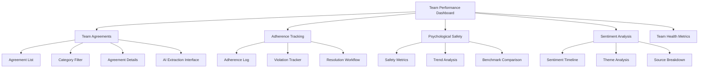

# Team Agreements & Team Performance Domain Implementation Plan

## 📌 Overview
**Status**: 🟢 **In Progress (P0 - Final Polish)**
**Target Domain**: Team Performance Domain (PMBOK 8th Edition)
**Goal**: Move beyond resource tracking to capture team culture, norms, and psychological safety through automated extraction of "Team Agreements". Finalize implementation with adherence tracking and psychological safety metrics.

### 🎯 Objectives
- Enhance AI extraction accuracy for team norms and psychological safety metrics
- Implement adherence tracking system with violation logging
- Build psychological safety metrics visualization and trends
- Finalize frontend display with filtering by category
- Integrate with PMBOK 8 Team Domain dashboard
- Conduct user acceptance testing with real-world team documents

### 🔄 Parallel Implementation Tracks
1. **Track 1**: AI Extraction Enhancement (better data foundation)
2. **Track 2**: Adherence Tracking & Metrics (operational impact)
3. **Track 3**: Frontend & UX Finalization (user experience)

---

## 🏗️ Architecture & Design

### 📊 Database Schema (Existing + Enhancements)
```sql
-- Core team agreements table (existing)
CREATE TABLE team_agreements (
  id UUID PRIMARY KEY,
  project_id UUID REFERENCES projects(id),
  title VARCHAR(200) NOT NULL,
  description TEXT NOT NULL,
  category VARCHAR(30) NOT NULL CHECK (category IN ('working_hours', 'communication', 'decision_making', 'conflict_resolution', 'quality_standards', 'meeting_norms', 'code_of_conduct', 'collaboration_tools', 'response_times', 'knowledge_sharing', 'psychological_safety', 'diversity_inclusion', 'performance_feedback', 'continuous_improvement', 'other')),
  agreed_by JSONB DEFAULT '[]'::jsonb,
  facilitated_by UUID REFERENCES users(id),
  effective_date TIMESTAMP NOT NULL,
  review_frequency VARCHAR(20),
  next_review_date TIMESTAMP,
  status VARCHAR(20) NOT NULL DEFAULT 'active' CHECK (status IN ('draft', 'active', 'under_review', 'revised', 'deprecated')),
  source_document_id UUID REFERENCES documents(id),
  created_at TIMESTAMP DEFAULT NOW(),
  updated_at TIMESTAMP DEFAULT NOW(),
  INDEX idx_team_agreements_project (project_id),
  INDEX idx_team_agreements_category (category),
  INDEX idx_team_agreements_status (status)
);

-- Adherence tracking table (new)
CREATE TABLE team_agreement_adherence (
  id UUID PRIMARY KEY,
  agreement_id UUID REFERENCES team_agreements(id),
  team_member_id UUID REFERENCES users(id),
  adherence_date TIMESTAMP NOT NULL,
  adherence_score DECIMAL(3,1) NOT NULL CHECK (adherence_score BETWEEN 0 AND 5),
  notes TEXT,
  violation_type VARCHAR(50) CHECK (violation_type IN ('minor', 'significant', 'severe', 'positive')),
  resolved BOOLEAN DEFAULT FALSE,
  resolved_date TIMESTAMP,
  resolved_by UUID REFERENCES users(id),
  created_at TIMESTAMP DEFAULT NOW(),
  INDEX idx_adherence_agreement (agreement_id),
  INDEX idx_adherence_member (team_member_id),
  INDEX idx_adherence_date (adherence_date)
);

-- Psychological safety metrics table (new)
CREATE TABLE psychological_safety_metrics (
  id UUID PRIMARY KEY,
  project_id UUID REFERENCES projects(id),
  assessment_date DATE NOT NULL,
  survey_score DECIMAL(3,1) CHECK (survey_score BETWEEN 0 AND 5),
  participation_rate DECIMAL(5,2),
  voice_score DECIMAL(3,1),
  support_score DECIMAL(3,1),
  learning_score DECIMAL(3,1),
  inclusivity_score DECIMAL(3,1),
  notes TEXT,
  created_at TIMESTAMP DEFAULT NOW(),
  INDEX idx_safety_project (project_id),
  INDEX idx_safety_date (assessment_date)
);

-- Team sentiment analysis (new)
CREATE TABLE team_sentiment (
  id UUID PRIMARY KEY,
  project_id UUID REFERENCES projects(id),
  analysis_date TIMESTAMP NOT NULL,
  sentiment_score DECIMAL(3,1) CHECK (sentiment_score BETWEEN -1 AND 1),
  positive_percentage DECIMAL(5,2),
  neutral_percentage DECIMAL(5,2),
  negative_percentage DECIMAL(5,2),
  key_themes JSONB,
  source_type VARCHAR(20) CHECK (source_type IN ('meetings', 'chat', 'documents', 'surveys')),
  source_reference TEXT,
  created_at TIMESTAMP DEFAULT NOW(),
  INDEX idx_sentiment_project (project_id),
  INDEX idx_sentiment_date (analysis_date)
);
```

### 🤖 AI Extraction Enhancement
```typescript
// services/jobs/TeamAgreementExtractionJobService.ts
class TeamAgreementExtractionJobService {
  async extractAgreementsFromDocument(documentId: string, projectId: string): Promise<TeamAgreement[]> {
    // 1. Retrieve document content with project context
    const document = await this.documentRepository.findById(documentId);
    const project = await this.projectRepository.findById(projectId);
    
    // 2. Call enhanced AI provider with context-aware prompt
    const prompt = this.buildEnhancedExtractionPrompt(document.content, project);
    const aiResponse = await this.aiProvider.generateWithContext(prompt, {
      temperature: 0.3, // Lower for more deterministic output
      response_format: "json"
    });
    
    // 3. Parse and validate extracted data
    const extractedData = this.parseAIResponse(aiResponse);
    
    // 4. Enrich with project-specific context
    const enrichedData = await this.enrichWithProjectContext(extractedData, projectId);
    
    // 5. Store agreements with confidence scores
    return this.agreementRepository.createMany(enrichedData);
  }

  private buildEnhancedExtractionPrompt(documentContent: string, project: Project): string {
    return `Extract Team Agreements from the following project document, focusing on:
    
    1. Working norms and expectations
    2. Communication protocols
    3. Decision-making processes
    4. Conflict resolution approaches
    5. Psychological safety commitments
    6. Diversity and inclusion statements
    7. Performance feedback mechanisms
    
    Document Content:
    ${documentContent}
    
    Project Context:
    - Industry: ${project.industry}
    - Team Size: ${project.teamSize}
    - Methodology: ${project.methodology}
    - Maturity Level: ${project.maturityLevel}
    
    Extract the following for each agreement:
    - Title (concise, action-oriented)
    - Description (specific behaviors and expectations)
    - Category (most relevant from the list above)
    - Suggested review frequency
    - Psychological safety relevance score (0-10)
    - Confidence score (0-100)
    
    Return in JSON format with this structure:
    {
      "agreements": [
        {
          "title": "string",
          "description": "string",
          "category": "string",
          "review_frequency": "monthly|quarterly|annual|as_needed",
          "psychological_safety_score": number,
          "confidence_score": number,
          "notes": "string"
        }
      ],
      "warnings": ["string"]
    }`;
  }

  private async enrichWithProjectContext(extractedData: any, projectId: string): Promise<TeamAgreement[]> {
    // Add project context, team members, and default values
    const project = await this.projectRepository.findById(projectId);
    
    return extractedData.agreements.map(agreement => ({
      ...agreement,
      project_id: projectId,
      agreed_by: project.teamMembers.map(member => member.id),
      effective_date: new Date(),
      next_review_date: this.calculateNextReviewDate(agreement.review_frequency),
      status: 'active'
    }));
  }
}
```

### 📡 API Specifications
| Endpoint | Method | Description | Request Body | Response |
|----------|--------|-------------|--------------|----------|
| `/api/teams/{projectId}/agreements` | GET | Retrieve team agreements | `?category=communication&status=active` | `{ agreements: TeamAgreement[] }` |
| `/api/teams/{projectId}/agreements` | POST | Create new agreement | `{ title, description, category, ... }` | `{ id, status }` |
| `/api/teams/{projectId}/agreements/{id}` | PUT | Update agreement | `{ status, next_review_date }` | `{ id, updated }` |
| `/api/teams/{projectId}/agreements/extract` | POST | Trigger AI extraction | `{ documentId }` | `{ jobId, status }` |
| `/api/teams/{projectId}/agreements/{id}/adherence` | POST | Log adherence | `{ adherence_score, notes, violation_type }` | `{ id, status }` |
| `/api/teams/{projectId}/safety-metrics` | POST | Submit safety assessment | `{ survey_score, participation_rate, ... }` | `{ id, status }` |
| `/api/teams/{projectId}/dashboard` | GET | Retrieve team dashboard data | `?period=last_30_days` | `{ metrics, trends, alerts }` |

### 🖥️ Frontend Components


### 📊 Adherence Tracking System
```typescript
// services/team/AdherenceService.ts
class AdherenceService {
  async logAdherence(agreementId: string, data: AdherenceLog): Promise<AdherenceRecord> {
    // 1. Validate input
    this.validateAdherenceData(data);
    
    // 2. Create adherence record
    const record = await this.adherenceRepository.create({
      agreement_id: agreementId,
      ...data
    });
    
    // 3. Update agreement adherence score
    await this.updateAgreementScore(agreementId);
    
    // 4. Check for violation patterns
    await this.checkForViolationPatterns(agreementId);
    
    // 5. Trigger alerts if needed
    if (data.violation_type && data.violation_type !== 'positive') {
      await this.alertService.triggerAdherenceAlert(agreementId, record);
    }
    
    return record;
  }

  private async updateAgreementScore(agreementId: string): Promise<void> {
    const recentScores = await this.adherenceRepository.findRecentScores(agreementId, 30);
    const avgScore = recentScores.reduce((sum, score) => sum + score, 0) / recentScores.length;
    
    await this.agreementRepository.update(agreementId, {
      adherence_score: parseFloat(avgScore.toFixed(1))
    });
  }

  private async checkForViolationPatterns(agreementId: string): Promise<void> {
    const recentViolations = await this.adherenceRepository.findRecentViolations(agreementId, 7);
    
    if (recentViolations.length >= 3) {
      // Pattern detected - escalate
      const agreement = await this.agreementRepository.findById(agreementId);
      await this.notificationService.escalateViolationPattern(agreement.project_id, agreementId);
    }
  }
}
```

### 🧠 Psychological Safety Metrics
```typescript
// services/team/PsychologicalSafetyService.ts
class PsychologicalSafetyService {
  async calculateTeamSafetyScore(projectId: string): Promise<TeamSafetyMetrics> {
    // 1. Get recent safety assessments
    const assessments = await this.safetyRepository.findRecent(projectId, 90);
    
    // 2. Get adherence data
    const adherence = await this.adherenceRepository.getProjectAdherence(projectId, 90);
    
    // 3. Get sentiment analysis
    const sentiment = await this.sentimentRepository.getProjectSentiment(projectId, 90);
    
    // 4. Calculate composite score (0-5 scale)
    const safetyScore = this.calculateCompositeScore(assessments, adherence, sentiment);
    
    // 5. Identify trends and recommendations
    const trends = this.identifyTrends(assessments, adherence);
    
    return {
      project_id: projectId,
      safety_score: parseFloat(safetyScore.toFixed(1)),
      assessment_count: assessments.length,
      adherence_score: parseFloat(this.calculateAdherenceScore(adherence).toFixed(1)),
      sentiment_score: parseFloat(this.calculateSentimentScore(sentiment).toFixed(1)),
      participation_rate: this.calculateParticipationRate(assessments),
      key_trends: trends,
      recommendations: this.generateRecommendations(trends)
    };
  }

  private calculateCompositeScore(
    assessments: SafetyAssessment[],
    adherence: AdherenceRecord[],
    sentiment: SentimentRecord[]
  ): number {
    // Weighted average of different safety indicators
    const assessmentWeight = 0.5;
    const adherenceWeight = 0.3;
    const sentimentWeight = 0.2;
    
    const assessmentScore = assessments.reduce((sum, a) => sum + a.survey_score, 0) / assessments.length || 0;
    const adherenceScore = this.calculateAdherenceScore(adherence);
    const sentimentScore = this.calculateSentimentScore(sentiment);
    
    return (assessmentScore * assessmentWeight) +
           (adherenceScore * adherenceWeight) +
           (sentimentScore * sentimentWeight);
  }
}
```

---

## 📅 Implementation Roadmap

### 🚀 Phase 1: AI Extraction Enhancement (Week 1-2)
- [ ] Develop enhanced extraction prompts with psychological safety focus
- [ ] Implement confidence scoring for extracted agreements
- [ ] Build extraction review interface with manual correction
- [ ] Create validation rules for agreement quality
- [ ] Implement extraction job monitoring and retry logic
- [ ] Develop extraction performance metrics

### 📊 Phase 2: Adherence Tracking (Week 3-4)
- [ ] Design and implement `team_agreement_adherence` table
- [ ] Build adherence logging interface
- [ ] Implement adherence scoring algorithm
- [ ] Create violation pattern detection
- [ ] Build resolution workflow for violations
- [ ] Implement adherence alerts and notifications

### 🧠 Phase 3: Psychological Safety Metrics (Week 5-6)
- [ ] Design and implement `psychological_safety_metrics` table
- [ ] Build safety assessment submission interface
- [ ] Implement composite safety score calculation
- [ ] Create trend analysis and benchmarking
- [ ] Build team sentiment analysis integration
- [ ] Develop recommendations engine

### 🖥️ Phase 4: Frontend & UX Finalization (Week 7-8)
- [ ] Enhance team agreements dashboard with filtering
- [ ] Build adherence tracking interface
- [ ] Create psychological safety dashboard
- [ ] Implement team health metrics visualization
- [ ] Build export and reporting functionality
- [ ] Conduct user acceptance testing

---

## 🔗 Integration Points

### 🤖 Job Queue Integration
```typescript
// server/src/queues/teamQueue.ts
import { Queue } from 'bull';
import { TeamAgreementExtractionJobService } from '../services/jobs/TeamAgreementExtractionJobService';

export const teamQueue = new Queue('team', process.env.REDIS_URL);

// Add extraction job
teamQueue.add('extract-agreements', {
  documentId: 'doc_123',
  projectId: 'proj_456',
  extractionScope: 'full'
});

// Process extraction jobs
teamQueue.process('extract-agreements', async (job) => {
  const { documentId, projectId } = job.data;
  const service = new TeamAgreementExtractionJobService();
  return service.extractAgreementsFromDocument(documentId, projectId);
});

// Add sentiment analysis job
teamQueue.add('analyze-sentiment', {
  projectId: 'proj_456',
  sourceType: 'meetings',
  sourceReference: 'meeting_789'
});
```

### 📊 Dashboard Integration
```typescript
// components/team/TeamPerformanceDashboard.tsx
import { useTeamAgreements } from '../../hooks/useTeamAgreements';
import { usePsychologicalSafety } from '../../hooks/usePsychologicalSafety';
import { useAdherenceTracking } from '../../hooks/useAdherenceTracking';

export function TeamPerformanceDashboard({ projectId }: { projectId: string }) {
  const { agreements, loading: agreementsLoading } = useTeamAgreements(projectId);
  const { safetyMetrics, loading: safetyLoading } = usePsychologicalSafety(projectId);
  const { adherenceData, loading: adherenceLoading } = useAdherenceTracking(projectId);
  
  if (agreementsLoading || safetyLoading || adherenceLoading) {
    return <LoadingSpinner />;
  }
  
  return (
    <div className="team-performance-dashboard">
      <div className="dashboard-header">
        <h1>Team Performance Dashboard</h1>
        <TeamHealthScore score={safetyMetrics.safety_score} />
      </div>
      
      <div className="dashboard-grid">
        <TeamAgreementsCard agreements={agreements} />
        <PsychologicalSafetyCard metrics={safetyMetrics} />
        <AdherenceTrackingCard data={adherenceData} />
        <TeamSentimentCard projectId={projectId} />
      </div>
      
      <TeamPerformanceTrends projectId={projectId} />
    </div>
  );
}
```

### 📈 PMBOK 8 Team Domain Integration
```typescript
// components/pmbok8/TeamDomainDashboard.tsx
import { useTeamMetrics } from '../../hooks/useTeamMetrics';

export function TeamDomainDashboard({ projectId }: { projectId: string }) {
  const {
    teamMetrics,
    loading,
    error
  } = useTeamMetrics(projectId);
  
  if (loading) return <LoadingSpinner />;
  if (error) return <ErrorDisplay message={error} />;
  
  return (
    <div className="pmbok8-team-domain">
      <PMBOK8Header domain="Team" complianceLevel={teamMetrics.complianceLevel} />
      
      <div className="domain-metrics-grid">
        <ComplianceCard
          title="Team Agreements"
          score={teamMetrics.agreementsCompliance}
          target={90}
        />
        
        <ComplianceCard
          title="Psychological Safety"
          score={teamMetrics.safetyScore}
          target={4.0}
          scale="5-point"
        />
        
        <ComplianceCard
          title="Adherence Tracking"
          score={teamMetrics.adherenceScore}
          target={85}
        />
        
        <ComplianceCard
          title="Team Development"
          score={teamMetrics.developmentScore}
          target={75}
        />
      </div>
      
      <TeamDomainRecommendations metrics={teamMetrics} />
    </div>
  );
}
```

---

## ⚠️ Risks & Mitigation

| Risk | Impact | Mitigation Strategy |
|------|--------|---------------------|
| **Extraction Accuracy** | Low trust in AI | Implement confidence scoring, manual review interface, and continuous training |
| **Adherence Subjectivity** | Inconsistent scoring | Provide clear scoring guidelines, calibration sessions, and benchmark examples |
| **Psychological Safety Sensitivity** | Low participation | Ensure anonymity, communicate value, and provide multiple submission methods |
| **Integration Complexity** | Delays in implementation | Modular design, comprehensive testing, and phased rollout |
| **User Adoption** | Low engagement | Highlight quick wins, provide training, and demonstrate business value |

---

## 📚 Documentation & Training
- **User Guide**: How to review extracted agreements, log adherence, and interpret safety metrics
- **Team Lead Guide**: Facilitating team agreements workshops and interpreting trends
- **Administrator Guide**: Configuring extraction settings, alert thresholds, and reporting
- **API Documentation**: Endpoints for integration with HR systems and survey tools
- **Training Materials**: Workshops on psychological safety, team agreements best practices

---

## 📅 Success Metrics
| Metric | Target | Measurement Method |
|--------|--------|-------------------|
| Extraction Accuracy | 90% | % of agreements accepted without manual correction |
| Agreement Coverage | 80% of projects | % of active projects with at least 5 agreements |
| Adherence Tracking | 70% participation | % of team members logging adherence weekly |
| Safety Assessment Completion | 85% | % of eligible team members completing assessments |
| Team Health Score Improvement | +0.5 pts | Change in average safety score over 6 months |
| User Satisfaction | 4.2/5 | Survey rating from team leads and members |

---

## 🔄 Next Steps
1. **Enhance AI Extraction**: Improve prompts and validation for team agreements
2. **Implement Adherence Tracking**: Build database schema and logging interface
3. **Develop Safety Metrics**: Create composite scoring and trend analysis
4. **Build Frontend Dashboard**: Integrate all components into team performance view
5. **Conduct User Testing**: Validate with real teams and gather feedback
6. **Integrate with PMBOK 8**: Connect to team domain compliance tracking