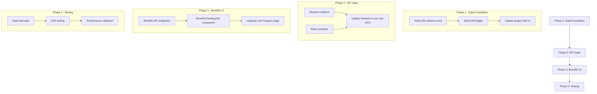

# ADPA Financial & Resource Management Enhancement Plan

**Date**: December 18, 2025  
**Status**: 📋 **IMPLEMENTATION READY**  
**Priority**: P0 - Immediate Focus  
**Scope**: Enhancing existing Financial/Resource backend services and frontend integration

---

## 📊 Executive Summary

### Current State Assessment

Based on comprehensive codebase analysis, ADPA has **significant existing infrastructure** that needs enhancement rather than building from scratch:

| Component | Status | Notes |
|-----------|--------|-------|
| Database Schema (Migrations 203-205) | ✅ Complete | program_budgets, program_cost_performance, program_benefits, program_financial_analysis |
| programFinancialService.ts | ✅ Complete | ROI, NPV, Payback, Budget Rollup, Financial Dashboard |
| evmCalculator.ts | ✅ Complete | All EVM metrics (PV, EV, AC, SV, CV, SPI, CPI, BAC, EAC, ETC, VAC, TCPI) |
| resourceService.ts | ✅ Complete | Allocation, conflicts, capacity |
| FinancialDashboard.tsx | ✅ Complete | Full EVM UI, ROI display |
| ProgramResourcesTab.tsx | ✅ Complete | 4 sub-tabs (Allocation, Capacity, Skills, Conflicts) |
| ProgramRisksTab.tsx | ⚠️ Uses Mock Data | Backend endpoint missing or incomplete |
| ProgramReportsTab.tsx | ⚠️ Uses Mock Data | Backend endpoint missing or incomplete |
| Project EVM Fields | ❌ Gap | planned_value, earned_value columns may not be populated |
| Benefits Tracking UI | ❌ Gap | program_benefits table exists, UI missing |

---

## 🎯 Implementation Priorities

### Phase 1: Data Foundation (Critical)
**Goal**: Ensure project data populates EVM calculations

### Phase 2: API Endpoint Gaps
**Goal**: Replace mock data with real API calls

### Phase 3: Benefits Tracking UI
**Goal**: Complete benefits management feature

### Phase 4: Integration Testing
**Goal**: End-to-end verification

---

## 📋 Phase 1: Data Foundation

### 1.1 Project EVM Fields Verification

**Problem**: The `evmCalculator.ts` queries projects for `planned_value`, `earned_value`, `actual_cost`, `percent_complete` but these fields may not be consistently populated.

**Current Query** (from `evmCalculator.ts:148-161`):
```sql
SELECT 
  id as "projectId",
  name as "projectName",
  COALESCE(planned_value, 0)::numeric as "plannedValue",
  COALESCE(earned_value, 0)::numeric as "earnedValue",
  COALESCE(actual_cost, 0)::numeric as "actualCost",
  COALESCE(budget, 0)::numeric as budget,
  COALESCE(percent_complete, 0)::numeric as "percentComplete"
FROM projects
WHERE program_id = $1 AND archived = false
```

**Required Actions**:

| Task | File | Change |
|------|------|--------|
| 1.1.1 | Database | Verify `planned_value`, `earned_value`, `actual_cost`, `percent_complete` columns exist in projects table |
| 1.1.2 | `projects.ts` route | Add PUT endpoint to update project EVM fields |
| 1.1.3 | Project Edit UI | Add fields for actual_cost, percent_complete |
| 1.1.4 | Auto-calculation | When percent_complete is updated, auto-calculate earned_value = budget * percent_complete / 100 |

**Database Migration** (if needed):
```sql
-- Migration: Add EVM columns to projects if not exists
ALTER TABLE projects 
  ADD COLUMN IF NOT EXISTS planned_value DECIMAL(15,2),
  ADD COLUMN IF NOT EXISTS earned_value DECIMAL(15,2),
  ADD COLUMN IF NOT EXISTS actual_cost DECIMAL(15,2),
  ADD COLUMN IF NOT EXISTS forecast_cost DECIMAL(15,2),
  ADD COLUMN IF NOT EXISTS percent_complete DECIMAL(5,2) DEFAULT 0;

-- Set planned_value = budget for existing projects (initial baseline)
UPDATE projects 
SET planned_value = budget 
WHERE planned_value IS NULL AND budget IS NOT NULL;
```

### 1.2 Auto-Calculate Earned Value Trigger

**Create Database Trigger**:
```sql
-- Trigger to auto-calculate earned_value when percent_complete changes
CREATE OR REPLACE FUNCTION calculate_earned_value()
RETURNS TRIGGER AS $$
BEGIN
  IF NEW.percent_complete IS NOT NULL AND NEW.budget IS NOT NULL THEN
    NEW.earned_value := (NEW.budget * NEW.percent_complete) / 100;
  END IF;
  RETURN NEW;
END;
$$ LANGUAGE plpgsql;

CREATE TRIGGER trigger_calculate_earned_value
  BEFORE INSERT OR UPDATE ON projects
  FOR EACH ROW
  WHEN (NEW.percent_complete IS DISTINCT FROM OLD.percent_complete)
  EXECUTE FUNCTION calculate_earned_value();
```

---

## 📋 Phase 2: API Endpoint Gaps

### 2.1 Program Reports Endpoint

**Current State**: `ProgramReportsTab.tsx` falls back to mock data (line 147-149)

**Missing Endpoint**: `GET /api/programs/:id/reports`

**Implementation** (`server/src/routes/programRoutes.ts`):

```typescript
/**
 * GET /api/programs/:id/reports
 * Get reports for a program
 */
router.get('/:id/reports', 
  authenticateToken, 
  requirePermission('programs.view'), 
  async (req, res) => {
    const { id: programId } = req.params
    const { type, status, limit = 20, offset = 0 } = req.query
    
    try {
      let query = `
        SELECT 
          id,
          program_id,
          title,
          type,
          status,
          generated_at,
          generated_by,
          file_url,
          file_size,
          parameters,
          created_at
        FROM program_reports
        WHERE program_id = $1
      `
      const params: any[] = [programId]
      let paramIndex = 2
      
      if (type) {
        query += ` AND type = $${paramIndex++}`
        params.push(type)
      }
      
      if (status) {
        query += ` AND status = $${paramIndex++}`
        params.push(status)
      }
      
      query += ` ORDER BY created_at DESC LIMIT $${paramIndex++} OFFSET $${paramIndex}`
      params.push(limit, offset)
      
      const result = await pool.query(query, params)
      
      res.json({
        success: true,
        data: result.rows
      })
    } catch (error) {
      logger.error('Failed to get program reports', { error, programId })
      res.status(500).json({ error: 'Failed to get reports' })
    }
  }
)
```

**Database Migration** (if table doesn't exist):
```sql
CREATE TABLE IF NOT EXISTS program_reports (
  id UUID PRIMARY KEY DEFAULT gen_random_uuid(),
  program_id UUID REFERENCES programs(id),
  title VARCHAR(255) NOT NULL,
  type VARCHAR(50) NOT NULL, -- 'executive', 'financial', 'risk', 'status', 'resource'
  status VARCHAR(50) DEFAULT 'generated', -- 'generating', 'generated', 'failed'
  generated_at TIMESTAMP DEFAULT NOW(),
  generated_by UUID REFERENCES users(id),
  file_url TEXT,
  file_size INTEGER,
  parameters JSONB,
  created_at TIMESTAMP DEFAULT NOW(),
  updated_at TIMESTAMP DEFAULT NOW()
);

CREATE INDEX idx_program_reports_program ON program_reports(program_id);
CREATE INDEX idx_program_reports_type ON program_reports(type);
```

### 2.2 Program Risks Endpoint

**Current State**: `ProgramRisksTab.tsx` falls back to mock data (lines 134-141)

**Missing Endpoint**: `GET /api/programs/:id/risks`

**Implementation** (`server/src/routes/programRoutes.ts`):

```typescript
/**
 * GET /api/programs/:id/risks
 * Get risks for projects in a program
 */
router.get('/:id/risks', 
  authenticateToken, 
  requirePermission('programs.view'), 
  async (req, res) => {
    const { id: programId } = req.params
    const { severity, status } = req.query
    
    try {
      let query = `
        SELECT 
          r.id,
          r.project_id,
          p.name as project_name,
          r.title,
          r.description,
          r.category,
          r.probability,
          r.impact,
          r.severity,
          r.status,
          r.owner,
          r.mitigation_plan,
          r.contingency_plan,
          r.risk_score,
          r.created_at,
          r.updated_at
        FROM risks r
        JOIN projects p ON p.id = r.project_id
        WHERE p.program_id = $1 AND p.archived = false
      `
      const params: any[] = [programId]
      let paramIndex = 2
      
      if (severity) {
        query += ` AND r.severity = $${paramIndex++}`
        params.push(severity)
      }
      
      if (status) {
        query += ` AND r.status = $${paramIndex++}`
        params.push(status)
      }
      
      query += ` ORDER BY r.risk_score DESC, r.created_at DESC`
      
      const result = await pool.query(query, params)
      
      // Calculate summary
      const summary = {
        total: result.rows.length,
        high: result.rows.filter(r => r.severity === 'high').length,
        medium: result.rows.filter(r => r.severity === 'medium').length,
        low: result.rows.filter(r => r.severity === 'low').length,
        open: result.rows.filter(r => r.status === 'open').length,
        mitigated: result.rows.filter(r => r.status === 'mitigated').length
      }
      
      res.json({
        success: true,
        data: result.rows,
        summary
      })
    } catch (error) {
      logger.error('Failed to get program risks', { error, programId })
      res.status(500).json({ error: 'Failed to get risks' })
    }
  }
)
```

---

## 📋 Phase 3: Benefits Tracking UI

### 3.1 Benefits Management Component

**Database**: `program_benefits` table already exists (migration 205)

**Required UI Component**: `components/program/BenefitsTrackingTab.tsx`

**Component Structure**:
```
BenefitsTrackingTab
├── BenefitsSummaryCards (4 cards)
│   ├── Total Expected Benefits
│   ├── Realized Benefits  
│   ├── Realization Rate %
│   └── Remaining Benefits
├── BenefitsTable
│   ├── Benefit Name
│   ├── Type (cost-savings, revenue, efficiency, etc.)
│   ├── Expected Value
│   ├── Realized Value
│   ├── Realization %
│   ├── Status
│   └── Actions (Edit, Track Progress)
├── AddBenefitDialog
└── BenefitDetailDialog
```

**API Endpoints Needed**:

| Method | Endpoint | Purpose |
|--------|----------|---------|
| GET | `/api/programs/:id/benefits` | List all benefits |
| POST | `/api/programs/:id/benefits` | Create new benefit |
| PUT | `/api/programs/:id/benefits/:benefitId` | Update benefit |
| DELETE | `/api/programs/:id/benefits/:benefitId` | Delete benefit |
| POST | `/api/programs/:id/benefits/:benefitId/realize` | Record benefit realization |

**Sample API Implementation**:
```typescript
/**
 * GET /api/programs/:id/benefits
 * Get benefits for a program
 */
router.get('/:id/benefits',
  authenticateToken,
  requirePermission('programs.view'),
  async (req, res) => {
    const { id: programId } = req.params
    
    try {
      const result = await pool.query(`
        SELECT 
          pb.*,
          p.name as project_name
        FROM program_benefits pb
        LEFT JOIN projects p ON p.id = pb.project_id
        WHERE pb.program_id = $1
        ORDER BY pb.expected_value DESC
      `, [programId])
      
      // Calculate summary
      const totalExpected = result.rows.reduce((sum, b) => sum + parseFloat(b.expected_value || 0), 0)
      const totalRealized = result.rows.reduce((sum, b) => sum + parseFloat(b.realized_value || 0), 0)
      
      res.json({
        success: true,
        data: result.rows,
        summary: {
          totalExpected,
          totalRealized,
          realizationRate: totalExpected > 0 ? (totalRealized / totalExpected) * 100 : 0,
          benefitCount: result.rows.length
        }
      })
    } catch (error) {
      logger.error('Failed to get program benefits', { error, programId })
      res.status(500).json({ error: 'Failed to get benefits' })
    }
  }
)
```

---

## 📋 Phase 4: Integration Testing

### 4.1 Test Scenarios

| Test | Description | Expected Result |
|------|-------------|-----------------|
| EVM Calculation | Create program with 3 projects, set percent_complete | CPI/SPI calculated correctly |
| Financial Dashboard | Open Financial tab for program | Real data displayed, no mock |
| Benefits Tracking | Add benefit, track realization | ROI updates automatically |
| Risk Aggregation | View risks across all program projects | All project risks shown |
| Resource Conflicts | Over-allocate resource | Conflict detected and shown |

### 4.2 Data Seeding Script

Create test data for development:
```typescript
// server/scripts/seed-program-financial-data.ts
async function seedProgramFinancialData(programId: string) {
  // 1. Update project EVM fields
  await pool.query(`
    UPDATE projects 
    SET 
      planned_value = budget,
      actual_cost = budget * 0.7,
      percent_complete = 70,
      earned_value = budget * 0.7
    WHERE program_id = $1 AND archived = false
  `, [programId])
  
  // 2. Create sample benefits
  await pool.query(`
    INSERT INTO program_benefits (program_id, benefit_name, benefit_type, expected_value, realized_value, status)
    VALUES 
      ($1, 'Operational Efficiency', 'efficiency', 500000, 250000, 'in-progress'),
      ($1, 'Cost Reduction', 'cost-savings', 300000, 300000, 'achieved'),
      ($1, 'Revenue Growth', 'revenue-increase', 1000000, 100000, 'in-progress')
  `, [programId])
  
  // 3. Calculate EVM metrics
  const evmMetrics = await calculateEVMMetrics(programId)
  await saveEVMMetrics(evmMetrics)
  
  // 4. Run financial analysis
  const analysis = await getFinancialAnalysis(programId)
  await saveFinancialAnalysis(analysis)
}
```

---

## 📊 Implementation Sequence



---

## 📁 Files to Create/Modify

### New Files:
| File | Purpose |
|------|---------|
| `server/migrations/2xx_add_project_evm_columns.sql` | Add EVM columns if missing |
| `server/migrations/2xx_program_reports_table.sql` | Reports table if missing |
| `components/program/BenefitsTrackingTab.tsx` | Benefits management UI |
| `server/scripts/seed-program-financial-data.ts` | Test data seeding |

### Modified Files:
| File | Change |
|------|--------|
| `server/src/routes/programRoutes.ts` | Add reports, risks, benefits endpoints |
| `app/programs/[id]/page.tsx` | Add Benefits tab |
| `components/program/ProgramReportsTab.tsx` | Remove mock data fallback |
| `components/program/ProgramRisksTab.tsx` | Remove mock data fallback |
| `app/projects/[id]/page.tsx` | Add EVM fields to project edit |

---

## ✅ Success Criteria

| Criterion | Metric |
|-----------|--------|
| Financial Dashboard | Displays real EVM data (no mock) |
| CPI/SPI Calculation | Matches manual calculation within 0.01 |
| Benefits Tracking | ROI auto-updates when benefits realized |
| Risk Aggregation | All program risks visible in one view |
| Reports | Generated reports stored and retrievable |
| Performance | Dashboard loads in < 2 seconds |

---

## 🚀 Recommended Implementation Order

1. **Day 1-2**: Phase 1 - Verify/add database columns, create trigger
2. **Day 3-4**: Phase 2 - Implement missing API endpoints
3. **Day 5-6**: Phase 2 - Update frontend to remove mock data
4. **Day 7-8**: Phase 3 - Build Benefits Tracking UI
5. **Day 9-10**: Phase 4 - Testing and validation

---

**Status**: Ready for implementation  
**Next Action**: Switch to Code mode to begin Phase 1 database verification
