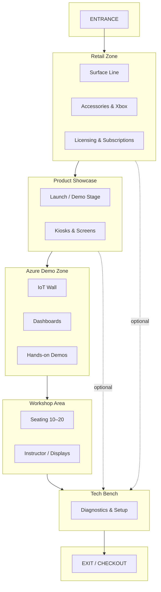
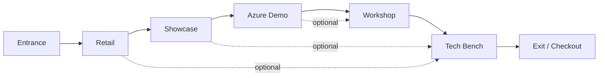

# Shop Layout: Customer Flow, Product Stations & Environmental Sensors  
## Microsoft Experience Centers Amsterdam — Pilot Blueprint

**Document type:** Store layout & operational schematic  
**Project:** Microsoft Experience Centers Amsterdam  
**Program pillars:** Microsoft Experience Centers, Microsoft Innovation Hub, Customer Engagement Programs  
**Version:** 1.0 (Draft)  
**Purpose:** Blueprint for pilot store layout, customer flow, product stations, and sensor deployment; aligns with [Digital Twin asset types](./01-project-ideation.md#52-digital-twin-asset-types).

---

## 1. Layout Overview

### 1.1 Zone Map (Top-Down)



*Flow is directional but customers may loop (e.g. Retail ↔ Showcase ↔ Tech Bench).*

### 1.2 Schematic Footprint (ASCII)

```
                    ┌─────────────────────────────────────────────────────────┐
                    │                      ENTRANCE                            │
                    └─────────────────────────┬───────────────────────────────┘
                                              │
     ┌────────────────────────────────────────┼────────────────────────────────────────┐
     │                 RETAIL ZONE            │                                        │
     │  ┌──────────────┐ ┌──────────────┐   │   ┌─────────────────────────────────┐   │
     │  │ Surface Pro  │ │ Surface      │   │   │     PRODUCT SHOWCASE             │   │
     │  │ Laptop • Go  │ │ Studio • Duo │   │   │  • Launch stage • Kiosks         │   │
     │  └──────────────┘ └──────────────┘   │   │  • Azure Media content          │   │
     │  ┌──────────────┐ ┌──────────────┐   │   └───────────────┬─────────────────┘   │
     │  │ Accessories  │ │ M365 • Azure │   │                   │                      │
     │  │ Xbox         │ │ Licensing    │   │                   ▼                      │
     │  └──────────────┘ └──────────────┘   │   ┌─────────────────────────────────┐   │
     └──────────────────────┬───────────────┘   │     AZURE DEMO ZONE              │   │
                            │                   │  • IoT wall • Dashboards          │   │
                            │                   │  • AI/DT demos • Sensors          │   │
                            │                   └───────────────┬─────────────────┘   │
                            │                                   │                      │
                            │   ┌───────────────────────────────┘                      │
                            │   │                                                        │
                            ▼   ▼                                                        │
     ┌─────────────────────────────────────────────────────────────────────────────────┐
     │  WORKSHOP AREA (10–20 pax)     │         TECH BENCH                              │
     │  • Modular desks • Displays    │  • Diagnostics • Setup • Migration              │
     │  • Surface hubs • Livestream   │         ▲                                        │
     └───────────────────────────────┼─────────┼────────────────────────────────────────┘
                                     │         │
                                     ▼         │
                    ┌──────────────────────────┴───────────────────────────────────────┐
                    │                    EXIT / CHECKOUT                                │
                    └──────────────────────────────────────────────────────────────────┘
```

---

## 2. Customer Flow

### 2.1 Primary Flow (First-Time / Discovery)

| Step | Zone | Customer action |
|------|------|------------------|
| 1 | **Entrance** | Enter; optional check-in / wayfinding |
| 2 | **Retail** | Browse Surface line, accessories, licensing |
| 3 | **Showcase** | Watch demos, use kiosks, try demo units |
| 4 | **Azure Demo** | Explore IoT/AI/dashboards; hands-on scenarios |
| 5 | **Workshop** (if scheduled) | Join session or view from edge |
| 6 | **Tech Bench** (if needed) | Diagnostics, setup, migration support |
| 7 | **Exit / Checkout** | Purchase, M365/Azure sign-up, exit |

### 2.2 Secondary Flows

- **Workshop-only:** Entrance → Workshop → (optional Retail / Tech Bench) → Exit.  
- **Support-only:** Entrance → Tech Bench → (optional Retail) → Exit.  
- **Quick browse:** Entrance → Retail → Showcase → Exit.

### 2.3 Flow Diagram (Mermaid)



### 2.4 Digital Twin Use

- **Footfall sensors** at zone boundaries → flow volumes and bottlenecks.  
- **Heat mapping** (e.g. showcase, Azure zone) → interest and dwell time.  
- **Event capacity** (workshop) → occupancy vs. bookings.

---

## 3. Product Stations

### 3.1 Station Overview

| Station ID | Zone | Name | Purpose | DT asset type |
|------------|------|------|---------|----------------|
| **PS-01** | Retail | Surface Line | Surface Pro, Laptop, Studio, Go, Duo | Device |
| **PS-02** | Retail | Accessories & Xbox | Pens, keyboards, docks, Xbox, peripherals | Device |
| **PS-03** | Retail | Licensing | M365, Windows, Defender, Azure credits | Customer interaction |
| **PS-04** | Showcase | Launch / Demo Stage | Events, feature demos, storytelling | Experience |
| **PS-05** | Showcase | Kiosks & Screens | Self-serve demos, Azure Media content | Device |
| **PS-06** | Azure Demo | IoT Wall | Sensors, live data, simple scenarios | Device + Sensor |
| **PS-07** | Azure Demo | Touch Dashboards | AI, IoT, Digital Twins, security demos | Device |
| **PS-08** | Workshop | Instructor Station | Facilitator, Surface hubs, livestream | Experience |
| **PS-09** | Workshop | Participant Stations | 10–20 modular desks + demo devices | Experience |
| **PS-10** | Tech Bench | Diagnostics & Setup | Support, migration, accessory testing | Customer interaction |

### 3.2 Station Details (Summary)

- **PS-01–PS-03:** Fixture-based retail; secure demo units where applicable.  
- **PS-04–PS-05:** Flexible layout for events; kiosks wired for cloud content.  
- **PS-06–PS-07:** Sensors feed dashboards; Azure IoT/Digital Twins demos.  
- **PS-08–PS-09:** Modular seating; shared displays; optional livestream.  
- **PS-10:** Service counter; diagnostic tools; seating for customers.

---

## 4. Environmental Sensors

### 4.1 Sensor Types & Placement

| Sensor ID | Type | Zone(s) | Purpose | DT asset type |
|-----------|------|---------|---------|----------------|
| **ENV-01** | HVAC / temperature | Global (zones) | Comfort, energy optimisation | Environmental |
| **ENV-02** | Humidity | Workshop, Azure Demo | Comfort, equipment care | Environmental |
| **ENV-03** | CO₂ | Workshop | Ventilation, occupancy | Environmental |
| **ENV-04** | Ambient light | All | Lighting zones, energy | Environmental |
| **ENV-05** | Occupancy (PIR or similar) | Per zone | Utilization, capacity | Sensor/IoT |
| **ENV-06** | Footfall / people count | Entrance, zone boundaries | Flow, conversion | Sensor/IoT |
| **ENV-07** | Door (open/close) | Entrance, Exit | Traffic, security | Sensor/IoT |
| **ENV-08** | Power (optional) | Demo stations, workshop | Usage, load | Environmental |

### 4.2 Sensor Zones (Logical)

```
Entrance     → ENV-06 (footfall), ENV-07 (door), ENV-04 (light)
Retail       → ENV-01, ENV-04, ENV-05
Showcase     → ENV-01, ENV-04, ENV-05
Azure Demo   → ENV-01, ENV-02, ENV-04, ENV-05; PS-06 sensors
Workshop     → ENV-01, ENV-02, ENV-03, ENV-04, ENV-05
Tech Bench   → ENV-01, ENV-04, ENV-05
Exit         → ENV-06, ENV-07, ENV-04
```

### 4.3 Data Use (Digital Twin)

- **Environmental:** HVAC and lighting setpoints; comfort alerts; energy reports.  
- **Occupancy / footfall:** Flow metrics, peak times, workshop utilisation.  
- **Doors:** Opening hours, traffic patterns.  
- **Dashboards:** Live store view in DT; export for franchise QA and optimisation.

---

## 5. Digital Twin Alignment

### 5.1 Asset Mapping

| Ideation asset type | Layout equivalent |
|---------------------|-------------------|
| Structural | Walls, fixtures, floor plan (zones in §1) |
| Device | PS-01, PS-02, PS-05, PS-06, PS-07; demo units, kiosks |
| Sensor/IoT | ENV-05, ENV-06, ENV-07; Azure Demo sensors |
| Experience | PS-04, PS-08, PS-09; workshop and showcase rigs |
| Environmental | ENV-01–04, ENV-08; HVAC, lighting |
| Customer interaction | PS-03, PS-10; checkout, Tech Bench |

### 5.2 Behaviours to Model

- Real-time **foot traffic** (ENV-06, ENV-07).  
- **Heat mapping** of product interest (Azure Demo, Showcase).  
- **Device demo usage** (kiosks, PS-06/07).  
- **Event capacity** (Workshop occupancy, ENV-03, ENV-05).  
- **Environmental optimisation** (HVAC, lighting from ENV-01, ENV-04).  
- **Energy insights** (ENV-08, lighting, HVAC).

---

## 6. Pilot Implementation Checklist

- [ ] Confirm pilot floor area and ceiling height.  
- [ ] Lock zone positions (Retail, Showcase, Azure, Workshop, Tech Bench).  
- [ ] Place product stations per §3.  
- [ ] Deploy environmental sensors per §4.  
- [ ] Define Digital Twin ontology (assets, relationships, telemetry).  
- [ ] Connect sensors to Azure IoT; feed DT and dashboards.  
- [ ] Validate customer flow with pilot staff and adjust signage.  
- [ ] Document as-built layout for franchise blueprint.

---

*Related: [01-project-ideation](./01-project-ideation.md) | [02-business-case](./02-business-case.md)*
