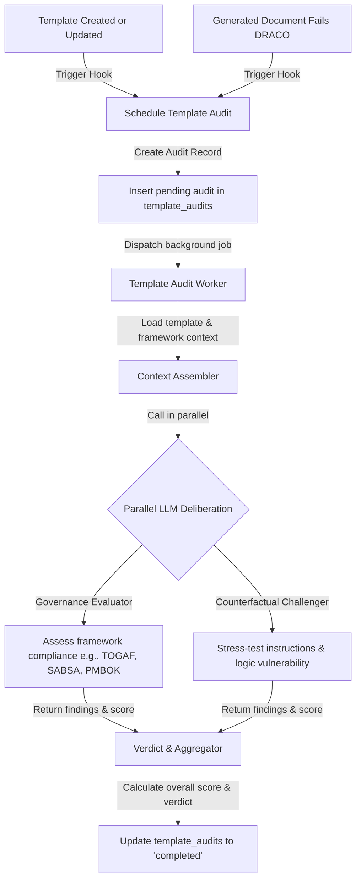

# DRACO Template Auditing & Closed-Loop Quality System Design

Date: 2026-05-25
Topic: Automated template audits and feedback loop based on document quality outcomes
Status: Draft (Pending Review)

## Goal

Provide template developers with automated, framework-specific auditing of document templates in development and production. Audit template prompts, paragraph layouts, and system instructions asynchronously using two specialized DRACO board roles (Governance Evaluator and Counterfactual Challenger). Establish a closed-loop feedback system that triggers a template audit if a generated document fails its runtime DRACO review.

## Context

The ADPA codebase already includes:
- **DRACO Review Board** (`server/src/services/dracoReviewBoard.ts`): Orchestrates parallel AI-based document reviews (Evidence Validator, Governance Evaluator, Counterfactual Challenger) with persistent rotation and scoring.
- **Document Generation Pipeline** (`server/src/services/documentGenerationService.ts`): Generates documents from templates using a multi-phase planner/drafter architecture.
- **Template Management Module** (`server/src/modules/documentTemplates/`): Full CRUD operations for templates stored in the `templates` database table.

This design extends these elements to audit the templates themselves, preventing poor prompts or incomplete structures from ever being committed or leading to systemic document generation failures.

---

## Proposed System Architecture



---

## Detailed Components

### 1. Database Schema

A new table `template_audits` is added to track historical audits, scoring, findings, and remediation steps.

```sql
CREATE TABLE template_audits (
    id UUID PRIMARY KEY DEFAULT uuid_generate_v4(),
    template_id UUID NOT NULL REFERENCES templates(id) ON DELETE CASCADE,
    template_version INTEGER NOT NULL DEFAULT 1,
    status VARCHAR(50) NOT NULL DEFAULT 'pending', -- 'pending', 'completed', 'failed'
    trigger_type VARCHAR(50) NOT NULL DEFAULT 'lifecycle', -- 'lifecycle', 'manual', 'document_failure'
    
    -- Overall Scores & Verdict
    overall_score INTEGER CHECK (overall_score >= 0 AND overall_score <= 100),
    governance_score INTEGER CHECK (governance_score >= 0 AND governance_score <= 100),
    resilience_score INTEGER CHECK (resilience_score >= 0 AND resilience_score <= 100),
    verdict VARCHAR(50), -- 'pass', 'flagged', 'fail'
    
    -- Governance Evaluator Results
    governance_findings JSONB DEFAULT '[]',
    governance_recommendations JSONB DEFAULT '[]',
    compliance_gaps JSONB DEFAULT '[]', -- standard-specific gaps (e.g. TOGAF, SABSA)
    
    -- Counterfactual Challenger Results
    challenger_findings JSONB DEFAULT '[]',
    challenger_recommendations JSONB DEFAULT '[]',
    challenged_assumptions JSONB DEFAULT '[]',
    logical_vulnerabilities JSONB DEFAULT '[]',
    
    -- Metadata & Timestamps
    error_message TEXT,
    created_at TIMESTAMP DEFAULT CURRENT_TIMESTAMP,
    completed_at TIMESTAMP
);

CREATE INDEX idx_template_audits_template_id ON template_audits(template_id);
```

---

### 2. Integration with Template Lifecycle Hooks

We will integrate background audit schedules into `DocumentTemplateService` methods:

- **`createTemplate`**:
  After inserting the template into the database, create a pending audit record with `trigger_type = 'lifecycle'` and dispatch the audit worker task asynchronously.
- **`updateTemplate`**:
  After updating the template, verify if core fields (`system_prompt`, `template_paragraphs`, `content`) changed. If yes, increment the version (or log the current version index), create a pending audit record, and dispatch the worker task.

---

### 3. Closed-Loop Trigger on Document Failures

Modify the asynchronous quality audit/DRACO post-generation handler in `server/src/routes/documentGeneration.ts` (or the `dracoService.ts` execution flow):

- When a document's DRACO review completes:
  1. Retrieve the overall DRACO score.
  2. If the score is $< 70$ (indicating failure or major issues) AND `template_id` is present:
     - Check if this template was audited in the last 12 hours (to prevent duplicate spam reviews).
     - If not, create a pending audit record with `trigger_type = 'document_failure'`.
     - Fetch the document's failed findings and recommendations to feed into the audit worker.
     - Dispatch the audit worker task.

---

### 4. Template Audit AI Deliberation

The worker builds context and runs two parallel LLM calls using the backend's configured AI provider (via `aiService`):

#### A. Governance Evaluator Prompt
Audits compliance against framework rules (TOGAF, SABSA, PMBOK 7/8, GDPR, SOC2).
- **PMBOK**: Mandates roles, lifecycle types, risk escalation paths, and communication matrices.
- **TOGAF**: Mandates viewpoints, gaps, stakeholder mappings, and governance.
- **SABSA**: Mandates security traceability, threat models, trust boundaries.

#### B. Counterfactual Challenger Prompt
Audits prompt quality for vulnerabilities, hallucination vectors, circular guidelines, and vague references.

---

### 5. Verdict Rules

- **Pass**: Overall score $\ge 75$ AND zero "critical" compliance gaps AND zero "high" logical vulnerabilities.
- **Flagged**: Overall score between $60$ and $74$, OR has "major" compliance gaps/medium vulnerabilities.
- **Fail**: Overall score $< 60$, OR any "critical" compliance gap, OR any "high" logical vulnerability.

---

### 6. API Endpoints

- **`GET /api/document-templates/:id/audits`**: Retrieves all audit runs for a template, sorted by creation timestamp descending.
- **`POST /api/document-templates/:id/audit`**: Manually triggers a background audit run for the given template. Returns a `202 Accepted` status with the triggered `auditId`.

---

### 7. Frontend Integration

A new interactive dashboard tab **"Template Audits"** will be added to the template detail view page at `app/templates/[id]/page.tsx`:

- **Component `components/TemplateAuditsPanel.tsx`**:
  - Fetches and displays a list of past audit logs (overall score, verdict badge, trigger type, timestamp).
  - Handles manual trigger requesting `POST /api/document-templates/:id/audit` with visual feedback.
  - Supports detailed inspection of any completed audit (Governance Evaluator compliance gaps and Counterfactual Challenger logical vulnerabilities).
  - Dynamically updates or polls if a background audit is in a `pending` state, displaying a loading progress bar: *"DRACO Board is deliberating..."*.
- **Page Integration**:
  - Increments tabs count from 5 to 6 in `app/templates/[id]/page.tsx`.
  - Registers the new `audits` tab trigger and pane.

---

## Scope Boundaries

### Included
- Creation of `template_audits` DB table and queries.
- Integration of trigger hooks inside `createTemplate`, `updateTemplate`, and document DRACO resolution.
- Asynchronous `TemplateAuditService` orchestrating the AI checks.
- Framework-specific prompts for TOGAF, SABSA, PMBOK, and a generic fallback.
- Backend API endpoints for manual triggering and listing audits.
- Frontend Tab and `TemplateAuditsPanel` React component showing real-time auditing states.

### Excluded
- Locking template usage if the audit verdict is 'fail' (audits will remain advisory and non-blocking in this phase).

