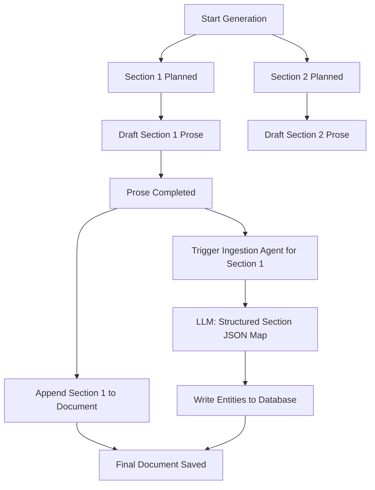

# Spec: Parallel Section Ingestion Agent for Inline Entity Extraction

## 1. Goal & Concept
Currently, project entities (like stakeholders, risks, budget details) are extracted by a post-generation background queue that spawns ~60 separate LLM calls. This introduces significant latency and token overhead. 

The **Parallel Section Ingestion Agent** runs alongside the existing section-by-section document generation pipeline. When a section finishes drafting, a lightweight extraction agent immediately reads that section's markdown to produce a structured JSON map of entities. The document generation process remains identical (markdown is saved as normal), but the extracted entities are directly written to the database during the generation lifecycle.



---

## 2. Key Components

### A. The Extraction Agent
A new service/helper `SectionExtractionAgent` will be created to extract entities from a single block of section text.
- **Input**: Section Markdown, Project ID, User ID, and Domain context.
- **Prompt**: Instructs the model to output a single JSON block conforming to the schemas of the entity types relevant to that section.
- **Structured Schema**: Uses Google Gemini / OpenAI structured outputs to guarantee schema compliance.

```typescript
interface SectionExtractionResult {
  stakeholders?: StakeholderInput[];
  milestones?: MilestoneInput[];
  risks?: RiskInput[];
  cost_estimates?: CostEstimateInput[];
  // ... other dynamic entity schemas
}
```

### B. In-Line Pipeline Hook
Modify the parallel map loop in `DocumentGenerationService.ts` to call the extraction agent concurrently as each section finishes drafting.

#### `server/src/services/documentGenerationService.ts`
When mapping through planned sections:
```typescript
const draftedSections = await this.mapWithConcurrency(generationPlan.sections, draftConcurrency, async (sectionTask, index) => {
  // 1. Draft the prose exactly as it is today (no changes to generation style/integrity)
  const sectionProse = await this.draftSection({ ... });
  
  // 2. Fire-and-forget (or await parallelly) the extraction agent for this section
  this.triggerSectionEntityExtraction(sectionProse.markdown, {
    projectId: params.projectId,
    userId: params.userId,
    sectionType: sectionTask.section_type
  }).catch(err => logger.error("Section entity extraction failed", err));

  return sectionProse;
});
```

### C. Database Writer
A database repository router that accepts the `SectionExtractionResult` JSON map and routes each array to the correct save function.
- It maps `stakeholders` directly to the `saveSingleEntityType` database repository.
- Since it operates section-by-section, the batch size is small, resulting in sub-second database write operations.

---

## 3. Implementation Steps

### Phase 1: Define Section Schema Mapping
Create a mapping configuration linking section types to their respective PMBOK entity schemas.
- `Executive Summary` -> `['stakeholders', 'risks', 'milestones']`
- `Project Budget / Finance` -> `['budget_baseline', 'cost_actuals', 'cost_estimates', 'funding_tranches']`
- `Project Timeline / Schedule` -> `['schedule_baseline', 'schedule_activities', 'milestones']`

### Phase 2: Ingestion Agent Prompts
Draft a unified structured prompt template that asks the LLM to output a JSON object containing keys only for the mapped schemas if those entities are mentioned in the section text.

### Phase 3: Queue Service Retirement
Once the Parallel Section Ingestion Agent is fully verified, we can deprecate the massive background post-processing queue `extract-project-data` and replace it with a single post-generation validation check to verify graph completeness, reducing LLM calls by **85%+**.
