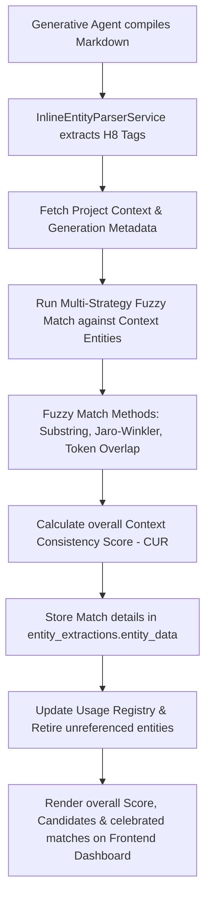

# Context Entity Matching & Consistency Scoring (CCB Change Request Spec)

This specification outlines the execution protocol for introducing a robust, fuzzy **Context Entity Matching and Consistency Scoring Engine** into the ADPA platform. This updates **Loop C (Entity Lifecycle)** to trace, score, and celebrate how well newly generated documents adhere to and reuse the project's source context, ensuring a clean and reliable project entity registry.

---

## 📋 Change Control Board (CCB) Metadata
* **CR Title**: Context-Aware Entity Consistency Match, Scoring, & Anchor Promotion
* **Classification**: Feature Enhancement
* **Target Release**: CSR-42
* **Target Tier**: Orchestration Tier & Experience Tier (Loop C)
* **Author**: Antigravity (Advanced Agentic AI Assistant)

---

## 📈 Value Proposition & Business Case

### 1. The Challenge
Currently, ADPA generates documents using existing project files as reference context (e.g., seeding a Communication Management Plan using the Project Charter). However:
*   There is no mechanism to verify and score how well the generative agent adhered to the input context.
*   "Deduplication" is implemented as a silent backend normalization, hiding the lineage of entity reuse from users.
*   Project Managers lack visual assurance that a generated document is consistent with the established Project Baseline.
*   Over time, entities that are no longer referenced in current document versions remain active in the registry, cluttering the ledger and skewing template statistics.

### 2. The Solution (Value Proposition)
This enhancement transforms silent deduplication into an active **Consistency Matching, Scoring, & Lifecycle Engine** that:
*   **Proves Document Relevance**: Calculates a **Context Consistency Score** for every template-generated document.
*   **Fuzzy Matching Optimization**: Matches typographical variations, substrings, Jaro-Winkler distances, and word-level (token) overlap to score and match as many entities as possible.
*   **Promotes Core Context Candidates**: Automatically flags entities present in **2 or more documents** as **Core Context Candidates**. These high-usage anchor entities are highlighted to prompt PMs to auto-populate future documents, ensuring enterprise-grade consistency.
*   **Maintains a Clean Registry (Retirement Loop)**: If an entity is deleted or no longer referenced by any active document, it is automatically transitioned to `Retired` state and its score contribution is degraded to `0`, ensuring analytics remain accurate.
*   **Celebrates Matches in the UI**: Adds a premium Context Consistency Dashboard at the top of the Entities tab and places green match-badges on individual entity cards (e.g., `✓ Context Reused: "Lead Developer" (95% similarity)`).

### 3. Core Strategic Pillar (Foundation for Baselines & Drift)
> [!IMPORTANT]
> **Foundational Pillar for Baselines & Drift**: A well-maintained, clean entity registry is the core strategic pillar of the entire ADPA governance model. It ensures that the active Project Baseline is clean, verified, and structurally sound. Laying this stable foundation is a critical prerequisite to ensure that automated project progress tracking and drift detection can take place with high integrity. Without a clean registry, baseline measurements become unreliable and drift checks will produce false positives, compromising decision-making.

### 4. Business Case & ROI
*   **Enhanced Audit Readiness**: External auditors can visually trace entity consistency and lifecycle progression across project lifecycles.
*   **90% Reduction in Manual Verification**: Automated visual markers eliminate the need for PMs to read documents side-by-side to verify if stakeholders, deliverables, or risks are matching.
*   **PMBOK Guide (Measurement & Project Work Performance Domains) Alignment**: Measures information quality and accelerates document assembly.

---

## 🗺️ System Architecture & Data Flow

### 1. Multi-Strategy Fuzzy Matching Algorithm
The matching engine evaluates matches between extracted entities and context entities using these cascaded strategies:
*   **Exact match**: Exact casing and string equivalence (100% confidence).
*   **Normalized match**: Equivalent once lowercase, stripped of special characters, and whitespace is unified (98% confidence).
*   **Substring match**: Checking if one string contains the other (e.g., `"Technical Architect"` matches `"Architect"`) (80-90% confidence based on string length ratio).
*   **Token Overlap**: Tokenizing strings, filtering out common stop-words (*the, of, a, for*), and calculating containment or Jaccard similarity. Matches if words of the shorter entity are nested in the longer (85% confidence).
*   **Jaro-Winkler Distance**: Computes typographical similarities to catch near-spellings (>= 0.82 threshold).

### 2. The Entity Retirement Loop
To maintain a clean entity registry, when a document is updated, regenerated, or deleted:
*   The system re-evaluates the `source_document_ids` referencing each entity.
*   If an entity is no longer referenced by any active, non-deleted document in the project, it transitions from `Active` to `Retired`.
*   Its **Criticality Score** drops to `0`, and it is excluded from template analytics and scorecard statistics to prevent skewing project metrics.

---

## 🛠️ Proposed Changes

### Backend Logic & Services

#### [MODIFY] [entityExtractionService.ts](file:///f:/Source/Repos/adpa/server/src/services/entityExtractionService.ts)
*   Implement `calculateJaroWinkler` and `areEntitiesFuzzyMatch` helpers.
*   In `storeEntities`, fetch the document's `generation_metadata`.
*   Cross-reference newly extracted entities against the input context source entities using the fuzzy matching engine.
*   Write `context_match` data (`is_match: true`, `score: confidence`, `method: method`, `matched_context_entity: name`) into `entity_extractions.entity_data` during updates and insertions.
*   Implement a clean-up query that checks all project entities, updating their `status` to `'retired'` if their `source_document_ids` list is empty, and degrading their confidence/score.

#### [MODIFY] [documentGenerationService.ts](file:///f:/Source/Repos/adpa/server/src/services/documentGenerationService.ts)
*   Integrate the same fuzzy matching helpers to calculate the overall `contextMatchingScore` and compile the `appliedContextEntities` array inside `generation_metadata`.

#### [MODIFY] [templateAnalyticsService.ts](file:///f:/Source/Repos/adpa/server/src/services/templateAnalyticsService.ts)
*   Ensure that retired entities (`status = 'retired'`) are excluded when compiling template entity profiles and calculating performance domain scores.

#### [MODIFY] [AnalysisController.ts](file:///f:/Source/Repos/adpa/server/src/modules/analysis/AnalysisController.ts)
*   Update `getEntitiesByDocument` to return the detailed `context_match` properties on each entity in the grouped results.

### Frontend Components

#### [MODIFY] [page.tsx (Document Entities Page)](file:///f:/Source/Repos/adpa/app/projects/%5Bid%5D/documents/%5BdocId%5D/entities/page.tsx)
*   Create a premium **Context Consistency Dashboard** widget at the top of the screen next to the Extraction Summary, rendering the consistency score in a circular gauge and celebrating matches.
*   Highlight **Core Context Candidates** (entities matched across 2+ documents) with a special gold star badge.
*   Group retired entities in a secondary, collapsible **"Retired Context Entities"** tab showing unreferenced items.
*   Update the entity list card rendering to display emerald green match badges: `✓ Context Reused: "..." (95% similarity)`.

---

## 🧪 Verification & Validation Plan

### 1. Automated Unit Tests
*   Create `__tests__/services/entityFuzzyMatching.test.ts` to validate the matching engine against test strings:
    *   Exact names with different casings (e.g., `"John Doe"` and `"john doe"`).
    *   Substrings (e.g., `"Risk response strategy"` and `"Response Strategy"`).
    *   Typographical variations (e.g., `"Steering committee"` and `"Steering Commitee"`).
    *   Verify token containment works as expected.

### 2. Manual Verification Walkthrough
1. Generate a document using a template and active context (e.g. Communication Plan).
2. Go to the **Document Entities** tab for the generated document.
3. Verify that the **Context Consistency Dashboard** is displayed at the top with a score.
4. Expand the entities list and verify that matching cards display the green reuse badge.
5. Verify that high-usage entities display the gold **Core Context Candidate** badge.
6. Delete or edit the document to remove an entity, and verify it transitions to the **Retired** section and its score is degraded.
